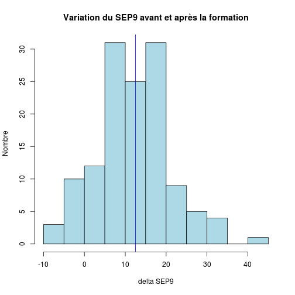

Données mémoire V.Brunstein
========================================================

Données originales
------------------

```r
date()
```

```
## [1] "Wed May 22 17:40:30 2013"
```

```r
getwd()
```

```
## [1] "/home/jcb/Documents/CESU/Travaux/Brunstein/Brunstein"
```


1. 2013-03-28:
2. 2013-03-30:
3. 2013-04-20: nouvelle série de données (total 36 cas)
4. 2013-05-15: résultats 3: 82 questionnaire

Données transformées
--------------------
Les fichiers XLS sont enregistrés au format txt.csv sous le nom de *resultats.csv*. Un nouveau fichier remplace le fichier courant auquel on ajoute le suffixe *-n*, n allant de 1 à *x* de sorte que *resultats.csv* reste toujours le fichier actif.


```r
# cartudo: file<-'~/Bureau/Brunstein'
# file<-'~/Documents/CESU/Travaux/Brunstein-master' setwd(file)
library("HH")
library("gplots")
library(plyr)
```


Routines de l'université de Monash pour Likert:
source("~/Documents/Statistiques/Likert/monash/R/likert.R")

ATTENTION: pas compatible avec HH (même nom de fonction)
```

Chargement des donnnées:
------------------------

- na.strings="": permet de remplacer les cases vides par des NA
- strip.white = TRUE: élimine les blancs inutiles
- skip=1: la première ligne ne sert à rien
- colClasses="character": évite que F ne soit transformé en FALSE (sexe)

```r
data <- read.csv("resultats.csv", header = TRUE, sep = ",", na.strings = "", 
    strip.white = TRUE, skip = 1, colClasses = "character")
```

Meagling des données
--------------------
*! ATTENTION pb avec les caractères accentués sous windows*

```r
groupe <- as.factor(data$Groupe)
no <- as.integer(data$Numéro)
diplome <- as.factor(data$Diplôme)
date_diplome <- as.integer(2013 - as.integer(data$Date))
sexe <- as.factor(data$Sexe)
travail <- as.factor(data$Lieu.exercice)
exp_urg <- as.factor(data$experience.urgence.1...oui.2...non)
conf_urg <- as.factor(data$confronté.situation.jamais...1.rarement...2.parfois...3.souvent...4)
last_urg_n <- as.factor(data$de.quand.date.dernière.situation.d.urgence)
last_urg_t <- as.factor(data$de.quand.date.dernière.situation.d.urgence.1)
formation <- as.factor(data$formation.urgence)
date_formation <- as.factor(data$date.derniere.formation.urgence)
```

Nouvelle présentation
---------------------

```r
names(data)
```

```
##  [1] "X"                                                                  
##  [2] "Groupe"                                                             
##  [3] "date"                                                               
##  [4] "Numéro"                                                             
##  [5] "Diplôme"                                                            
##  [6] "Date"                                                               
##  [7] "Sexe"                                                               
##  [8] "X3.categories.lieu.exercice"                                        
##  [9] "Lieu.exercice"                                                      
## [10] "experience.urgence.1...oui.2...non"                                 
## [11] "Date.debut"                                                         
## [12] "date.fin"                                                           
## [13] "confronté.situation.jamais...1.rarement...2.parfois...3.souvent...4"
## [14] "de.quand.date.dernière.situation.d.urgence"                         
## [15] "de.quand.date.dernière.situation.d.urgence.1"                       
## [16] "formation.urgence"                                                  
## [17] "date.derniere.formation.urgence"                                    
## [18] "date.derniere.formation.urgence.1"                                  
## [19] "A"                                                                  
## [20] "B"                                                                  
## [21] "C"                                                                  
## [22] "situation.depuis.formation"                                         
## [23] "A.après.formation"                                                  
## [24] "B.après.formation"                                                  
## [25] "C.après.formation"                                                  
## [26] "D"                                                                  
## [27] "E"                                                                  
## [28] "F"                                                                  
## [29] "G"                                                                  
## [30] "H"                                                                  
## [31] "I"                                                                  
## [32] "J"                                                                  
## [33] "K"                                                                  
## [34] "L"                                                                  
## [35] "M"                                                                  
## [36] "N"                                                                  
## [37] "Q1A"                                                                
## [38] "Q1B"                                                                
## [39] "Q1C"                                                                
## [40] "Q2A"                                                                
## [41] "Q2B"                                                                
## [42] "Q2C"                                                                
## [43] "Q3A"                                                                
## [44] "Q3B"                                                                
## [45] "Q3C"                                                                
## [46] "Q4A"                                                                
## [47] "Q4B"                                                                
## [48] "Q4C"                                                                
## [49] "Q5A"                                                                
## [50] "Q5B"                                                                
## [51] "Q5C"                                                                
## [52] "Q6A"                                                                
## [53] "Q6B"                                                                
## [54] "Q6C"                                                                
## [55] "Q7A"                                                                
## [56] "Q7B"                                                                
## [57] "Q7C"                                                                
## [58] "Q8A"                                                                
## [59] "Q8B"                                                                
## [60] "Q8C"                                                                
## [61] "Q9A"                                                                
## [62] "Q9B"                                                                
## [63] "Q9C"                                                                
## [64] "Tel"                                                                
## [65] "X.1"                                                                
## [66] "X.2"                                                                
## [67] "X.3"                                                                
## [68] "X.4"                                                                
## [69] "X.5"
```


Historique des transformation.

Stat simples
------------

### Origine socio-professionnelle:

```r
summary(diplome)
```

```
##         AP         AS        IDE       MERM        PPH SAGE FEMME 
##          1         29         45          2          1          3 
##       NA's 
##          2
```

```r
plot(diplome)
```

 

```r
ddply(data, .(diplome), "nrow")
```

```
##      diplome nrow
## 1         AP    1
## 2         AS   29
## 3        IDE   45
## 4       MERM    2
## 5        PPH    1
## 6 SAGE FEMME    3
## 7       <NA>    2
```


### Données pour Likert:

```r
x <- summary(as.factor(data$Q1A))
x
```

```
##    1    2    3    4    5    6    7    8   NA NA's 
##    1    1    2    9   24   27   12    3    1    3
```

```r
# likert(x)
```

Ca marche mais on obtient que 4 valeurs sur les 8 possibles et l'échelle de likert est faussée.
Voila ce qu'on devrait obtenir:

```r
a <- c(0, 0, 0, 2, 11, 6, 1, 0)
likert(a)
```

 

La question Q1 complète (avant/après):

```r
b <- summary(as.factor(data$Q1B))
b
```

```
##    5    6    7    8 NA's 
##    2   12   45   22    2
```

```r
Q1B <- c(0, 0, 0, 0, 0, 4, 11, 5)
a
```

```
## [1]  0  0  0  2 11  6  1  0
```

```r
Q1A <- a
c <- rbind(Q1A, Q1B)
likert(c, main = "Question Q1 (avant / après)")
```

 

```r

a <- as.integer(data$Q1A)
```

```
## Warning: NAs introduits lors de la conversion automatique
```

```r
b <- as.integer(data$Q1B)

summary(a)
```

```
##    Min. 1st Qu.  Median    Mean 3rd Qu.    Max.    NA's 
##    1.00    5.00    6.00    5.51    6.00    8.00       4
```

```r
summary(b)
```

```
##    Min. 1st Qu.  Median    Mean 3rd Qu.    Max.    NA's 
##    5.00    7.00    7.00    7.07    8.00    8.00       2
```

```r

boxplot(a, b)
```

 

```r

# ma<-mean(summary(as.factor(data$Q1A)))
# mb<-mean(summary(as.factor(data$Q1B)))

t <- t.test(a, b)
t
```

```
## 
## 	Welch Two Sample t-test
## 
## data:  a and b 
## t = -9.632, df = 123.5, p-value < 2.2e-16
## alternative hypothesis: true difference in means is not equal to 0 
## 95 percent confidence interval:
##  -1.890 -1.246 
## sample estimates:
## mean of x mean of y 
##     5.506     7.074
```

```r
t[["statistic"]]
```

```
##      t 
## -9.631
```

```r
t[["parameter"]]
```

```
##    df 
## 123.5
```

```r
t[["p.value"]]
```

```
## [1] 1.023e-16
```

Ce qui peut s'écrire avec **sweave**:

Il n'y a pas de différence significative entre les moyennes des scores avant et après:
($t(\Sexpr{res[['parameter']]})=\Sexpr{round(res[['statistic']],3)}$,
$p \Sexpr{ifelse(res[['p.value']]<0.001,'< 0.001',
   paste('=',round(res[['p.value']],3)))}$)

Expansion des score de likert:
------------------------------
Le score de Likert pour une question varie de 1 à 8 mais tous les items ne sont pas renseignés. Par exemple pour la question Q1A on obtient le score suivant:

```r
summary(as.factor(data$Q1A))
```

```
##    1    2    3    4    5    6    7    8   NA NA's 
##    1    1    2    9   24   27   12    3    1    3
```

Ce qui fausse la représentation de l'échelle de Likert. Celle-ci est exacte avec la série:

```r
a <- c(0, 0, 0, 2, 11, 6, 1, 0)
```

Pour obtenir automatiquement une séquence complète, on peut appliquer l'algorithme suivant: pour chaque ligne de *data* on forme un vecteur z contenant huit 0. Puis on affecte 1 à la position correspondante à la valeur du score pour cette question à cette ligne. Par exemple la valeur de Q1A pour la première ligne est 6 => z[6]=1. Enfin on "colle" le vecteur z à la liste a. L'opération est répétée pour toutes les lignes.


```r
a <- lapply(1:nrow(data), function(x) {
    z <- 0
    z[1:8] <- 0
    z[as.integer(data$Q1A[x])] <- 1
    a <- rbind(z)
})
```

```
## Warning: NAs introduits lors de la conversion automatique
```

```r
a <- do.call(rbind, a)
Q1A <- apply(a, 2, sum)

a <- lapply(1:nrow(data), function(x) {
    z <- 0
    z[1:8] <- 0
    z[as.integer(data$Q1B[x])] <- 1
    a <- rbind(z)
})
a <- do.call(rbind, a)
Q1B <- apply(a, 2, sum)

c <- rbind(Q1A, Q1B)
likert(c, main = "Question Q1 (avant / après)")
```

 

Application à la question 4
---------------------------

```r
a <- lapply(1:nrow(data), function(x) {
    z <- 0
    z[1:8] <- 0
    z[as.integer(data$Q4A[x])] <- 1
    a <- rbind(z)
})
a <- do.call(rbind, a)
Q4A <- apply(a, 2, sum)

a <- lapply(1:nrow(data), function(x) {
    z <- 0
    z[1:8] <- 0
    z[as.integer(data$Q4B[x])] <- 1
    a <- rbind(z)
})
a <- do.call(rbind, a)
Q4B <- apply(a, 2, sum)

c <- rbind(Q4A, Q4B)
likert(c, main = "Question Q4 (avant / après)", xlab = "'je pense que n'hésite pas à prendre des décisions en situation d'urgence'")
```

 


Application à la question 6
---------------------------

```r
a <- lapply(1:nrow(data), function(x) {
    z <- 0
    z[1:8] <- 0
    z[as.integer(data$Q6A[x])] <- 1
    a <- rbind(z)
})
a <- do.call(rbind, a)
Q6A <- apply(a, 2, sum)

a <- lapply(1:nrow(data), function(x) {
    z <- 0
    z[1:8] <- 0
    z[as.integer(data$Q6B[x])] <- 1
    a <- rbind(z)
})
a <- do.call(rbind, a)
Q6B <- apply(a, 2, sum)

c <- rbind(Q6A, Q6B)
likert(c, main = "Question Q6 (avant / après)", xlab = "'Même en situation d'urgence je préfère attendre un collègue'")
```

 

Calcul du SEP
-------------
Les questions avant/après vont de la colonne 32 à 49.

Il faut d'abord transformer les valeurs de character en numeric:

```r
# for(i in 32:49){data[,i]<-as.numeric(data[,i])}
for (i in "Q1A":"Q9C") {
    data[, i] <- as.numeric(data[, i])
}
```

```
## Warning: NAs introduits lors de la conversion automatique
```

```
## Warning: NAs introduits lors de la conversion automatique
```

```
## Error: argument NA / NaN
```

On crée une liste des question "avant":

```r
# avant<-seq(from=32, to=49, by=2)
avant <- seq(from = "Q1A", to = "Q9C", by = 2)
```

```
## Error: argument non numérique pour un opérateur binaire
```

On isole dans un dataframe les questions "avant":

```r
av <- data[, avant]
```

```
## Error: objet 'avant' introuvable
```

on calcule la somme de chaque ligne:

```r
a <- apply(av, 1, sum)
```

```
## Error: objet 'av' introuvable
```

```r
a
```

```
##   [,1] [,2] [,3] [,4] [,5] [,6] [,7] [,8]
## z    0    0    0    1    0    0    0    0
## z    0    0    0    0    0    0    1    0
## z    0    1    0    0    0    0    0    0
## z    0    0    0    0    0    0    0    1
## z    0    0    0    0    0    1    0    0
## z    0    0    0    1    0    0    0    0
## z    0    0    0    0    0    0    1    0
## z    0    0    0    0    0    0    1    0
## z    0    0    0    0    0    0    0    1
## z    0    0    0    0    0    0    1    0
## z    0    0    0    0    0    1    0    0
## z    0    0    0    0    0    0    0    1
## z    0    0    1    0    0    0    0    0
## z    0    0    0    0    0    1    0    0
## z    0    0    0    0    0    1    0    0
## z    1    0    0    0    0    0    0    0
## z    0    1    0    0    0    0    0    0
## z    1    0    0    0    0    0    0    0
## z    1    0    0    0    0    0    0    0
## z    0    0    0    0    1    0    0    0
## z    0    0    0    0    0    0    0    1
## z    0    0    1    0    0    0    0    0
## z    0    0    1    0    0    0    0    0
## z    0    0    0    0    0    0    0    1
## z    0    0    0    1    0    0    0    0
## z    0    0    0    0    0    0    1    0
## z    1    0    0    0    0    0    0    0
## z    0    0    0    1    0    0    0    0
## z    0    0    0    0    0    0    1    0
## z    0    0    0    0    0    1    0    0
## z    0    0    0    0    0    0    0    1
## z    0    0    0    1    0    0    0    0
## z    0    0    0    0    0    0    0    1
## z    0    1    0    0    0    0    0    0
## z    0    0    0    1    0    0    0    0
## z    0    0    0    0    0    0    0    1
## z    1    0    0    0    0    0    0    0
## z    0    0    0    0    0    0    0    1
## z    0    0    0    0    0    0    1    0
## z    0    0    0    0    0    0    1    0
## z    0    0    0    0    0    1    0    0
## z    0    0    0    0    0    0    0    1
## z    0    0    0    1    0    0    0    0
## z    0    0    0    0    0    1    0    0
## z    0    0    1    0    0    0    0    0
## z    0    0    0    0    0    1    0    0
## z    0    0    0    0    0    1    0    0
## z    0    0    0    1    0    0    0    0
## z    0    0    0    0    0    0    0    1
## z    0    0    0    0    0    0    1    0
## z    0    0    0    0    0    0    1    0
## z    0    0    0    0    0    1    0    0
## z    0    0    0    0    0    0    0    1
## z    0    0    0    0    0    1    0    0
## z    0    0    0    0    0    0    1    0
## z    0    0    0    0    0    0    0    1
## z    0    0    1    0    0    0    0    0
## z    0    0    0    0    0    0    1    0
## z    0    0    0    0    0    1    0    0
## z    0    0    0    0    0    0    0    1
## z    0    0    0    0    1    0    0    0
## z    1    0    0    0    0    0    0    0
## z    0    0    0    0    0    1    0    0
## z    0    0    0    0    0    1    0    0
## z    0    0    0    0    0    0    0    1
## z    0    0    0    0    0    0    0    1
## z    0    0    0    0    0    0    0    1
## z    0    0    0    0    0    0    0    1
## z    0    0    0    0    0    0    1    0
## z    0    0    0    0    0    1    0    0
## z    0    0    0    0    0    0    1    0
## z    0    0    0    0    0    0    1    0
## z    0    0    0    0    0    1    0    0
## z    0    0    0    0    0    0    1    0
## z    0    0    0    0    0    1    0    0
## z    0    0    0    0    0    1    0    0
## z    0    0    0    0    0    1    0    0
## z    0    0    0    0    0    0    0    1
## z    0    0    0    0    0    1    0    0
## z    0    0    0    0    0    0    0    1
## z    0    1    0    0    0    0    0    0
## z    0    0    0    0    0    0    0    0
## z    0    0    0    0    0    0    0    0
```

```r
summary(a)
```

```
##        V1               V2               V3               V4        
##  Min.   :0.0000   Min.   :0.0000   Min.   :0.0000   Min.   :0.0000  
##  1st Qu.:0.0000   1st Qu.:0.0000   1st Qu.:0.0000   1st Qu.:0.0000  
##  Median :0.0000   Median :0.0000   Median :0.0000   Median :0.0000  
##  Mean   :0.0723   Mean   :0.0482   Mean   :0.0602   Mean   :0.0964  
##  3rd Qu.:0.0000   3rd Qu.:0.0000   3rd Qu.:0.0000   3rd Qu.:0.0000  
##  Max.   :1.0000   Max.   :1.0000   Max.   :1.0000   Max.   :1.0000  
##        V5               V6              V7              V8       
##  Min.   :0.0000   Min.   :0.000   Min.   :0.000   Min.   :0.000  
##  1st Qu.:0.0000   1st Qu.:0.000   1st Qu.:0.000   1st Qu.:0.000  
##  Median :0.0000   Median :0.000   Median :0.000   Median :0.000  
##  Mean   :0.0241   Mean   :0.241   Mean   :0.193   Mean   :0.241  
##  3rd Qu.:0.0000   3rd Qu.:0.000   3rd Qu.:0.000   3rd Qu.:0.000  
##  Max.   :1.0000   Max.   :1.000   Max.   :1.000   Max.   :1.000
```

On fait la même opération pour après

```r
# apres<-seq(from=33, to=49, by=2)
apres <- seq(from = "Q1B", to = "Q9C", by = 2)
```

```
## Error: argument non numérique pour un opérateur binaire
```

```r
ap <- data[, apres]
```

```
## Error: objet 'apres' introuvable
```

```r
b <- apply(ap, 1, sum)
```

```
## Error: objet 'ap' introuvable
```

```r
summary(b)
```

```
##    Min. 1st Qu.  Median    Mean 3rd Qu.    Max.    NA's 
##    5.00    7.00    7.00    7.07    8.00    8.00       2
```

Pour faciliter la compréhension on crée deux variables complémentaires, sepa (sep avant) et sepb (sep après):

```r
data$sepa <- a
data$sepb <- b
```

L'étude de la différence sepb - sepa montre que si le globalement le SEP augmente après la formation (moyenne de 11 points), il régresse pour certains (-4) et augmente massivement pour d'autres (+42):

```r
s <- summary(data$sepb - data$sepa)
h <- data$sepb - data$sepa
s
```

```
##        V1          V2             V3             V4             V5      
##  Min.   :5   Min.   :5.00   Min.   :5.00   Min.   :5.00   Min.   :5.00  
##  1st Qu.:7   1st Qu.:7.00   1st Qu.:7.00   1st Qu.:7.00   1st Qu.:7.00  
##  Median :7   Median :7.00   Median :7.00   Median :7.00   Median :7.00  
##  Mean   :7   Mean   :7.03   Mean   :7.01   Mean   :6.97   Mean   :7.05  
##  3rd Qu.:7   3rd Qu.:8.00   3rd Qu.:8.00   3rd Qu.:7.00   3rd Qu.:8.00  
##  Max.   :8   Max.   :8.00   Max.   :8.00   Max.   :8.00   Max.   :8.00  
##  NA's   :2   NA's   :2      NA's   :2      NA's   :2      NA's   :2     
##        V6             V7             V8      
##  Min.   :5.00   Min.   :4.00   Min.   :4.00  
##  1st Qu.:6.00   1st Qu.:6.00   1st Qu.:6.00  
##  Median :7.00   Median :7.00   Median :7.00  
##  Mean   :6.83   Mean   :6.88   Mean   :6.83  
##  3rd Qu.:7.00   3rd Qu.:7.00   3rd Qu.:7.00  
##  Max.   :8.00   Max.   :8.00   Max.   :8.00  
##  NA's   :2      NA's   :2      NA's   :2
```

```r
h
```

```
##   [,1] [,2] [,3] [,4] [,5] [,6] [,7] [,8]
## z    6    6    6    5    6    6    6    6
## z    7    7    7    7    7    7    6    7
## z    7    6    7    7    7    7    7    7
## z    7    7    7    7    7    7    7    6
## z    7    7    7    7    7    6    7    7
## z    7    7    7    6    7    7    7    7
## z    7    7    7    7    7    7    6    7
## z    8    8    8    8    8    8    7    8
## z    8    8    8    8    8    8    8    7
## z    7    7    7    7    7    7    6    7
## z    7    7    7    7    7    6    7    7
## z    6    6    6    6    6    6    6    5
## z    6    6    5    6    6    6    6    6
## z    6    6    6    6    6    5    6    6
## z    7    7    7    7    7    6    7    7
## z    7    8    8    8    8    8    8    8
## z    7    6    7    7    7    7    7    7
## z    7    8    8    8    8    8    8    8
## z    7    8    8    8    8    8    8    8
## z    7    7    7    7    6    7    7    7
## z    7    7    7    7    7    7    7    6
## z    7    7    6    7    7    7    7    7
## z    7    7    6    7    7    7    7    7
## z    7    7    7    7    7    7    7    6
## z    7    7    7    6    7    7    7    7
## z    8    8    8    8    8    8    7    8
## z    6    7    7    7    7    7    7    7
## z    7    7    7    6    7    7    7    7
## z    7    7    7    7    7    7    6    7
## z    7    7    7    7    7    6    7    7
## z    7    7    7    7    7    7    7    6
## z    8    8    8    7    8    8    8    8
## z    8    8    8    8    8    8    8    7
## z    6    5    6    6    6    6    6    6
## z    7    7    7    6    7    7    7    7
## z    8    8    8    8    8    8    8    7
## z    6    7    7    7    7    7    7    7
## z    6    6    6    6    6    6    6    5
## z    8    8    8    8    8    8    7    8
## z    7    7    7    7    7    7    6    7
## z    8    8    8    8    8    7    8    8
## z    7    7    7    7    7    7    7    6
## z    8    8    8    7    8    8    8    8
## z    7    7    7    7    7    6    7    7
## z    8    8    7    8    8    8    8    8
## z    8    8    8    8    8    7    8    8
## z    8    8    8    8    8    7    8    8
## z    6    6    6    5    6    6    6    6
## z    7    7    7    7    7    7    7    6
## z    5    5    5    5    5    5    4    5
## z    7    7    7    7    7    7    6    7
## z    7    7    7    7    7    6    7    7
## z    5    5    5    5    5    5    5    4
## z    6    6    6    6    6    5    6    6
## z    6    6    6    6    6    6    5    6
## z    6    6    6    6    6    6    6    5
## z    7    7    6    7    7    7    7    7
## z    7    7    7    7    7    7    6    7
## z    8    8    8    8    8    7    8    8
## z    7    7    7    7    7    7    7    6
## z    8    8    8    8    7    8    8    8
## z    6    7    7    7    7    7    7    7
## z    7    7    7    7    7    6    7    7
## z    6    6    6    6    6    5    6    6
## z    8    8    8    8    8    8    8    7
## z    7    7    7    7    7    7    7    6
## z    8    8    8    8    8    8    8    7
## z    8    8    8    8    8    8    8    7
## z    8    8    8    8    8    8    7    8
## z    7    7    7    7    7    6    7    7
## z    7    7    7    7    7    7    6    7
## z    8    8    8    8    8    8    7    8
## z    7    7    7    7    7    6    7    7
## z    7    7    7    7    7    7    6    7
## z    7    7    7    7    7    6    7    7
## z    7    7    7    7    7    6    7    7
## z    6    6    6    6    6    5    6    6
## z    7    7    7    7    7    7    7    6
## z    7    7    7    7    7    6    7    7
## z    7    7    7    7    7    7    7    6
## z    7    6    7    7    7    7    7    7
## z   NA   NA   NA   NA   NA   NA   NA   NA
## z   NA   NA   NA   NA   NA   NA   NA   NA
```

```r
hist(h, main = "Variation du SEP avant et après la formation", ylab = "Nombre", 
    xlab = "delta SEP", col = "lightblue")
abline(v = s[4], col = "blue")
```

```
## Warning: NAs introduits lors de la conversion automatique
```

 

Progression du SEP selon le groupe socio-professionnel:

```r
round(sort(tapply(data$sepb - data$sepa, diplome, mean, na.rm = TRUE)), 2)
```

```
## Error: arguments must have same length
```


Le score SEP (Sentiment d'efficacité personnelle) a progressé après la formation.

```r
boxplot(a, b, main = "SEP avant et après la formation")
```

```
## Warning: la condition a une longueur > 1 et seul le premier élément est
## utilisé
```

```
## Error: un tel index n'existe pas au niveau 1
```

Et cette évolution est très significative:

```r
t <- t.test(a, b)
t
```

```
## 
## 	Welch Two Sample t-test
## 
## data:  a and b 
## t = -85.74, df = 84.08, p-value < 2.2e-16
## alternative hypothesis: true difference in means is not equal to 0 
## 95 percent confidence interval:
##  -7.113 -6.791 
## sample estimates:
## mean of x mean of y 
##     0.122     7.074
```

### expérience professionnelle

```r
summary(exp_urg)
```

```
##  non  oui NA's 
##   50   31    2
```

SEP moyen en fonction de l'expérience:

```r
tapply(a, exp_urg, mean, na.rm = TRUE)
```

```
## Error: arguments must have same length
```


Analyse de la question 4
------------------------
*Q: je pense que n'hésite pas à prendre des décisions en situation d'urgence*

```r
summary(data[, 38])
```

```
##    Length     Class      Mode 
##        83 character character
```

```r
summary(data[, 39])
```

```
##    Length     Class      Mode 
##        83 character character
```

Il y a une progression du groupe: après la formation, davantage d'apprenants se sentent capables de prendre une décision en situation d'urgence.

Analyse de la question 6
------------------------
*Q: Même en situation d'urgence je préfère attendre un collègue*

```r
summary(data[, 42])
```

```
##    Length     Class      Mode 
##        83 character character
```

```r
summary(data[, 43])
```

```
##    Length     Class      Mode 
##        83 character character
```

Après la formation, la position du groupe évolue peu bien que l'on note une une diminution de la moyenne, cad que les stagiaires en fin de formation attendront moins la validation de leur décision par une pair avant d'agir.

### SEP et fréquence des situations d'urgence

fréquence absolue et selon le lieu d'exercice:

```r
summary(conf_urg)
```

```
##   jamais  parfois rarement  souvent     NA's 
##       10       39       18       14        2
```

```r
table(travail, conf_urg)
```

```
##                     conf_urg
## travail              jamais parfois rarement souvent
##   Bloc                    0       1        0       0
##   bloc ophtalmo           0       1        0       0
##   centre                  0       1        0       0
##   centre du sommeil       1       0        0       0
##   chir orthopédique       1       0        0       0
##   chir pediatrique        0       0        1       0
##   chirurgie               1       0        2       0
##   chirurgie générale      0       1        0       0
##   CIC                     0       1        0       0
##   CMCO                    0       2        0       0
##   EF cardio               0       1        0       0
##   EHPAD                   1       0        0       0
##   entreprise              0       3        0       0
##   GASTRO chir             0       0        1       0
##   GERIATRIE               0       1        0       0
##   gériatrie               0       0        1       0
##   geronto psy             0       0        1       0
##   gyneco                  1       0        1       1
##   HEMODIALYSE             0       0        0       1
##   long sejour             1       0        1       0
##   maternité               1       0        0       0
##   medecine                0       2        1       0
##   MEDECINE                0       2        1       0
##   médecine                0       1        0       1
##   medecine nucléaire      0       0        1       0
##   MIRNED                  0       0        1       0
##   NA                      0       5        0       0
##   NEPHRO                  0       1        0       0
##   neurologie              0       1        0       0
##   NHC                     0       1        0       0
##   obstetrique             0       0        2       0
##   oncologie               1       0        1       0
##   ORL                     0       0        0       1
##   pharmacie               1       0        0       0
##   PNEUMO                  0       2        1       0
##   POOL MCO                0       1        0       0
##   radio                   0       1        0       0
##   rea neurochir           0       0        0       1
##   SI HEMATO               0       0        0       1
##   SSPI                    0       1        0       0
##   ste anne                0       1        0       0
##   STE BARBE               0       2        0       0
##   STRASBOURG              0       0        1       0
##   TRAUMATO                0       2        0       0
##   UAA                     0       0        0       1
##   URGENCES                0       2        0       6
##   USC                     0       1        0       1
```

Sep moyen et fréquence des situations d'urgence

```r
tapply(a, conf_urg, mean, na.rm = TRUE)
```

```
## Error: arguments must have same length
```

```r
x <- split(a, conf_urg)
boxplot(x, main = "SEP en fonction de la fréquence des situations d'urgence", 
    ylab = "SEP", col = "orange")
```

 

```r
x <- aov(a ~ conf_urg)
x
```

```
## Call:
##    aov(formula = a ~ conf_urg)
## 
## Terms:
##                 conf_urg Residuals
## resp 1             0.093     5.463
## resp 2             0.213     3.590
## resp 3             0.158     4.533
## resp 4             0.078     7.132
## resp 5             0.076     1.874
## resp 6             2.283    12.779
## resp 7             0.579    12.261
## resp 8             0.058    15.004
## Deg. of Freedom        3        77
## 
## Residual standard error: 0.2664 0.2159 0.2426 0.3043 0.156 0.4074 0.399 0.4414 
## Estimated effects may be unbalanced
## 2 observations deleted due to missingness
```

```r
summary(x)
```

```
##  Response 1 :
##             Df Sum Sq Mean Sq F value Pr(>F)
## conf_urg     3   0.09  0.0309    0.44   0.73
## Residuals   77   5.46  0.0709               
## 
##  Response 2 :
##             Df Sum Sq Mean Sq F value Pr(>F)
## conf_urg     3   0.21  0.0709    1.52   0.22
## Residuals   77   3.59  0.0466               
## 
##  Response 3 :
##             Df Sum Sq Mean Sq F value Pr(>F)
## conf_urg     3   0.16  0.0528     0.9   0.45
## Residuals   77   4.53  0.0589               
## 
##  Response 4 :
##             Df Sum Sq Mean Sq F value Pr(>F)
## conf_urg     3   0.08  0.0260    0.28   0.84
## Residuals   77   7.13  0.0926               
## 
##  Response 5 :
##             Df Sum Sq Mean Sq F value Pr(>F)
## conf_urg     3  0.076  0.0254    1.04   0.38
## Residuals   77  1.874  0.0243               
## 
##  Response 6 :
##             Df Sum Sq Mean Sq F value Pr(>F)   
## conf_urg     3   2.28   0.761    4.59 0.0052 **
## Residuals   77  12.78   0.166                  
## ---
## Signif. codes:  0 '***' 0.001 '**' 0.01 '*' 0.05 '.' 0.1 ' ' 1 
## 
##  Response 7 :
##             Df Sum Sq Mean Sq F value Pr(>F)
## conf_urg     3   0.58   0.193    1.21   0.31
## Residuals   77  12.26   0.159               
## 
##  Response 8 :
##             Df Sum Sq Mean Sq F value Pr(>F)
## conf_urg     3   0.06  0.0192     0.1   0.96
## Residuals   77  15.00  0.1949               
## 
## 2 observations deleted due to missingness
```

```r
plotmeans(a ~ conf_urg, ylab = "SEP", xlab = "Confrontation aux situations d'urgence", 
    main = "SEP moyen et situations d'urgence", col = "red")
```

 

```r

TukeyHSD(x)
```

```
## Error: 'model.tables' is not implemented for multiple responses
```

Plus la confrontation au situations d'urgence augmente et plus le SEP est élevé.

Différence significative pour *parfois-jamais*, *souvent-jamais*.

Profession et SEP
-----------------


```r
table(diplome, conf_urg)
```

```
##             conf_urg
## diplome      jamais parfois rarement souvent
##   AP              0       0        1       0
##   AS              4      12        5       8
##   IDE             4      25       10       6
##   MERM            0       1        1       0
##   PPH             1       0        0       0
##   SAGE FEMME      1       1        1       0
```

SEP avant formation:

```r
tapply(a, diplome, mean, na.rm = TRUE)
```

```
## Error: arguments must have same length
```

SEP après formation:

```r
tapply(b, diplome, mean, na.rm = TRUE)
```

```
##         AP         AS        IDE       MERM        PPH SAGE FEMME 
##      7.000      7.000      7.156      7.500      7.000      6.333
```

Le SEP avant formation est élevé pour les AS, IDE et MERM et particulièrement bas por les PPH. Après la formation, il augmente pour toutes les catégories mais la progression la plus spectaculaire est observée pour les PPH. Avant la formation, le SEP est significativement différent selon le métier:

```r
xa <- aov(a ~ diplome)
summary(xa)
```

```
##  Response 1 :
##             Df Sum Sq Mean Sq F value Pr(>F)
## diplome      5   0.23  0.0454    0.64   0.67
## Residuals   75   5.33  0.0710               
## 
##  Response 2 :
##             Df Sum Sq Mean Sq F value Pr(>F)
## diplome      5   0.04  0.0074    0.15   0.98
## Residuals   75   3.77  0.0502               
## 
##  Response 3 :
##             Df Sum Sq Mean Sq F value Pr(>F)
## diplome      5   0.27  0.0531     0.9   0.49
## Residuals   75   4.43  0.0590               
## 
##  Response 4 :
##             Df Sum Sq Mean Sq F value Pr(>F)
## diplome      5   0.40  0.0807    0.89   0.49
## Residuals   75   6.81  0.0908               
## 
##  Response 5 :
##             Df Sum Sq Mean Sq F value Pr(>F)
## diplome      5  0.007 0.00146    0.06      1
## Residuals   75  1.943 0.02591               
## 
##  Response 6 :
##             Df Sum Sq Mean Sq F value Pr(>F)
## diplome      5   0.81   0.161    0.85   0.52
## Residuals   75  14.25   0.190               
## 
##  Response 7 :
##             Df Sum Sq Mean Sq F value Pr(>F)
## diplome      5   0.95   0.189    1.19   0.32
## Residuals   75  11.89   0.159               
## 
##  Response 8 :
##             Df Sum Sq Mean Sq F value Pr(>F)
## diplome      5   0.47  0.0937    0.48   0.79
## Residuals   75  14.59  0.1946               
## 
## 2 observations deleted due to missingness
```

```r
plotmeans(a ~ diplome, ylab = "SEP", xlab = "Diplome", main = "SEP moyen (avant) et métier", 
    col = "red")
```

 

Après la formation, il n'y a plus de différence de SEP quelque soit le métier:

```r
xb <- aov(b ~ diplome)
summary(xb)
```

```
##             Df Sum Sq Mean Sq F value Pr(>F)
## diplome      5    2.5   0.496    0.95   0.45
## Residuals   75   39.1   0.521               
## 2 observations deleted due to missingness
```

```r
plotmeans(b ~ diplome, ylab = "SEP", xlab = "Diplome", main = "SEP moyen (après) et métier", 
    col = "red")
```

```
## Warning: production de NaN
```

```
## Warning: un flèche de longueur nulle n'a pas d'angle déterminé et est
## ignorée
```

```
## Warning: un flèche de longueur nulle n'a pas d'angle déterminé et est
## ignorée
```

```
## Warning: un flèche de longueur nulle n'a pas d'angle déterminé et est
## ignorée
```

```
## Warning: un flèche de longueur nulle n'a pas d'angle déterminé et est
## ignorée
```

 

Expérience réelle de l'urgence
------------------------------
Existe t'il un lien entre le SEP et le fait d'avoir été confronté à une situation d'urgence ? On utiise l'item *de.quand.date.dernière.situation.d.urgence*. L'information est donnée sur deux colonnes: la première est un chiffre, la seconde est l'unité de temps:

```r
summary(as.factor(data$de.quand.date.dernière.situation.d.urgence.1))
```

```
##      ans    jours     mois       NA semaines     NA's 
##       21        8       26       18        4        6
```

La plus petite unité de mesure étant le *jour* on transforme toutes des mesures en jours. Pour ce faire on crée une nouvelle colonne **data$sem**:

```r
data$sem[data$de.quand.date.dernière.situation.d.urgence.1 == NA] <- 0
data$sem[data$de.quand.date.dernière.situation.d.urgence.1 == "semaines"] <- 7
data$sem[data$de.quand.date.dernière.situation.d.urgence.1 == "mois"] <- 30
data$sem[data$de.quand.date.dernière.situation.d.urgence.1 == "jours"] <- 1
data$sem[data$de.quand.date.dernière.situation.d.urgence.1 == "ans"] <- 365
```

On obtient une nouvelle variable appelée **data$exp** en multipliant le vecteur data$sem par data$de.quand.date.dernière.situation.d.urgence (après transformation en vecteur numérique):

```r
data$exp <- data$sem * as.numeric(data$de.quand.date.dernière.situation.d.urgence)
```

```
## Warning: NAs introduits lors de la conversion automatique
```

```r
summary(data$exp)
```

```
##    Min. 1st Qu.  Median    Mean 3rd Qu.    Max.    NA's 
##       1      30     180     407     365    4020      26
```

Non répondant ou sans expérience:

```r
notexp <- sum(is.na(data$exp))
```

soit en pourcentage du total:

```r
round(notexp * 100/nrow(data), 2)
```

```
## [1] 31.33
```

Corrélation entre SEP et confrontation à situation d'urgence:

```r
fit <- lm(sepa ~ exp, data = data)
summary(fit)
```

```
## Response Y1 :
## 
## Call:
## lm(formula = Y1 ~ exp, data = data)
## 
## Residuals:
##     Min      1Q  Median      3Q     Max 
## -0.0850 -0.0840 -0.0785 -0.0584  0.9283 
## 
## Coefficients:
##              Estimate Std. Error t value Pr(>|t|)  
## (Intercept)  8.50e-02   3.96e-02    2.15    0.036 *
## exp         -3.65e-05   4.87e-05   -0.75    0.457  
## ---
## Signif. codes:  0 '***' 0.001 '**' 0.01 '*' 0.05 '.' 0.1 ' ' 1 
## 
## Residual standard error: 0.259 on 55 degrees of freedom
##   (26 observations deleted due to missingness)
## Multiple R-squared: 0.0101,	Adjusted R-squared: -0.00788 
## F-statistic: 0.562 on 1 and 55 DF,  p-value: 0.457 
## 
## 
## Response Y2 :
## 
## Call:
## lm(formula = Y2 ~ exp, data = data)
## 
## Residuals:
##     Min      1Q  Median      3Q     Max 
## -0.3055 -0.0484 -0.0267 -0.0147  0.9869 
## 
## Coefficients:
##             Estimate Std. Error t value Pr(>|t|)  
## (Intercept) 1.16e-02   3.30e-02    0.35    0.725  
## exp         1.01e-04   4.06e-05    2.48    0.016 *
## ---
## Signif. codes:  0 '***' 0.001 '**' 0.01 '*' 0.05 '.' 0.1 ' ' 1 
## 
## Residual standard error: 0.216 on 55 degrees of freedom
##   (26 observations deleted due to missingness)
## Multiple R-squared:  0.1,	Adjusted R-squared: 0.0841 
## F-statistic: 6.14 on 1 and 55 DF,  p-value: 0.0163 
## 
## 
## Response Y3 :
## 
## Call:
## lm(formula = Y3 ~ exp, data = data)
## 
## Residuals:
##     Min      1Q  Median      3Q     Max 
## -0.0670 -0.0660 -0.0607 -0.0412  0.9393 
## 
## Coefficients:
##              Estimate Std. Error t value Pr(>|t|)  
## (Intercept)  6.70e-02   3.46e-02    1.94    0.058 .
## exp         -3.53e-05   4.25e-05   -0.83    0.410  
## ---
## Signif. codes:  0 '***' 0.001 '**' 0.01 '*' 0.05 '.' 0.1 ' ' 1 
## 
## Residual standard error: 0.226 on 55 degrees of freedom
##   (26 observations deleted due to missingness)
## Multiple R-squared: 0.0124,	Adjusted R-squared: -0.00556 
## F-statistic: 0.69 on 1 and 55 DF,  p-value: 0.41 
## 
## 
## Response Y4 :
## 
## Call:
## lm(formula = Y4 ~ exp, data = data)
## 
## Residuals:
##    Min     1Q Median     3Q    Max 
## -0.128 -0.127 -0.125 -0.119  0.885 
## 
## Coefficients:
##              Estimate Std. Error t value Pr(>|t|)  
## (Intercept)  1.28e-01   5.11e-02    2.49    0.016 *
## exp         -1.15e-05   6.29e-05   -0.18    0.855  
## ---
## Signif. codes:  0 '***' 0.001 '**' 0.01 '*' 0.05 '.' 0.1 ' ' 1 
## 
## Residual standard error: 0.334 on 55 degrees of freedom
##   (26 observations deleted due to missingness)
## Multiple R-squared: 0.000611,	Adjusted R-squared: -0.0176 
## F-statistic: 0.0337 on 1 and 55 DF,  p-value: 0.855 
## 
## 
## Response Y5 :
## 
## Call:
## lm(formula = Y5 ~ exp, data = data)
## 
## Residuals:
##     Min      1Q  Median      3Q     Max 
## -0.0208 -0.0206 -0.0194 -0.0179  0.9806 
## 
## Coefficients:
##              Estimate Std. Error t value Pr(>|t|)
## (Intercept)  2.08e-02   2.04e-02    1.02     0.31
## exp         -8.06e-06   2.52e-05   -0.32     0.75
## 
## Residual standard error: 0.134 on 55 degrees of freedom
##   (26 observations deleted due to missingness)
## Multiple R-squared: 0.00186,	Adjusted R-squared: -0.0163 
## F-statistic: 0.103 on 1 and 55 DF,  p-value: 0.75 
## 
## 
## Response Y6 :
## 
## Call:
## lm(formula = Y6 ~ exp, data = data)
## 
## Residuals:
##    Min     1Q Median     3Q    Max 
## -0.335 -0.242 -0.238 -0.236  0.764 
## 
## Coefficients:
##             Estimate Std. Error t value Pr(>|t|)    
## (Intercept) 2.36e-01   6.70e-02    3.52  0.00089 ***
## exp         2.47e-05   8.25e-05    0.30  0.76568    
## ---
## Signif. codes:  0 '***' 0.001 '**' 0.01 '*' 0.05 '.' 0.1 ' ' 1 
## 
## Residual standard error: 0.438 on 55 degrees of freedom
##   (26 observations deleted due to missingness)
## Multiple R-squared: 0.00163,	Adjusted R-squared: -0.0165 
## F-statistic: 0.0897 on 1 and 55 DF,  p-value: 0.766 
## 
## 
## Response Y7 :
## 
## Call:
## lm(formula = Y7 ~ exp, data = data)
## 
## Residuals:
##    Min     1Q Median     3Q    Max 
## -0.405 -0.208 -0.192 -0.189  0.811 
## 
## Coefficients:
##             Estimate Std. Error t value Pr(>|t|)   
## (Intercept) 1.89e-01   6.32e-02    2.98   0.0043 **
## exp         5.40e-05   7.78e-05    0.69   0.4906   
## ---
## Signif. codes:  0 '***' 0.001 '**' 0.01 '*' 0.05 '.' 0.1 ' ' 1 
## 
## Residual standard error: 0.413 on 55 degrees of freedom
##   (26 observations deleted due to missingness)
## Multiple R-squared: 0.00868,	Adjusted R-squared: -0.00934 
## F-statistic: 0.482 on 1 and 55 DF,  p-value: 0.491 
## 
## 
## Response Y8 :
## 
## Call:
## lm(formula = Y8 ~ exp, data = data)
## 
## Residuals:
##     Min      1Q  Median      3Q     Max 
## -0.2638 -0.2559 -0.2318 -0.0072  0.8324 
## 
## Coefficients:
##              Estimate Std. Error t value Pr(>|t|)    
## (Intercept)  2.64e-01   6.47e-02    4.08  0.00015 ***
## exp         -8.79e-05   7.96e-05   -1.10  0.27422    
## ---
## Signif. codes:  0 '***' 0.001 '**' 0.01 '*' 0.05 '.' 0.1 ' ' 1 
## 
## Residual standard error: 0.422 on 55 degrees of freedom
##   (26 observations deleted due to missingness)
## Multiple R-squared: 0.0217,	Adjusted R-squared: 0.00391 
## F-statistic: 1.22 on 1 and 55 DF,  p-value: 0.274
```


Calcul du SEP7
==============
Le SEP7 est le SEP calculé sur les 7 premières questions. Les questions vont de la colonne 32 à la colonne 45 pour les sept premières questions. Les réponses doivent d'abord être transformées en valeurs numériques. Puis elle sont divisées en 2 groupes, avant et après. Pour chaque question, les valeurs sont sommées pour calculer la valeur du SEP avant (sep7a) et après (sep7b) la formation.

```r
for (i in 32:49) {
    data[, i] <- as.numeric(data[, i])
}
```

```
## Warning: NAs introduits lors de la conversion automatique
```

```
## Warning: NAs introduits lors de la conversion automatique
```

```
## Warning: NAs introduits lors de la conversion automatique
```

```
## Warning: NAs introduits lors de la conversion automatique
```

```
## Warning: NAs introduits lors de la conversion automatique
```

```
## Warning: NAs introduits lors de la conversion automatique
```

```
## Warning: NAs introduits lors de la conversion automatique
```

```r
avant <- seq(from = 32, to = 45, by = 2)
av <- data[, avant]
sep7a <- apply(av, 1, sum)
summary(sep7a)
```

```
##    Min. 1st Qu.  Median    Mean 3rd Qu.    Max.    NA's 
##    38.0    45.2    47.0    47.2    50.8    52.0      65
```

```r

apres <- seq(from = 33, to = 45, by = 2)
ap <- data[, apres]
sep7b <- apply(ap, 1, sum)
summary(sep7b)
```

```
##    Min. 1st Qu.  Median    Mean 3rd Qu.    Max.    NA's 
##    40.0    44.0    47.0    46.2    49.0    52.0      66
```

On calcule la différence avant-après et on trace le graphique représentatif:

```r
s <- summary(sep7b - sep7a)
h <- sep7b - sep7a
s
```

```
##    Min. 1st Qu.  Median    Mean 3rd Qu.    Max.    NA's 
##   -4.00   -2.50   -2.00   -1.53   -1.00    4.00      68
```

```r
hist(h, main = "Variation du SEP7 avant et après la formation", ylab = "Nombre", 
    xlab = "delta SEP7", col = "lightblue")
abline(v = s[4], col = "blue")
```

 

SEP7 et expérience de l'urgence
-------------------------------
Le niveau du SEP est-il différent avant la formation entre les personnes qui ont une expérience de l'urgence et les autres ?

```r
exp_urg <- as.factor(data$experience.urgence.1...oui.2...non)
t <- tapply(sep7a, exp_urg, mean, na.rm = TRUE)
t
```

```
##   non   oui 
## 47.20 47.12
```

```r
yl <- c(15, 60)
boxplot(sep7a ~ exp_urg, ylim = yl)
```

 

```r
t.test(sep7a ~ exp_urg)
```

```
## 
## 	Welch Two Sample t-test
## 
## data:  sep7a by exp_urg 
## t = 0.0372, df = 13.27, p-value = 0.9709
## alternative hypothesis: true difference in means is not equal to 0 
## 95 percent confidence interval:
##  -4.273  4.423 
## sample estimates:
## mean in group non mean in group oui 
##             47.20             47.12
```

Il existe une différence entre les deux groupes mais elle n'est pas significative.

Que se passe t-il si on pose la même question après la formation ?

```r
tapply(sep7b, exp_urg, mean, na.rm = TRUE)
```

```
##   non   oui 
## 46.00 46.57
```

```r
boxplot(sep7b ~ exp_urg, ylim = yl)
```

 

```r
t.test(sep7b ~ exp_urg)
```

```
## 
## 	Welch Two Sample t-test
## 
## data:  sep7b by exp_urg 
## t = -0.3491, df = 14.63, p-value = 0.732
## alternative hypothesis: true difference in means is not equal to 0 
## 95 percent confidence interval:
##  -4.068  2.925 
## sample estimates:
## mean in group non mean in group oui 
##             46.00             46.57
```

Après la formation, le niveau du SEP7 est équivalent dans les 2 groupes.

Calcul du SEP9
==============
Le SEP9 est le SEP calculé sur les 9 premières questions. Les questions vont de la colonne 32 à la colonne 49 pour les neuf premières questions. Les réponses doivent d'abord être transformées en valeurs numériques. Puis elle sont divisées en 2 groupes, avant et après. Pour chaque question, les valeurs sont sommées pour calculer la valeur du SEP avant (sep9a) et après (sep9b) la formation.


```r
for (i in 32:49) {
    data[, i] <- as.numeric(data[, i])
}
avant <- seq(from = 32, to = 49, by = 2)
av <- data[, avant]
sep9a <- apply(av, 1, sum)
summary(sep9a)
```

```
##    Min. 1st Qu.  Median    Mean 3rd Qu.    Max.    NA's 
##    48.0    57.0    59.0    59.7    64.0    66.0      66
```

```r

apres <- seq(from = 33, to = 49, by = 2)
ap <- data[, apres]
sep9b <- apply(ap, 1, sum)
summary(sep9b)
```

```
##    Min. 1st Qu.  Median    Mean 3rd Qu.    Max.    NA's 
##    52.0    55.0    58.0    58.4    63.0    65.0      66
```

On calcule la différence avant-après et on trace le graphique représentatif:

```r
s <- summary(sep9b - sep9a)
h <- sep9b - sep9a
s
```

```
##    Min. 1st Qu.  Median    Mean 3rd Qu.    Max.    NA's 
##    -6.0    -3.5    -2.0    -2.2    -2.0     5.0      68
```

```r
hist(h, main = "Variation du SEP9 avant et après la formation", ylab = "Nombre", 
    xlab = "delta SEP9", col = "lightblue")
abline(v = s[4], col = "blue")
```

 

SEP9 et expérience de l'urgence
-------------------------------
Le niveau du SEP est-il différent avant la formation entre les personnes qui ont une expérience de l'urgence et les autres ?

```r
exp_urg <- as.factor(data$experience.urgence.1...oui.2...non)
t <- tapply(sep9a, exp_urg, mean, na.rm = TRUE)
t
```

```
##   non   oui 
## 60.11 59.25
```

```r
yl <- c(15, 73)
boxplot(sep9a ~ exp_urg, ylim = yl)
```

 

```r
t.test(sep9a ~ exp_urg)
```

```
## 
## 	Welch Two Sample t-test
## 
## data:  sep9a by exp_urg 
## t = 0.3476, df = 12.91, p-value = 0.7338
## alternative hypothesis: true difference in means is not equal to 0 
## 95 percent confidence interval:
##  -4.495  6.218 
## sample estimates:
## mean in group non mean in group oui 
##             60.11             59.25
```

Il existe une différence entre les deux groupes et elle est significative.

Que se passe t-il si on pose la même question après la formation ?

```r
tapply(sep9b, exp_urg, mean, na.rm = TRUE)
```

```
## non oui 
##  58  59
```

```r
boxplot(sep9b ~ exp_urg, ylim = yl)
```

 

```r
t.test(sep9b ~ exp_urg)
```

```
## 
## 	Welch Two Sample t-test
## 
## data:  sep9b by exp_urg 
## t = -0.4639, df = 13.14, p-value = 0.6503
## alternative hypothesis: true difference in means is not equal to 0 
## 95 percent confidence interval:
##  -5.652  3.652 
## sample estimates:
## mean in group non mean in group oui 
##                58                59
```

Après la formation, le niveau du SEP9 est équivalent dans les 2 groupes.

Etude des questions A, B, C
============================
Préparation

```r
summary(as.factor(data$A))
```

```
##    1    2    3    4    5    6    7    8   NA NA's 
##    1    3    4    4   12   22   17   13    4    3
```

```r
summary(as.factor(data$B))
```

```
##    1    2    3    4    5    6    7    8   NA NA's 
##    1    3    4   10   15   24   10    8    5    3
```

```r
summary(as.factor(data$C))
```

```
##    1    2    3    4    5    6    7    8   NA NA's 
##    1    1    3    4   12   25   18    9    7    3
```

likert.


```r
a <- lapply(1:nrow(data), function(x) {
    z <- 0
    z[1:8] <- 0
    z[as.integer(data$A[x])] <- 1
    a <- rbind(z)
})
```

```
## Warning: NAs introduits lors de la conversion automatique
```

```
## Warning: NAs introduits lors de la conversion automatique
```

```
## Warning: NAs introduits lors de la conversion automatique
```

```
## Warning: NAs introduits lors de la conversion automatique
```

```r
a <- do.call(rbind, a)
QA <- apply(a, 2, sum)
a <- lapply(1:nrow(data), function(x) {
    z <- 0
    z[1:8] <- 0
    z[as.integer(data$B[x])] <- 1
    a <- rbind(z)
})
```

```
## Warning: NAs introduits lors de la conversion automatique
```

```
## Warning: NAs introduits lors de la conversion automatique
```

```
## Warning: NAs introduits lors de la conversion automatique
```

```
## Warning: NAs introduits lors de la conversion automatique
```

```
## Warning: NAs introduits lors de la conversion automatique
```

```r
a <- do.call(rbind, a)
QB <- apply(a, 2, sum)
a <- lapply(1:nrow(data), function(x) {
    z <- 0
    z[1:8] <- 0
    z[as.integer(data$C[x])] <- 1
    a <- rbind(z)
})
```

```
## Warning: NAs introduits lors de la conversion automatique
```

```
## Warning: NAs introduits lors de la conversion automatique
```

```
## Warning: NAs introduits lors de la conversion automatique
```

```
## Warning: NAs introduits lors de la conversion automatique
```

```
## Warning: NAs introduits lors de la conversion automatique
```

```
## Warning: NAs introduits lors de la conversion automatique
```

```
## Warning: NAs introduits lors de la conversion automatique
```

```r
a <- do.call(rbind, a)
QC <- apply(a, 2, sum)
c <- rbind(QA, QB, QC)
c
```

```
##    [,1] [,2] [,3] [,4] [,5] [,6] [,7] [,8]
## QA    1    3    4    4   12   22   17   13
## QB    1    3    4   10   15   24   10    8
## QC    1    1    3    4   12   25   18    9
```

```r
likert(c)
```

 

Corrélation SEP 7 et questions a,b,c

```r
plot(as.factor(data$A), sep7a, ylab = "SEP 7", xlab = "J'ai su trouver ma place au sein de l'équipe")
```

 

```r
plot(as.factor(data$B), sep7a, ylab = "SEP 7", xlab = "")
```

 

```r
plot(as.factor(data$C), sep7a, ylab = "SEP 7", xlab = "")
```

 


Corrélation SEP 9 et questions a,b,c

```r
plot(as.factor(data$A), sep9a, ylab = "SEP 9", xlab = "J'ai su trouver ma place au sein de l'équipe")
```

 

```r
plot(as.factor(data$B), sep9a, ylab = "SEP 9", xlab = "")
```

 

```r
plot(as.factor(data$C), sep9a, ylab = "SEP 9", xlab = "")
```

 


Questions d à n
================

```r
a <- lapply(1:nrow(data), function(x) {
    z <- 0
    z[1:8] <- 0
    z[as.integer(data$D[x])] <- 1
    a <- rbind(z)
})
a <- do.call(rbind, a)
QD <- apply(a, 2, sum)

a <- lapply(1:nrow(data), function(x) {
    z <- 0
    z[1:8] <- 0
    z[as.integer(data$E[x])] <- 1
    a <- rbind(z)
})
```

```
## Warning: NAs introduits lors de la conversion automatique
```

```r
a <- do.call(rbind, a)
QE <- apply(a, 2, sum)

a <- lapply(1:nrow(data), function(x) {
    z <- 0
    z[1:8] <- 0
    z[as.integer(data$F[x])] <- 1
    a <- rbind(z)
})
a <- do.call(rbind, a)
QF <- apply(a, 2, sum)

a <- lapply(1:nrow(data), function(x) {
    z <- 0
    z[1:8] <- 0
    z[as.integer(data$G[x])] <- 1
    a <- rbind(z)
})
a <- do.call(rbind, a)
QG <- apply(a, 2, sum)

a <- lapply(1:nrow(data), function(x) {
    z <- 0
    z[1:8] <- 0
    z[as.integer(data$H[x])] <- 1
    a <- rbind(z)
})
a <- do.call(rbind, a)
QH <- apply(a, 2, sum)

a <- lapply(1:nrow(data), function(x) {
    z <- 0
    z[1:8] <- 0
    z[as.integer(data$I[x])] <- 1
    a <- rbind(z)
})
a <- do.call(rbind, a)
QI <- apply(a, 2, sum)

a <- lapply(1:nrow(data), function(x) {
    z <- 0
    z[1:8] <- 0
    z[as.integer(data$J[x])] <- 1
    a <- rbind(z)
})
a <- do.call(rbind, a)
QJ <- apply(a, 2, sum)

a <- lapply(1:nrow(data), function(x) {
    z <- 0
    z[1:8] <- 0
    z[as.integer(data$K[x])] <- 1
    a <- rbind(z)
})
a <- do.call(rbind, a)
QK <- apply(a, 2, sum)

a <- lapply(1:nrow(data), function(x) {
    z <- 0
    z[1:8] <- 0
    z[as.integer(data$L[x])] <- 1
    a <- rbind(z)
})
a <- do.call(rbind, a)
QL <- apply(a, 2, sum)

a <- lapply(1:nrow(data), function(x) {
    z <- 0
    z[1:8] <- 0
    z[as.integer(data$M[x])] <- 1
    a <- rbind(z)
})
a <- do.call(rbind, a)
QM <- apply(a, 2, sum)

a <- lapply(1:nrow(data), function(x) {
    z <- 0
    z[1:8] <- 0
    z[as.integer(data$N[x])] <- 1
    a <- rbind(z)
})
a <- do.call(rbind, a)
QN <- apply(a, 2, sum)

c <- rbind(QD, QE, QF, QG, QH, QI, QJ, QK, QL, QM, QN)
c
```

```
##    [,1] [,2] [,3] [,4] [,5] [,6] [,7] [,8]
## QD    0    0    0    1    2    7   22   49
## QE    0    0    1    0    1    5   16   57
## QF    0    0    0    1    0    2   13   65
## QG    0    0    0    2    2   11   15   51
## QH    0    0    0    0    2    8   13   58
## QI    0    0    0    0    1    6   10   64
## QJ    0    0    0    0    3    1   12   65
## QK    0    0    0    0    3    2   10   66
## QL    0    0    0    1    9   28   23   16
## QM    0    0    0    0    1   20   37   23
## QN    0    0    0    0    1   12   32   36
```

```r
likert(c)
```

 

```r

library("epicalc")
```

```
## Loading required package: foreign
```

```
## Loading required package: nnet
```

```
## Attaching package: 'epicalc'
```

```
## The following object(s) are masked from 'package:reshape':
## 
## expand, rename
```

```
## The following object(s) are masked from 'package:plyr':
## 
## rename
```

```
## The following object(s) are masked from 'package:lattice':
## 
## dotplot
```

```r

data$D <- as.numeric(data$D)
data$E <- as.numeric(data$E)
```

```
## Warning: NAs introduits lors de la conversion automatique
```

```r
data$F <- as.numeric(data$F)
data$G <- as.numeric(data$G)
data$H <- as.numeric(data$H)
data$I <- as.numeric(data$I)
data$J <- as.numeric(data$J)
data$K <- as.numeric(data$K)
data$L <- as.numeric(data$L)
data$M <- as.numeric(data$M)
data$N <- as.numeric(data$N)

use(data)
pack()

label.var(A, "J'ai su trouver ma place au sein de l'équipe")
label.var(D, "J'ai été encouragé à échanger avec le reste du groupe")
label.var(E, "J'ai pu observer les PEC des autres et donner mon avis")
label.var(F, "L'ambiance était propice à mon apprentissage et ma participation")
label.var(G, "Dans les MES j'ai pu dédider des actios à entreprendre")

des()
```

```
##  
##  No. of observations =  83 
##    Variable                                                           
## 1  X                                                                  
## 2  Groupe                                                             
## 3  date                                                               
## 4  Numéro                                                             
## 5  Diplôme                                                            
## 6  Date                                                               
## 7  Sexe                                                               
## 8  X3.categories.lieu.exercice                                        
## 9  Lieu.exercice                                                      
## 10 experience.urgence.1...oui.2...non                                 
## 11 Date.debut                                                         
## 12 date.fin                                                           
## 13 confronté.situation.jamais...1.rarement...2.parfois...3.souvent...4
## 14 de.quand.date.dernière.situation.d.urgence                         
## 15 de.quand.date.dernière.situation.d.urgence.1                       
## 16 formation.urgence                                                  
## 17 date.derniere.formation.urgence                                    
## 18 date.derniere.formation.urgence.1                                  
## 19 A                                                                  
## 20 B                                                                  
## 21 C                                                                  
## 22 situation.depuis.formation                                         
## 23 A.après.formation                                                  
## 24 B.après.formation                                                  
## 25 C.après.formation                                                  
## 26 D                                                                  
## 27 E                                                                  
## 28 F                                                                  
## 29 G                                                                  
## 30 H                                                                  
## 31 I                                                                  
## 32 J                                                                  
## 33 K                                                                  
## 34 L                                                                  
## 35 M                                                                  
## 36 N                                                                  
## 37 Q1A                                                                
## 38 Q1B                                                                
## 39 Q1C                                                                
## 40 Q2A                                                                
## 41 Q2B                                                                
## 42 Q2C                                                                
## 43 Q3A                                                                
## 44 Q3B                                                                
## 45 Q3C                                                                
## 46 Q4A                                                                
## 47 Q4B                                                                
## 48 Q4C                                                                
## 49 Q5A                                                                
## 50 Q5B                                                                
## 51 Q5C                                                                
## 52 Q6A                                                                
## 53 Q6B                                                                
## 54 Q6C                                                                
## 55 Q7A                                                                
## 56 Q7B                                                                
## 57 Q7C                                                                
## 58 Q8A                                                                
## 59 Q8B                                                                
## 60 Q8C                                                                
## 61 Q9A                                                                
## 62 Q9B                                                                
## 63 Q9C                                                                
## 64 Tel                                                                
## 65 X.1                                                                
## 66 X.2                                                                
## 67 X.3                                                                
## 68 X.4                                                                
## 69 X.5                                                                
## 70 sepa                                                               
## 71 sepb                                                               
## 72 sem                                                                
## 73 exp                                                                
## 74 b                                                                  
## 75 conf_urg                                                           
## 76 date_diplome                                                       
## 77 date_formation                                                     
## 78 diplome                                                            
## 79 exp_urg                                                            
## 80 formation                                                          
## 81 groupe                                                             
## 82 h                                                                  
## 83 last_urg_n                                                         
## 84 last_urg_t                                                         
## 85 no                                                                 
## 86 sep7a                                                              
## 87 sep7b                                                              
## 88 sep9a                                                              
## 89 sep9b                                                              
## 90 sexe                                                               
## 91 travail                                                            
##    Class          
## 1  character      
## 2  character      
## 3  character      
## 4  character      
## 5  character      
## 6  character      
## 7  character      
## 8  character      
## 9  character      
## 10 character      
## 11 character      
## 12 character      
## 13 character      
## 14 character      
## 15 character      
## 16 character      
## 17 character      
## 18 character      
## 19 character      
## 20 character      
## 21 character      
## 22 character      
## 23 character      
## 24 character      
## 25 character      
## 26 numeric        
## 27 numeric        
## 28 numeric        
## 29 numeric        
## 30 numeric        
## 31 numeric        
## 32 numeric        
## 33 numeric        
## 34 numeric        
## 35 numeric        
## 36 numeric        
## 37 numeric        
## 38 numeric        
## 39 numeric        
## 40 numeric        
## 41 numeric        
## 42 numeric        
## 43 numeric        
## 44 numeric        
## 45 numeric        
## 46 numeric        
## 47 numeric        
## 48 numeric        
## 49 numeric        
## 50 character      
## 51 character      
## 52 character      
## 53 character      
## 54 character      
## 55 character      
## 56 character      
## 57 character      
## 58 character      
## 59 character      
## 60 character      
## 61 character      
## 62 character      
## 63 character      
## 64 character      
## 65 character      
## 66 character      
## 67 character      
## 68 character      
## 69 character      
## 70 matrix         
## 71 integer        
## 72 numeric        
## 73 numeric        
## 74 integer        
## 75 factor         
## 76 integer        
## 77 factor         
## 78 factor         
## 79 factor         
## 80 factor         
## 81 factor         
## 82 numeric        
## 83 factor         
## 84 factor         
## 85 integer        
## 86 numeric        
## 87 numeric        
## 88 numeric        
## 89 numeric        
## 90 factor         
## 91 factor         
##    Description                                                     
## 1                                                                  
## 2                                                                  
## 3                                                                  
## 4                                                                  
## 5                                                                  
## 6                                                                  
## 7                                                                  
## 8                                                                  
## 9                                                                  
## 10                                                                 
## 11                                                                 
## 12                                                                 
## 13                                                                 
## 14                                                                 
## 15                                                                 
## 16                                                                 
## 17                                                                 
## 18                                                                 
## 19 J'ai su trouver ma place au sein de l'équipe                    
## 20                                                                 
## 21                                                                 
## 22                                                                 
## 23                                                                 
## 24                                                                 
## 25                                                                 
## 26 J'ai été encouragé à échanger avec le reste du groupe           
## 27 J'ai pu observer les PEC des autres et donner mon avis          
## 28 L'ambiance était propice à mon apprentissage et ma participation
## 29 Dans les MES j'ai pu dédider des actios à entreprendre          
## 30                                                                 
## 31                                                                 
## 32                                                                 
## 33                                                                 
## 34                                                                 
## 35                                                                 
## 36                                                                 
## 37                                                                 
## 38                                                                 
## 39                                                                 
## 40                                                                 
## 41                                                                 
## 42                                                                 
## 43                                                                 
## 44                                                                 
## 45                                                                 
## 46                                                                 
## 47                                                                 
## 48                                                                 
## 49                                                                 
## 50                                                                 
## 51                                                                 
## 52                                                                 
## 53                                                                 
## 54                                                                 
## 55                                                                 
## 56                                                                 
## 57                                                                 
## 58                                                                 
## 59                                                                 
## 60                                                                 
## 61                                                                 
## 62                                                                 
## 63                                                                 
## 64                                                                 
## 65                                                                 
## 66                                                                 
## 67                                                                 
## 68                                                                 
## 69                                                                 
## 70                                                                 
## 71                                                                 
## 72                                                                 
## 73                                                                 
## 74                                                                 
## 75                                                                 
## 76                                                                 
## 77                                                                 
## 78                                                                 
## 79                                                                 
## 80                                                                 
## 81                                                                 
## 82                                                                 
## 83                                                                 
## 84                                                                 
## 85                                                                 
## 86                                                                 
## 87                                                                 
## 88                                                                 
## 89                                                                 
## 90                                                                 
## 91
```

```r
tableStack(D:N, minlevel = 1, maxlevel = 8, means = TRUE, medians = TRUE, na.rm = TRUE, 
    dataFrame = data, var.labels = TRUE, var.labels.trunc = 150)
```

```
##                1 2 3 4 5 6  7  8  count mean median sd 
## D              0 0 0 1 2 7  22 49 81    7.4  8      0.9
## E              0 0 1 0 1 5  16 57 80    7.6  8      0.8
## F              0 0 0 1 0 2  13 65 81    7.7  8      0.6
## G              0 0 0 2 2 11 15 51 81    7.4  8      1  
## H              0 0 0 0 2 8  13 58 81    7.6  8      0.8
## I              0 0 0 0 1 6  10 64 81    7.7  8      0.7
## J              0 0 0 0 3 1  12 65 81    7.7  8      0.7
## K              0 0 0 0 3 2  10 66 81    7.7  8      0.7
## L              0 0 0 1 9 28 23 16 77    6.6  7      1  
## M              0 0 0 0 1 20 37 23 81    7    7      0.8
## N              0 0 0 0 1 12 32 36 81    7.3  7      0.8
##  Total score                      76    81.8        6  
##  Average score                    76    7.4         0.5
```

```r

summ()
```

```
## Warning: sd(<matrix>) is deprecated.  Use apply(*, 2, sd) instead.
```

```
## Error: le nombre d'objets à remplacer n'est pas multiple de la taille du
## remplacement
```

```r
summ(D, ylab = "Nombre de réponses", main = "J'ai été encouragé à échanger avec le reste du groupe")
```

 

```
##   obs. mean   median  s.d.   min.   max.  
##   81   7.432  8       0.85   4      8
```

Note: pour transformer des variables en interger, on peut utilise *unclass(liste des var)*.

Dans **Epicalc** utiliser *label.var* pour ajouter un commentaire aux items de Likert. Ex: label.var(A, "J'ai su trouver ma place au sein de l'équipe")
