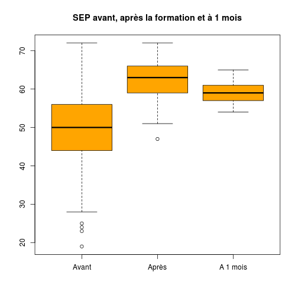

Données mémoire V.Brunstein
========================================================

Données originales
------------------

```r
date()
```

```
## [1] "Sat Apr 27 16:19:10 2013"
```

```r
getwd()
```

```
## [1] "/home/jcb/Documents/CESU/Travaux/Brunstein/Brunstein"
```


1. 2013-03-28:
2. 2013-03-30:
3. 2013-04-20: nouvelle série de données (total 36 cas)

Données transformées
--------------------
Les fichiers XLS sont enregistrés au format txt.csv sous le nom de *resultats.csv*. Un nouveau fichier remplace le fichier courant auquel on ajoute le suffixe *-n*, n allant de 1 à *x* de sorte que *resultats.csv* reste toujours le fichier actif.


```r
# cartudo: file<-'~/Bureau/Brunstein'
# file<-'~/Documents/CESU/Travaux/Brunstein-master' setwd(file)
library("HH")
```

```
## Loading required package: lattice
```

```
## Loading required package: grid
```

```
## Loading required package: multcomp
```

```
## Loading required package: mvtnorm
```

```
## Loading required package: survival
```

```
## Loading required package: splines
```

```
## Loading required package: leaps
```

```
## Loading required package: RColorBrewer
```

```
## Loading required package: latticeExtra
```

```
## Loading required package: reshape
```

```
## Loading required package: plyr
```

```
## Attaching package: 'reshape'
```

```
## The following object(s) are masked from 'package:plyr':
## 
## rename, round_any
```

```
## Loading required package: colorspace
```

```r
library("gplots")
```

```
## Loading required package: gtools
```

```
## Attaching package: 'gtools'
```

```
## The following object(s) are masked from 'package:HH':
## 
## logit
```

```
## Loading required package: gdata
```

```
## gdata: read.xls support for 'XLS' (Excel 97-2004) files ENABLED.
```

```
## ```

```
## gdata: read.xls support for 'XLSX' (Excel 2007+) files ENABLED.
```

```
## Attaching package: 'gdata'
```

```
## The following object(s) are masked from 'package:HH':
## 
## case
```

```
## The following object(s) are masked from 'package:stats':
## 
## nobs
```

```
## The following object(s) are masked from 'package:utils':
## 
## object.size
```

```
## Loading required package: caTools
```

```
## Loading required package: KernSmooth
```

```
## KernSmooth 2.23 loaded Copyright M. P. Wand 1997-2009
```

```
## Loading required package: MASS
```

```
## Attaching package: 'gplots'
```

```
## The following object(s) are masked from 'package:HH':
## 
## residplot
```

```
## The following object(s) are masked from 'package:stats':
## 
## lowess
```

```r
library(plyr)
```


Routines de l'université de Monash pour Likert:
source("~/Documents/Statistiques/Likert/monash/R/likert.R")

ATTENTION: pas compatible avec HH (même nom de fonction)
```

Chargement des donnnées:
------------------------

- na.strings="": permet de remplacer les cases vides par des NA
- strip.white = TRUE: élimine les blancs inutiles
- skip=1: la première ligne ne sert à rien
- colClasses="character": évite que F ne soit transformé en FALSE (sexe)

```r
data <- read.csv("resultats.csv", header = TRUE, sep = ",", na.strings = "", 
    strip.white = TRUE, skip = 1, colClasses = "character")
```

Meagling des données
--------------------
*! ATTENTION pb avec les caractères accentués sous windows*

```r
groupe <- as.factor(data$Groupe)
no <- as.integer(data$Numéro)
diplome <- as.factor(data$Diplôme)
date_diplome <- as.integer(2013 - as.integer(data$Date))
sexe <- as.factor(data$Sexe)
travail <- as.factor(data$Lieu.exercice)
exp_urg <- as.factor(data$experience.urgence.1...oui.2...non)
conf_urg <- as.factor(data$confronté.situation.jamais...1.rarement...2.parfois...3.souvent...4)
last_urg_n <- as.factor(data$de.quand.date.dernière.situation.d.urgence)
last_urg_t <- as.factor(data$de.quand.date.dernière.situation.d.urgence.1)
formation <- as.factor(data$formation.urgence)
date_formation <- as.factor(data$date.derniere.formation.urgence)
```

Nouvelle présentation
---------------------

```r
names(data)
```

```
##  [1] "X"                                                                  
##  [2] "Groupe"                                                             
##  [3] "date"                                                               
##  [4] "Numéro"                                                             
##  [5] "Diplôme"                                                            
##  [6] "Date"                                                               
##  [7] "Sexe"                                                               
##  [8] "Lieu.exercice"                                                      
##  [9] "experience.urgence.1...oui.2...non"                                 
## [10] "Date.debut"                                                         
## [11] "date.fin"                                                           
## [12] "confronté.situation.jamais...1.rarement...2.parfois...3.souvent...4"
## [13] "de.quand.date.dernière.situation.d.urgence"                         
## [14] "de.quand.date.dernière.situation.d.urgence.1"                       
## [15] "formation.urgence"                                                  
## [16] "date.derniere.formation.urgence"                                    
## [17] "date.derniere.formation.urgence.1"                                  
## [18] "A"                                                                  
## [19] "B"                                                                  
## [20] "C"                                                                  
## [21] "D"                                                                  
## [22] "E"                                                                  
## [23] "F"                                                                  
## [24] "G"                                                                  
## [25] "H"                                                                  
## [26] "I"                                                                  
## [27] "J"                                                                  
## [28] "K"                                                                  
## [29] "L"                                                                  
## [30] "M"                                                                  
## [31] "N"                                                                  
## [32] "Q1A"                                                                
## [33] "Q1B"                                                                
## [34] "Q2A"                                                                
## [35] "Q2B"                                                                
## [36] "Q3A"                                                                
## [37] "Q3B"                                                                
## [38] "Q4A"                                                                
## [39] "Q4B"                                                                
## [40] "Q5A"                                                                
## [41] "Q5B"                                                                
## [42] "Q6A"                                                                
## [43] "Q6B"                                                                
## [44] "Q7A"                                                                
## [45] "Q7B"                                                                
## [46] "Q8A"                                                                
## [47] "Q8B"                                                                
## [48] "Q9A"                                                                
## [49] "Q9B"                                                                
## [50] "Tel"
```


Historique des transformation.

Stat simples
------------

### Origine socio-professionnelle:

```r
summary(diplome)
```

```
##         AS        IDE       MERM        PPH SAGE FEMME 
##          8         25          1          1          1
```

```r
plot(diplome)
```

 

```r
ddply(data, .(diplome), "nrow")
```

```
##      diplome nrow
## 1         AS    8
## 2        IDE   25
## 3       MERM    1
## 4        PPH    1
## 5 SAGE FEMME    1
```


### Données pour Likert:

```r
x <- summary(as.factor(data$Q1A))
x
```

```
##    1    4    5    6    7 NA's 
##    1    3   14   10    7    1
```

```r
# likert(x)
```

Ca marche mais on obtient que 4 valeurs sur les 8 possibles et l'échelle de likert est faussée.
Voila ce qu'on devrait obtenir:

```r
a <- c(0, 0, 0, 2, 11, 6, 1, 0)
likert(a)
```

 

La question Q1 complète (avant/après):

```r
b <- summary(as.factor(data$Q1B))
b
```

```
##  6  7  8 
##  5 22  9
```

```r
Q1B <- c(0, 0, 0, 0, 0, 4, 11, 5)
a
```

```
## [1]  0  0  0  2 11  6  1  0
```

```r
Q1A <- a
c <- rbind(Q1A, Q1B)
likert(c, main = "Question Q1 (avant / après)")
```

 

```r

a <- as.integer(data$Q1A)
b <- as.integer(data$Q1B)

summary(a)
```

```
##    Min. 1st Qu.  Median    Mean 3rd Qu.    Max.    NA's 
##    1.00    5.00    5.00    5.49    6.00    7.00       1
```

```r
summary(b)
```

```
##    Min. 1st Qu.  Median    Mean 3rd Qu.    Max. 
##    6.00    7.00    7.00    7.11    7.25    8.00
```

```r

boxplot(a, b)
```

 

```r

# ma<-mean(summary(as.factor(data$Q1A)))
# mb<-mean(summary(as.factor(data$Q1B)))

t <- t.test(a, b)
t
```

```
## 
## 	Welch Two Sample t-test
## 
## data:  a and b 
## t = -7.147, df = 50.8, p-value = 3.252e-09
## alternative hypothesis: true difference in means is not equal to 0 
## 95 percent confidence interval:
##  -2.082 -1.169 
## sample estimates:
## mean of x mean of y 
##     5.486     7.111
```

```r
t[["statistic"]]
```

```
##      t 
## -7.147
```

```r
t[["parameter"]]
```

```
##   df 
## 50.8
```

```r
t[["p.value"]]
```

```
## [1] 3.252e-09
```

Ce qui peut s'écrire avec **sweave**:

Il n'y a pas de différence significative entre les moyennes des scores avant et après:
($t(\Sexpr{res[['parameter']]})=\Sexpr{round(res[['statistic']],3)}$,
$p \Sexpr{ifelse(res[['p.value']]<0.001,'< 0.001',
   paste('=',round(res[['p.value']],3)))}$)

Expansion des score de likert:
------------------------------
Le score de Likert pour une question varie de 1 à 8 mais tous les items ne sont pas renseignés. Par exemple pour la question Q1A on obtient le score suivant:

```r
summary(as.factor(data$Q1A))
```

```
##    1    4    5    6    7 NA's 
##    1    3   14   10    7    1
```

Ce qui fausse la représentation de l'échelle de Likert. Celle-ci est exacte avec la série:

```r
a <- c(0, 0, 0, 2, 11, 6, 1, 0)
```

Pour obtenir automatiquement une séquence complète, on peut appliquer l'algorithme suivant: pour chaque ligne de *data* on forme un vecteur z contenant huit 0. Puis on affecte 1 à la position correspondante à la valeur du score pour cette question à cette ligne. Par exemple la valeur de Q1A pour la première ligne est 6 => z[6]=1. Enfin on "colle" le vecteur z à la liste a. L'opération est répétée pour toutes les lignes.


```r
a <- lapply(1:nrow(data), function(x) {
    z <- 0
    z[1:8] <- 0
    z[as.integer(data$Q1A[x])] <- 1
    a <- rbind(z)
})
a <- do.call(rbind, a)
Q1A <- apply(a, 2, sum)

a <- lapply(1:nrow(data), function(x) {
    z <- 0
    z[1:8] <- 0
    z[as.integer(data$Q1B[x])] <- 1
    a <- rbind(z)
})
a <- do.call(rbind, a)
Q1B <- apply(a, 2, sum)

c <- rbind(Q1A, Q1B)
likert(c, main = "Question Q1 (avant / après)")
```

 

Application à la question 4
---------------------------

```r
a <- lapply(1:nrow(data), function(x) {
    z <- 0
    z[1:8] <- 0
    z[as.integer(data$Q4A[x])] <- 1
    a <- rbind(z)
})
a <- do.call(rbind, a)
Q4A <- apply(a, 2, sum)

a <- lapply(1:nrow(data), function(x) {
    z <- 0
    z[1:8] <- 0
    z[as.integer(data$Q4B[x])] <- 1
    a <- rbind(z)
})
a <- do.call(rbind, a)
Q4B <- apply(a, 2, sum)

c <- rbind(Q4A, Q4B)
likert(c, main = "Question Q4 (avant / après)", xlab = "'je pense que n'hésite pas à prendre des décisions en situation d'urgence'")
```

 


Application à la question 6
---------------------------

```r
a <- lapply(1:nrow(data), function(x) {
    z <- 0
    z[1:8] <- 0
    z[as.integer(data$Q6A[x])] <- 1
    a <- rbind(z)
})
a <- do.call(rbind, a)
Q6A <- apply(a, 2, sum)

a <- lapply(1:nrow(data), function(x) {
    z <- 0
    z[1:8] <- 0
    z[as.integer(data$Q6B[x])] <- 1
    a <- rbind(z)
})
a <- do.call(rbind, a)
Q6B <- apply(a, 2, sum)

c <- rbind(Q6A, Q6B)
likert(c, main = "Question Q6 (avant / après)", xlab = "'Même en situation d'urgence je préfère attendre un collègue'")
```

 

Calcul du SEP
-------------
Les questions avant/après vont de la colonne 32 à 49.

Il faut d'abord transformer les valeurs de character en numeric:

```r
for (i in 32:49) {
    data[, i] <- as.numeric(data[, i])
}
```

On crée une liste des question "avant":

```r
avant <- seq(from = 32, to = 49, by = 2)
```

On isole dans un dataframe les questions "avant":

```r
av <- data[, avant]
```

on calcule la somme de chaque ligne:

```r
a <- apply(av, 1, sum)
a
```

```
##  [1] 44 48 49 55 45 45 51 56 47 52 49 50 45 43 44 63 46 58 53 39 50 63 55
## [24] 56 58 47 57 40 23 58 NA 60 61 54 55 37
```

```r
summary(a)
```

```
##    Min. 1st Qu.  Median    Mean 3rd Qu.    Max.    NA's 
##    23.0    45.0    50.0    50.2    56.0    63.0       1
```

On fait la même opération pour après

```r
apres <- seq(from = 33, to = 49, by = 2)
ap <- data[, apres]
b <- apply(ap, 1, sum)
summary(b)
```

```
##    Min. 1st Qu.  Median    Mean 3rd Qu.    Max. 
##    51.0    58.0    61.0    61.2    64.0    72.0
```

Pour faciliter la compréhension on crée deux variables complémentaires, sepa (sep avant) et sepb (sep après):

```r
data$sepa <- a
data$sepb <- b
```

L'étude de la différence sepb - sepa montre que si le globalement le SEP augmente après la formation (moyenne de 11 points), il régresse pour certains (-4) et augmente massivement pour d'autres (+42):

```r
s <- summary(data$sepb - data$sepa)
h <- data$sepb - data$sepa
s
```

```
##    Min. 1st Qu.  Median    Mean 3rd Qu.    Max.    NA's 
##    -4.0     6.0    10.0    11.1    16.5    42.0       1
```

```r
h
```

```
##  [1] 14 16 15  6 18 12 14 11 19  8 10  6  6 13 17 -4  9  2  9 19 19 -1  0
## [24]  7  1 24  1 20 42  7 NA  4 11 -2  9 25
```

```r
hist(h, main = "Variation du SEP avant et après la formation", ylab = "Nombre", 
    xlab = "delta SEP", col = "lightblue")
abline(v = s[4], col = "blue")
```

 

Progression du SEP selon le groupe socio-professionnel:

```r
round(sort(tapply(data$sepb - data$sepa, diplome, mean, na.rm = TRUE)), 2)
```

```
##       MERM         AS        IDE SAGE FEMME        PPH 
##       7.00       7.29      10.76      18.00      42.00
```


Le score SEP (Sentiment d'efficacité personnelle) a progressé après la formation.

```r
boxplot(a, b, main = "SEP avant et après la formation")
```

 

Et cette évolution est très significative:

```r
t <- t.test(a, b)
t
```

```
## 
## 	Welch Two Sample t-test
## 
## data:  a and b 
## t = -6.843, df = 54.13, p-value = 7.339e-09
## alternative hypothesis: true difference in means is not equal to 0 
## 95 percent confidence interval:
##  -14.253  -7.794 
## sample estimates:
## mean of x mean of y 
##     50.17     61.19
```

### expérience professionnelle

```r
summary(exp_urg)
```

```
## non oui 
##  20  16
```

SEP moyen en fonction de l'expérience:

```r
tapply(a, exp_urg, mean, na.rm = TRUE)
```

```
##   non   oui 
## 47.58 53.25
```


Analyse de la question 4
------------------------
*Q: je pense que n'hésite pas à prendre des décisions en situation d'urgence*

```r
summary(data[, 38])
```

```
##    Min. 1st Qu.  Median    Mean 3rd Qu.    Max.    NA's 
##    1.00    5.00    6.00    5.46    6.00    8.00       1
```

```r
summary(data[, 39])
```

```
##    Min. 1st Qu.  Median    Mean 3rd Qu.    Max. 
##    6.00    6.75    7.00    7.00    7.25    8.00
```

Il y a une progression du groupe: après la formation, davantage d'apprenants se sentent capables de prendre une décision en situation d'urgence.

Analyse de la question 6
------------------------
*Q: Même en situation d'urgence je préfère attendre un collègue*

```r
summary(data[, 42])
```

```
##    Min. 1st Qu.  Median    Mean 3rd Qu.    Max.    NA's 
##    1.00    4.00    6.00    5.63    7.00    8.00       1
```

```r
summary(data[, 43])
```

```
##    Min. 1st Qu.  Median    Mean 3rd Qu.    Max. 
##    1.00    3.00    6.00    5.11    7.00    8.00
```

Après la formation, la position du groupe évolue peu bien que l'on note une une diminution de la moyenne, cad que les stagiaires en fin de formation attendront moins la validation de leur décision par une pair avant d'agir.

### SEP et fréquence des situations d'urgence

fréquence absolue et selon le lieu d'exercice:

```r
summary(conf_urg)
```

```
##   jamais  parfois rarement  souvent 
##        6       20        5        5
```

```r
table(travail, conf_urg)
```

```
##                     conf_urg
## travail              jamais parfois rarement souvent
##   Bloc                    0       1        0       0
##   bloc ophtalmo           0       1        0       0
##   centre                  0       1        0       0
##   centre du sommeil       1       0        0       0
##   chir orthopédique       1       0        0       0
##   chir pediatrique        0       0        1       0
##   CMCO                    0       1        0       0
##   EF cardio               0       1        0       0
##   EHPAD                   1       0        0       0
##   entreprise              0       3        0       0
##   GASTRO chir             0       0        1       0
##   GERIATRIE               0       1        0       0
##   HEMATO                  0       0        0       1
##   HEMODIALYSE             0       0        0       1
##   long sejour             1       0        0       0
##   MEDECINE                0       1        1       0
##   medecine nucléaire      0       0        1       0
##   NA                      0       2        0       0
##   NEPHRO                  0       1        0       0
##   oncologie               0       0        1       0
##   pharmacie               1       0        0       0
##   PNEUMO                  0       1        0       0
##   rea neurochir           0       0        0       1
##   SSPI                    0       1        0       0
##   STE BARBE               0       1        0       0
##   TRAUMATO                0       1        0       0
##   UAA                     0       0        0       1
##   URGENCES                0       1        0       1
##   USC                     0       1        0       0
```

Sep moyen et fréquence des situations d'urgence

```r
tapply(a, conf_urg, mean, na.rm = TRUE)
```

```
##   jamais  parfois rarement  souvent 
##    39.20    52.05    48.20    55.60
```

```r
x <- split(a, conf_urg)
boxplot(x, main = "SEP en fonction de la fréquence des situations d'urgence", 
    ylab = "SEP", col = "orange")
```

 

```r
x <- aov(a ~ conf_urg)
x
```

```
## Call:
##    aov(formula = a ~ conf_urg)
## 
## Terms:
##                 conf_urg Residuals
## Sum of Squares     839.2    1491.8
## Deg. of Freedom        3        31
## 
## Residual standard error: 6.937 
## Estimated effects may be unbalanced
## 1 observation deleted due to missingness
```

```r
summary(x)
```

```
##             Df Sum Sq Mean Sq F value Pr(>F)   
## conf_urg     3    839   279.7    5.81 0.0028 **
## Residuals   31   1492    48.1                  
## ---
## Signif. codes:  0 '***' 0.001 '**' 0.01 '*' 0.05 '.' 0.1 ' ' 1 
## 1 observation deleted due to missingness
```

```r
plotmeans(a ~ conf_urg, ylab = "SEP", xlab = "Confrontation aux situations d'urgence", 
    main = "SEP moyen et situations d'urgence", col = "red")
```

 

```r

TukeyHSD(x)
```

```
##   Tukey multiple comparisons of means
##     95% family-wise confidence level
## 
## Fit: aov(formula = a ~ conf_urg)
## 
## $conf_urg
##                   diff     lwr    upr  p adj
## parfois-jamais   12.85   3.436 22.264 0.0043
## rarement-jamais   9.00  -2.907 20.907 0.1916
## souvent-jamais   16.40   4.493 28.307 0.0040
## rarement-parfois -3.85 -13.264  5.564 0.6862
## souvent-parfois   3.55  -5.864 12.964 0.7371
## souvent-rarement  7.40  -4.507 19.307 0.3476
```

Plus la confrontation au situations d'urgence augmente et plus le SEP est élevé.

Différence significative pour *parfois-jamais*, *souvent-jamais*.

Profession et SEP
-----------------


```r
table(diplome, conf_urg)
```

```
##             conf_urg
## diplome      jamais parfois rarement souvent
##   AS              3       3        0       2
##   IDE             2      16        4       3
##   MERM            0       0        1       0
##   PPH             1       0        0       0
##   SAGE FEMME      0       1        0       0
```

SEP avant formation:

```r
tapply(a, diplome, mean, na.rm = TRUE)
```

```
##         AS        IDE       MERM        PPH SAGE FEMME 
##      51.00      50.92      58.00      23.00      45.00
```

SEP après formation:

```r
tapply(b, diplome, mean, na.rm = TRUE)
```

```
##         AS        IDE       MERM        PPH SAGE FEMME 
##      58.50      61.68      65.00      65.00      63.00
```

Le SEP avant formation est élevé pour les AS, IDE et MERM et particulièrement bas por les PPH. Après la formation, il augmente pour toutes les catégories mais la progression la plus spectaculaire est observée pour les PPH. Avant la formation, le SEP est significativement différent selon le métier:

```r
xa <- aov(a ~ diplome)
summary(xa)
```

```
##             Df Sum Sq Mean Sq F value Pr(>F)   
## diplome      4    845   211.3    4.27 0.0075 **
## Residuals   30   1486    49.5                  
## ---
## Signif. codes:  0 '***' 0.001 '**' 0.01 '*' 0.05 '.' 0.1 ' ' 1 
## 1 observation deleted due to missingness
```

```r
plotmeans(a ~ diplome, ylab = "SEP", xlab = "Diplome", main = "SEP moyen (avant) et métier", 
    col = "red")
```

```
## Warning: production de NaN
```

 

Après la formation, il n'y a plus de différence de SEP quelque soit le métier:

```r
xb <- aov(b ~ diplome)
summary(xb)
```

```
##             Df Sum Sq Mean Sq F value Pr(>F)
## diplome      4     96    24.1    1.06   0.39
## Residuals   31    705    22.8
```

```r
plotmeans(b ~ diplome, ylab = "SEP", xlab = "Diplome", main = "SEP moyen (après) et métier", 
    col = "red")
```

```
## Warning: production de NaN
```

 

Expérience réelle de l'urgence
------------------------------
Existe t'il un lien entre le SEP et le fait d'avoir été confronté à une situation d'urgence ? On utiise l'item *de.quand.date.dernière.situation.d.urgence*. L'information est donnée sur deux colonnes: la première est un chiffre, la seconde est l'unité de temps:

```r
summary(as.factor(data$de.quand.date.dernière.situation.d.urgence.1))
```

```
##      ans    jours     mois       NA semaines     NA's 
##       10        2       14        4        3        3
```

La plus petite unité de mesure étant le *jour* on transforme toutes des mesures en jours. Pour ce faire on crée une nouvelle colonne **data$sem**:

```r
data$sem[data$de.quand.date.dernière.situation.d.urgence.1 == NA] <- 0
data$sem[data$de.quand.date.dernière.situation.d.urgence.1 == "semaines"] <- 7
data$sem[data$de.quand.date.dernière.situation.d.urgence.1 == "mois"] <- 30
data$sem[data$de.quand.date.dernière.situation.d.urgence.1 == "jours"] <- 1
data$sem[data$de.quand.date.dernière.situation.d.urgence.1 == "ans"] <- 365
```

On obtient une nouvelle variable appelée **data$exp** en multipliant le vecteur data$sem par data$de.quand.date.dernière.situation.d.urgence (après transformation en vecteur numérique):

```r
data$exp <- data$sem * as.numeric(data$de.quand.date.dernière.situation.d.urgence)
```

```
## Warning: NAs introduits lors de la conversion automatique
```

```r
summary(data$exp)
```

```
##    Min. 1st Qu.  Median    Mean 3rd Qu.    Max.    NA's 
##       3      30     180     419     365    4020       7
```

Non répondant ou sans expérience:

```r
notexp <- sum(is.na(data$exp))
```

soit en pourcentage du total:

```r
round(notexp * 100/nrow(data), 2)
```

```
## [1] 19.44
```

Corrélation entre SEP et confrontation à situation d'urgence:

```r
fit <- lm(sepa ~ exp, data = data)
summary(fit)
```

```
## 
## Call:
## lm(formula = sepa ~ exp, data = data)
## 
## Residuals:
##     Min      1Q  Median      3Q     Max 
## -12.944  -4.994   0.006   5.072  11.070 
## 
## Coefficients:
##             Estimate Std. Error t value Pr(>|t|)    
## (Intercept) 5.19e+01   1.44e+00   36.05   <2e-16 ***
## exp         9.13e-05   1.67e-03    0.05     0.96    
## ---
## Signif. codes:  0 '***' 0.001 '**' 0.01 '*' 0.05 '.' 0.1 ' ' 1 
## 
## Residual standard error: 6.78 on 27 degrees of freedom
##   (7 observations deleted due to missingness)
## Multiple R-squared: 0.000111,	Adjusted R-squared: -0.0369 
## F-statistic: 0.003 on 1 and 27 DF,  p-value: 0.957
```


