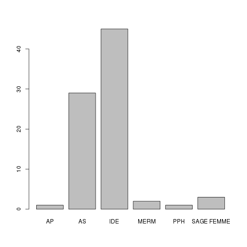

Données mémoire V.Brunstein
========================================================

Données originales
------------------

1. 2013-03-28:
2. 2013-03-30:

Données transformées
--------------------
Les fichiers XLS sont enregistrés au format txt.csv sous le nom de *resultats.csv*. Un nouveau fichier remplace le fichier courant auquel on ajoute le suffixe *-n*, n allant de 1 à *x* de sorte que *resultats.csv* reste toujours le fichier actif.


```r
# cartudo: file<-'~/Bureau/Brunstein'
file <- "~/Documents/CESU/Travaux/Brunstein"
setwd(file)
library("HH", lib.loc = "/home/jcb/R/x86_64-pc-linux-gnu-library/2.15")
```

```
## Loading required package: lattice
```

```
## Loading required package: grid
```

```
## Loading required package: multcomp
```

```
## Loading required package: mvtnorm
```

```
## Loading required package: survival
```

```
## Loading required package: splines
```

```
## Loading required package: leaps
```

```
## Loading required package: RColorBrewer
```

```
## Loading required package: latticeExtra
```

```
## Loading required package: reshape
```

```
## Loading required package: plyr
```

```
## Attaching package: 'reshape'
```

```
## The following object(s) are masked from 'package:plyr':
## 
## rename, round_any
```

```
## Loading required package: colorspace
```


Routines de l'université de Monash pour Likert:
source("../Doc Cartudo/Statistiques/LIKERT/Likert et R/monash/R/likert.R")

Chargement des donnnées:
------------------------

- na.strings="": permet de remplacer les cases vides par des NA
- strip.white = TRUE: élimine les blancs inutiles
- skip=1: la première ligne ne sert à rien
- colClasses="character": évite que F ne soit transformé en FALSE (sexe)

```r
data <- read.csv("resultats.csv", header = TRUE, sep = ",", na.strings = "", 
    strip.white = TRUE, skip = 1, colClasses = "character")
```

Meagling des données
--------------------

```r
groupe <- as.factor(data$Groupe)
no <- as.integer(data$Numéro)
diplome <- as.factor(data$Diplôme)
date_diplome <- as.integer(2013 - as.integer(data$Date))
sexe <- as.factor(data$Sexe)
travail <- as.factor(data$Lieu.exercice)
exp_urg <- as.factor(data$experience.urgence.1...oui.2...non)
conf_urg <- as.factor(data$confronté.situation.jamais...1.rarement...2.parfois...3.souvent...4)
last_urg_n <- as.factor(data$de.quand.date.dernière.situation.d.urgence)
last_urg_t <- as.factor(data$de.quand.date.dernière.situation.d.urgence.1)
formation <- as.factor(data$formation.urgence)
date_formation <- as.factor(data$date.derniere.formation.urgence)
```


Historique des transformation.

Stat simples
------------

### Origine socio-professionnelle:

```r
summary(diplome)
```

```
##         AS        IDE SAGE FEMME 
##          3         16          1
```

```r
plot(diplome)
```

 


Données pour Likert:

```r
x <- summary(as.factor(data$Q1A))
x
```

```
##  4  5  6  7 
##  2 11  6  1
```

```r
# likert(x)
```

Ca marche mais on obtient que 4 valeurs sur les 8 possibles et l'échelle de likert est faussée.
Voila ce qu'on devrait obtenir:

```r
a <- c(0, 0, 0, 2, 11, 6, 1, 0)
likert(a)
```

 

La question Q1 complète (avant/après):

```r
b <- summary(as.factor(data$Q1B))
b
```

```
##  6  7  8 
##  4 11  5
```

```r
Q1B <- c(0, 0, 0, 0, 0, 4, 11, 5)
a
```

```
## [1]  0  0  0  2 11  6  1  0
```

```r
Q1A <- a
c <- rbind(Q1A, Q1B)
likert(c, main = "Question Q1 (avant / après)")
```

 

```r

a <- as.integer(data$Q1A)
b <- as.integer(data$Q1B)

summary(a)
```

```
##    Min. 1st Qu.  Median    Mean 3rd Qu.    Max. 
##     4.0     5.0     5.0     5.3     6.0     7.0
```

```r
summary(b)
```

```
##    Min. 1st Qu.  Median    Mean 3rd Qu.    Max. 
##    6.00    7.00    7.00    7.05    7.25    8.00
```

```r

boxplot(a, b)
```

 

```r

# ma<-mean(summary(as.factor(data$Q1A)))
# mb<-mean(summary(as.factor(data$Q1B)))

t <- t.test(a, b)
t
```

```
## 
## 	Welch Two Sample t-test
## 
## data:  a and b 
## t = -7.795, df = 37.84, p-value = 2.181e-09
## alternative hypothesis: true difference in means is not equal to 0 
## 95 percent confidence interval:
##  -2.205 -1.295 
## sample estimates:
## mean of x mean of y 
##      5.30      7.05
```

```r
t[["statistic"]]
```

```
##      t 
## -7.796
```

```r
t[["parameter"]]
```

```
##    df 
## 37.84
```

```r
t[["p.value"]]
```

```
## [1] 2.181e-09
```

Ce qui peut s'écrire avec **sweave**:

Il n'y a pas de différence significative entre les moyennes des scores avant et après:
($t(\Sexpr{res[['parameter']]})=\Sexpr{round(res[['statistic']],3)}$,
$p \Sexpr{ifelse(res[['p.value']]<0.001,'< 0.001',
   paste('=',round(res[['p.value']],3)))}$)

Expansion des score de likert:
------------------------------
Le score de Likert pour une question varie de 1 à 8 mais tous les items ne sont pas renseignés. Par exemple pour la question Q1A on obtient le score suivant:

```r
summary(as.factor(data$Q1A))
```

```
##  4  5  6  7 
##  2 11  6  1
```

Ce qui fausse la représentation de l'échelle de Likert. Celle-ci est exacte avec la série:

```r
a <- c(0, 0, 0, 2, 11, 6, 1, 0)
```

Pour obtenir automatiquement une séquence complète, on peut appliquer l'algorithme suivant: pour chaque ligne de *data* on forme un vecteur z contenant huit 0. Puis on affecte 1 à la position correspondante à la valeur du score pour cette question à cette ligne. Par exemple la valeur de Q1A pour la première ligne est 6 => z[6]=1. Enfin on "colle" le vecteur z à la liste a. L'opération est répétée pour toutes les lignes.


```r
a <- lapply(1:nrow(data), function(x) {
    z <- 0
    z[1:8] <- 0
    z[as.integer(data$Q1A[x])] <- 1
    a <- rbind(z)
})
a <- do.call(rbind, a)
Q1A <- apply(a, 2, sum)

a <- lapply(1:nrow(data), function(x) {
    z <- 0
    z[1:8] <- 0
    z[as.integer(data$Q1B[x])] <- 1
    a <- rbind(z)
})
a <- do.call(rbind, a)
Q1B <- apply(a, 2, sum)

c <- rbind(Q1A, Q1B)
likert(c, main = "Question Q1 (avant / après)")
```

 


