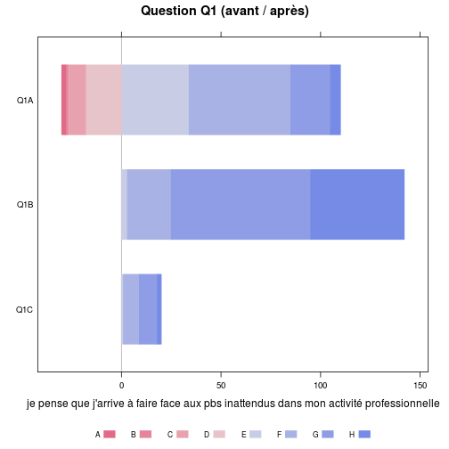
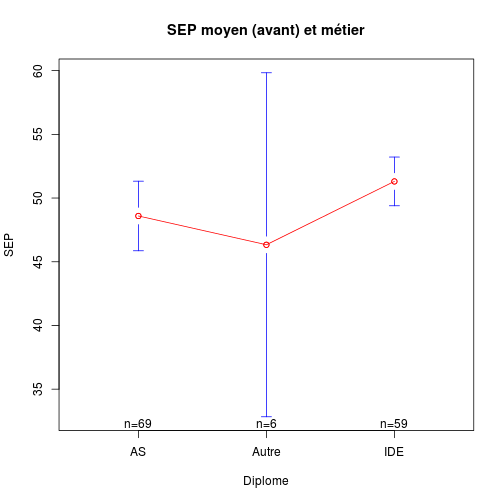
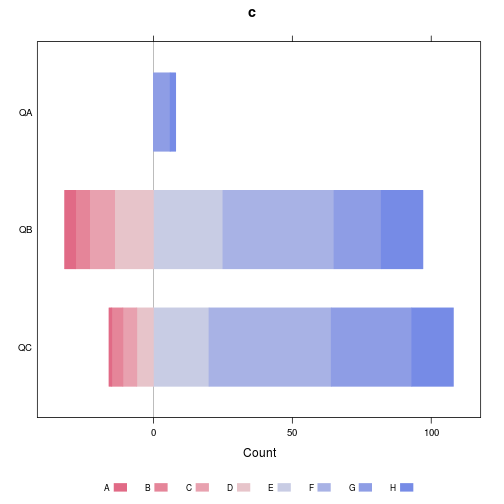

Données mémoire V.Brunstein
========================================================

Données originales
------------------
les données sont préparées par *Brunstein_prepare_data.Rmd*.

elles se récupère avec *load("Brunstein.Rdata")*.

```r
date()
```

```
## [1] "Sun Dec  8 11:35:24 2013"
```

```r
getwd()
```

```
## [1] "/home/jcb/Documents/CESU/Brunstein"
```


1. 2013-03-28:
2. 2013-03-30:
3. 2013-04-20: nouvelle série de données (total 36 cas)
4. 2013-05-15: résultats 3: 82 questionnaire. L'odre et le nom des colonnes a été totalement modifié => nécessite de reécrire la programme. Abandon du programme en cours et création de Brunstein2.
5. 2013-05-21 Brunstein2: ne fonctionne qu'avec les données issues de *résultats enquête vs 3.0.xlsx*

Données transformées
--------------------
Les fichiers XLS sont enregistrés au format txt.csv sous le nom de *resultats.csv*. Un nouveau fichier remplace le fichier courant auquel on ajoute le suffixe *-n*, n allant de 1 à *x* de sorte que *resultats.csv* reste toujours le fichier actif.


```r
# cartudo: file<-'~/Bureau/Brunstein'
# file<-'~/Documents/CESU/Travaux/Brunstein-master' setwd(file)
library("HH")
library("gplots")
library("plyr")
library("epicalc")
```


Routines de l'université de Monash pour Likert:
source("~/Documents/Statistiques/Likert/monash/R/likert.R")

ATTENTION: pas compatible avec HH (même nom de fonction)
```

Chargement des donnnées:
------------------------

```r
load("Brunstein.Rdata")
# correction d'une idiotie de la V4:
data[data == "6,5"] <- "6"
```


Nouvelle présentation
---------------------

```r
names(data)
```

```
##  [1] "Groupe"                     "Numéro"                    
##  [3] "B"                          "C"                         
##  [5] "situation.depuis.formation" "A.après.formation"         
##  [7] "B.après.formation"          "C.après.formation"         
##  [9] "D"                          "E"                         
## [11] "F"                          "G"                         
## [13] "H"                          "I"                         
## [15] "J"                          "K"                         
## [17] "L"                          "M"                         
## [19] "N"                          "Q1A"                       
## [21] "Q1B"                        "Q1C"                       
## [23] "Q2A"                        "Q2B"                       
## [25] "Q2C"                        "Q3A"                       
## [27] "Q3B"                        "Q3C"                       
## [29] "Q4A"                        "Q4B"                       
## [31] "Q4C"                        "Q5A"                       
## [33] "Q5B"                        "Q5C"                       
## [35] "Q6A"                        "Q6B"                       
## [37] "Q6C"                        "Q7A"                       
## [39] "Q7B"                        "Q7C"                       
## [41] "Q8A"                        "Q8B"                       
## [43] "Q8C"                        "Q9A"                       
## [45] "Q9B"                        "Q9C"                       
## [47] "Tel"                        "groupe"                    
## [49] "no"                         "diplome"                   
## [51] "date_diplome"               "sexe"                      
## [53] "travail"                    "exp_urg"                   
## [55] "conf_urg"                   "last_urg_n"                
## [57] "last_urg_t"                 "formation"                 
## [59] "date_formation"
```


Historique des transformation.

Stat simples
------------

### Origine socio-professionnelle:

```r
summary(data$diplome)
```

```
##    AS Autre   IDE 
##    78     6    60
```

```r
plot(data$diplome)
```

 

```r
ddply(data, .(data$diplome), "nrow")
```

```
##   data$diplome nrow
## 1           AS   78
## 2        Autre    6
## 3          IDE   60
```


### Données pour Likert:

```r
x <- summary(as.factor(data$Q1A))
x
```

```
##    1    2    3    4    5    6    7    8   NA NA's 
##    2    1    9   18   34   51   20    5    3    1
```

```r
# likert(x)
```

Ca marche mais on obtient que 4 valeurs sur les 8 possibles et l'échelle de likert est faussée.
Voila ce qu'on devrait obtenir:

```r
a <- c(0, 0, 0, 2, 11, 6, 1, 0)
likert(a)
```

 

La question Q1 complète (avant/après):

```r
b <- summary(as.factor(data$Q1B))
b
```

```
##    5    6    7    8 NA's 
##    3   22   70   47    2
```

```r
Q1B <- c(0, 0, 0, 0, 0, 4, 11, 5)
a
```

```
## [1]  0  0  0  2 11  6  1  0
```

```r
Q1A <- a
c <- rbind(Q1A, Q1B)
likert(c, main = "Question Q1 (avant / après)")
```

 

```r

a <- as.integer(data$Q1A)
```

```
## Warning: NAs introduits lors de la conversion automatique
```

```r
b <- as.integer(data$Q1B)

summary(a)
```

```
##    Min. 1st Qu.  Median    Mean 3rd Qu.    Max.    NA's 
##    1.00    5.00    6.00    5.42    6.00    8.00       4
```

```r
summary(b)
```

```
##    Min. 1st Qu.  Median    Mean 3rd Qu.    Max.    NA's 
##    5.00    7.00    7.00    7.13    8.00    8.00       2
```

```r

boxplot(a, b)
```

 

```r

# ma<-mean(summary(as.factor(data$Q1A)))
# mb<-mean(summary(as.factor(data$Q1B)))

t <- t.test(a, b, paired = TRUE)
t
```

```
## 
## 	Paired t-test
## 
## data:  a and b
## t = -14.41, df = 137, p-value < 2.2e-16
## alternative hypothesis: true difference in means is not equal to 0
## 95 percent confidence interval:
##  -1.945 -1.475
## sample estimates:
## mean of the differences 
##                   -1.71
```

```r
t[["statistic"]]
```

```
##      t 
## -14.41
```

```r
t[["parameter"]]
```

```
##  df 
## 137
```

```r
t[["p.value"]]
```

```
## [1] 3.195e-29
```

Ce qui peut s'écrire avec **sweave**:

Il n'y a pas de différence significative entre les moyennes des scores avant et après:
($t(\Sexpr{res[['parameter']]})=\Sexpr{round(res[['statistic']],3)}$,
$p \Sexpr{ifelse(res[['p.value']]<0.001,'< 0.001',
   paste('=',round(res[['p.value']],3)))}$)

Expansion des score de likert:
------------------------------
Le score de Likert pour une question varie de 1 à 8 mais tous les items ne sont pas renseignés. Par exemple pour la question Q1A on obtient le score suivant:

```r
summary(as.factor(data$Q1A))
```

```
##    1    2    3    4    5    6    7    8   NA NA's 
##    2    1    9   18   34   51   20    5    3    1
```

Ce qui fausse la représentation de l'échelle de Likert. Celle-ci est exacte avec la série:

```r
a <- c(0, 0, 0, 2, 11, 6, 1, 0)
```

Pour obtenir automatiquement une séquence complète, on peut appliquer l'algorithme suivant: pour chaque ligne de *data* on forme un vecteur z contenant huit 0. Puis on affecte 1 à la position correspondante à la valeur du score pour cette question à cette ligne. Par exemple la valeur de Q1A pour la première ligne est 6 => z[6]=1. Enfin on "colle" le vecteur z à la liste a. L'opération est répétée pour toutes les lignes.


```r
a <- lapply(1:nrow(data), function(x) {
    z <- 0
    z[1:8] <- 0
    z[as.integer(data$Q1A[x])] <- 1
    a <- rbind(z)
})
```

```
## Warning: NAs introduits lors de la conversion automatique
## Warning: NAs introduits lors de la conversion automatique
## Warning: NAs introduits lors de la conversion automatique
```

```r
a <- do.call(rbind, a)
Q1A <- apply(a, 2, sum)

a <- lapply(1:nrow(data), function(x) {
    z <- 0
    z[1:8] <- 0
    z[as.integer(data$Q1B[x])] <- 1
    a <- rbind(z)
})
a <- do.call(rbind, a)
Q1B <- apply(a, 2, sum)

c <- rbind(Q1A, Q1B)
likert(c, main = "Question Q1 (avant / après)")
```

 

Application à la question 4
---------------------------

```r
a <- lapply(1:nrow(data), function(x) {
    z <- 0
    z[1:8] <- 0
    z[as.integer(data$Q4A[x])] <- 1
    a <- rbind(z)
})
```

```
## Warning: NAs introduits lors de la conversion automatique
```

```r
a <- do.call(rbind, a)
Q4A <- apply(a, 2, sum)

a <- lapply(1:nrow(data), function(x) {
    z <- 0
    z[1:8] <- 0
    z[as.integer(data$Q4B[x])] <- 1
    a <- rbind(z)
})
a <- do.call(rbind, a)
Q4B <- apply(a, 2, sum)

a <- lapply(1:nrow(data), function(x) {
    z <- 0
    z[1:8] <- 0
    z[as.integer(data$Q4C[x])] <- 1
    a <- rbind(z)
})
a <- do.call(rbind, a)
Q4C <- apply(a, 2, sum)

c <- rbind(Q4A, Q4B, Q4C)
likert(c, main = "Question Q4 (avant / après)", xlab = "'je pense que n'hésite pas à prendre des décisions en situation d'urgence'")
```

 


Application à la question 6
---------------------------

```r
a <- lapply(1:nrow(data), function(x) {
    z <- 0
    z[1:8] <- 0
    z[as.integer(data$Q6A[x])] <- 1
    a <- rbind(z)
})
```

```
## Warning: NAs introduits lors de la conversion automatique
```

```r
a <- do.call(rbind, a)
Q6A <- apply(a, 2, sum)

a <- lapply(1:nrow(data), function(x) {
    z <- 0
    z[1:8] <- 0
    z[as.integer(data$Q6B[x])] <- 1
    a <- rbind(z)
})
a <- do.call(rbind, a)
Q6B <- apply(a, 2, sum)

a <- lapply(1:nrow(data), function(x) {
    z <- 0
    z[1:8] <- 0
    z[as.integer(data$Q6C[x])] <- 1
    a <- rbind(z)
})
```

```
## Warning: NAs introduits lors de la conversion automatique
```

```r
a <- do.call(rbind, a)
Q6C <- apply(a, 2, sum)

c <- rbind(Q6A, Q6B, Q6C)
likert(c, main = "Question Q6 (avant / après)", xlab = "'Même en situation d'urgence je préfère attendre un collègue'")
```

 


Application à la question 1
---------------------------

```r
a <- lapply(1:nrow(data), function(x) {
    z <- 0
    z[1:8] <- 0
    z[as.integer(data$Q1A[x])] <- 1
    a <- rbind(z)
})
```

```
## Warning: NAs introduits lors de la conversion automatique
## Warning: NAs introduits lors de la conversion automatique
## Warning: NAs introduits lors de la conversion automatique
```

```r
a <- do.call(rbind, a)
Q1A <- apply(a, 2, sum)

a <- lapply(1:nrow(data), function(x) {
    z <- 0
    z[1:8] <- 0
    z[as.integer(data$Q1B[x])] <- 1
    a <- rbind(z)
})
a <- do.call(rbind, a)
Q1B <- apply(a, 2, sum)

a <- lapply(1:nrow(data), function(x) {
    z <- 0
    z[1:8] <- 0
    z[as.integer(data$Q1C[x])] <- 1
    a <- rbind(z)
})
a <- do.call(rbind, a)
Q1C <- apply(a, 2, sum)

c <- rbind(Q1A, Q1B, Q1C)
likert(c, main = "Question Q1 (avant / après)", xlab = "je pense que j'arrive à faire face aux pbs inattendus dans mon activité professionnelle")
```

 


Calcul du SEP
-------------
Les questions avant/après vont de la colonne 21 à 47. Dans la version 3, il y a 3 colonnes par question: A, B, C.

Il faut d'abord transformer les valeurs de character en numeric:

```r
debut <- 20
fin <- 46
step <- 3
names(data[debut:fin])
```

```
##  [1] "Q1A" "Q1B" "Q1C" "Q2A" "Q2B" "Q2C" "Q3A" "Q3B" "Q3C" "Q4A" "Q4B"
## [12] "Q4C" "Q5A" "Q5B" "Q5C" "Q6A" "Q6B" "Q6C" "Q7A" "Q7B" "Q7C" "Q8A"
## [23] "Q8B" "Q8C" "Q9A" "Q9B" "Q9C"
```

```r

for (i in debut:fin) {
    data[, i] <- as.numeric(data[, i])
}
```

On crée une liste des question "avant":

```r
avant <- seq(from = debut, to = fin, by = step)
```

On isole dans un dataframe les questions "avant":

```r
av <- data[, avant]
```

on calcule la somme de chaque ligne:

```r
a <- apply(av, 1, sum)
a
```

```
##   [1] 44 48 49 55 45 45 51 56 47 52 49 50 45 43 44 63 46 58 53 39 50 63 55
##  [24] 56 58 47 57 40 23 58 NA 60 61 54 55 37 50 58 51 49 44 44 55 63 62 72
##  [47] 71 40 28 54 47 58 NA 19 60 65 43 52 47 49 51 43 51 43 50 58 56 39 52
##  [70] 54 54 46 NA 49 NA 50 44 64 55 36 47 62 56 41 60 48 46 NA 48 24 53 72
##  [93] 46 28 41 58 44 33 60 34 41 57 25 44 30 55 56 57 54 59 65 53 52 55 67
## [116] 40 53 46 38 54 61 43 47 48 52 43 NA 36 NA 32 NA 44 48 68 38 51 50 50
## [139] 56 NA 56 48 NA 53
```

```r
summary(a)
```

```
##    Min. 1st Qu.  Median    Mean 3rd Qu.    Max.    NA's 
##    19.0    44.0    50.0    49.7    56.0    72.0      10
```

On fait la même opération pour après

```r
apres <- seq(from = debut + 1, to = fin, by = step)
ap <- data[, apres]
b <- apply(ap, 1, sum)
summary(b)
```

```
##    Min. 1st Qu.  Median    Mean 3rd Qu.    Max.    NA's 
##    47.0    59.0    63.0    62.3    66.0    72.0       3
```


SEP à 1 mois

```r
unMois <- seq(from = debut + 2, to = fin, by = step)
ap_1mois <- data[, unMois]
c <- apply(ap_1mois, 1, sum)
summary(c)
```

```
##    Min. 1st Qu.  Median    Mean 3rd Qu.    Max.    NA's 
##    54.0    57.0    59.0    59.3    61.0    65.0     125
```


Pour faciliter la compréhension on crée deux variables complémentaires, sepa (sep avant) et sepb (sep après):

```r
data$sepa <- a
data$sepb <- b
data$sepc <- c

sav <- summary(data$sepa)
hist(data$sepa, main = "SEP avant la formation", ylab = "Nombre", xlab = "SEP", 
    col = "lightblue")
abline(v = sav[4], col = "blue")
```

 

```r

sap <- summary(data$sepb)
hist(data$sepb, main = "SEP après la formation", ylab = "Nombre", xlab = "SEP", 
    col = "lightblue")
abline(v = sap[4], col = "blue")
```

 

```r

s1mois <- summary(data$sepc)
hist(data$sepc, main = "SEP à 1 mois", ylab = "Nombre", xlab = "SEP", col = "lightblue")
abline(v = s1mois[4], col = "blue")
```

 

L'étude de la différence sepb - sepa montre que si le globalement le SEP augmente après la formation (moyenne de 11 points), il régresse pour certains (-4) et augmente massivement pour d'autres (+42):

```r
s <- summary(data$sepb - data$sepa)
h <- data$sepb - data$sepa
s
```

```
##    Min. 1st Qu.  Median    Mean 3rd Qu.    Max.    NA's 
##    -8.0     7.0    13.0    12.5    18.0    42.0      13
```

```r
h
```

```
##   [1] 14 16 15  6 18 12 14 11 19  8 10  6  6 13 17 -4  9  2  9 19 19 -1  0
##  [24]  7  1 24  1 20 42  7 NA  4 11 -2  9 25  6  8 16 16 16 17  5  1  5 -3
##  [47] -2 16 29  2 12  6 NA 35 -1 -3 16 10 20 18 12 14  9 12 18  9 13 29 18
##  [70]  7  9 24 NA  9 NA  7 11  2  7 27 17  5 13 NA  0  9 18 NA 10 31  9 -8
##  [93] 20 26 17  3 19 31  1 29 23 11 31 20 25  9  9  9 15  6 -6 NA 15 14 -1
## [116] 23 14 14 16 14  8 16 18 11 14 21 NA 23 NA 23 NA 15 16 -5 19  9 19 NA
## [139]  6 NA 16 18 NA 14
```

```r
hist(h, main = "Variation du SEP avant et après la formation", ylab = "Nombre", 
    xlab = "delta SEP", col = "lightblue")
abline(v = s[4], col = "blue")
```

 

Progression du SEP selon le groupe socio-professionnel:

```r
round(sort(tapply(data$sepb - data$sepa, data$diplome, mean, na.rm = TRUE)), 
    2)
```

```
##   IDE    AS Autre 
## 11.29 13.40 14.67
```


Le score SEP (Sentiment d'efficacité personnelle) a progressé après la formation.

```r
boxplot(data$sepa, data$sepb, data$sepc, main = "SEP avant, après la formation et à 1 mois", 
    col = "orange", names = c("Avant", "Après", "A 1 mois"))
```

 

Et cette évolution est très significative:

```r
t <- t.test(data$sepa, data$sepb, paired = TRUE)
t
```

```
## 
## 	Paired t-test
## 
## data:  data$sepa and data$sepb
## t = -15.85, df = 130, p-value < 2.2e-16
## alternative hypothesis: true difference in means is not equal to 0
## 95 percent confidence interval:
##  -14.09 -10.96
## sample estimates:
## mean of the differences 
##                  -12.53
```

A ce stade, *data* compte 3 colonnes supplémentaires 
- sepa = sep avant formation
- sepb = après
- sepc = à 1 mois  
Les 3 sont-ils différents ?  
On effectuue une analyse de la variance entre ces 3 colonnes. Pour celà il est nécessaire de formater les données pour l'Anova qui attend une matrice de 2 colonnes, une colonne de valeur et une colonne de groupes. On va utiliser le package *reshape* pour cela.

Etapes:
- on crée un data frame **g** constitué par la colonne *Numéro* qui servira d'identifiant, et des colonnes *sepa*, *sepb* et *sepc* qui formeront les colonne des *valeurs* et des *groupe*.
- puis on crée la matrice **md** avec la méthode *melt* de *reshape*
- enfin on procède à l'Anova avec la méthode *aov*


```r
library("reshape")
library("gplots")
g <- data[, c(2, 60:62)]
head(g)
```

```
##   Numéro sepa sepb sepc
## 1      2   44   58   54
## 2      3   48   64   56
## 3      4   49   64   57
## 4      5   55   61   60
## 5      7   45   63   NA
## 6      8   45   57   59
```

```r
md <- melt(g, id = "Numéro")
head(md)
```

```
##   Numéro variable value
## 1      2     sepa    44
## 2      3     sepa    48
## 3      4     sepa    49
## 4      5     sepa    55
## 5      7     sepa    45
## 6      8     sepa    45
```

```r
a <- aov(value ~ variable, data = md)
a
```

```
## Call:
##    aov(formula = value ~ variable, data = md)
## 
## Terms:
##                 variable Residuals
## Sum of Squares     11087     16488
## Deg. of Freedom        2       291
## 
## Residual standard error: 7.527
## Estimated effects may be unbalanced
## 138 observations deleted due to missingness
```

```r
summary(a)
```

```
##              Df Sum Sq Mean Sq F value Pr(>F)    
## variable      2  11087    5544    97.8 <2e-16 ***
## Residuals   291  16488      57                   
## ---
## Signif. codes:  0 '***' 0.001 '**' 0.01 '*' 0.05 '.' 0.1 ' ' 1
## 138 observations deleted due to missingness
```

```r
plotmeans(md$value ~ md$variable, xlab = "groupes 'avant', 'après' et 'à 1 mois'", 
    ylab = "SEP moyen", main = "Graphique des SEP moyens\navec l'intervalle de confiance à 95%")
```

 

```r

# si la fonction Tuckey ne fonctionne pas, désactiver la librairie HH
# (detach('package:HH'))
print(TukeyHSD(a))
```

```
##   Tukey multiple comparisons of means
##     95% family-wise confidence level
## 
## Fit: aov(formula = value ~ variable, data = md)
## 
## $variable
##             diff    lwr    upr  p adj
## sepb-sepa 12.604 10.465 14.744 0.0000
## sepc-sepa  9.577  5.230 13.924 0.0000
## sepc-sepb -3.028 -7.361  1.306 0.2282
```

```r
plot(TukeyHSD(a), col = "blue")
```

 

```r
# title(xlab='Différences entre le niveau moyen du SEP', main = 'Intervalle
# de confiance à 95%')
```

La différence entre les trois groupes est fortement signigicative (i.e. au moins une moyenne diffère fortement des autres). Le test de Tuckey permet d'identifier les différences:
- le sep après formation (sepb) est nettement supérieur au SEP avant formation (sepa) 
- le sep à 1 mois (sepc) est nettement supérieur au SEP avant formation (sepa)
- il n'y a pas de différence statistiquement significative entre les sepb et sepc, ce qui peut s'interpréter de 2 façons: 
  - version optimiste: le bénéfice de la formation est conservé après 1 mois à un niveau qui n'est pas différent de celui observé juste après la formation.
  - version prudente: l'effectif à 1 mois est insuffisant pour montrer une différence entre sepb et sepc. 
- SEP moyen à 3 mois (n = 7 personnes, 5 IDE, 2 AS): 54.85. Il reste supérieur au SEP avant mais la taille de l'effectif rend toute interprétation illusoire.

Groupe des AS
-------------
On forme une population d'AS constituée par les groupes 8,11,13,14,15

```r
as <- data[data$Groupe %in% c(8, 11, 13:15), ]
for (i in debut:fin) {
    as[, i] <- as.numeric(as[, i])
}
```

on mesure le SEP avant, après et a 1 mois:


```r

avant <- seq(from = debut, to = fin, by = step)
av <- as[, avant]
a <- apply(av, 1, sum)
summary(a)
```

```
##    Min. 1st Qu.  Median    Mean 3rd Qu.    Max.    NA's 
##    25.0    42.5    48.0    47.2    54.0    68.0       7
```

```r

apres <- seq(from = debut + 1, to = fin, by = step)
ap <- as[, apres]
b <- apply(ap, 1, sum)
summary(b)
```

```
##    Min. 1st Qu.  Median    Mean 3rd Qu.    Max.    NA's 
##    54.0    59.0    63.0    62.8    66.0    72.0       1
```

```r

unMois <- seq(from = debut + 2, to = fin, by = step)
ap_1mois <- as[, unMois]
c <- apply(ap_1mois, 1, sum)
summary(c)
```

```
##    Min. 1st Qu.  Median    Mean 3rd Qu.    Max.    NA's 
##      NA      NA      NA     NaN      NA      NA      47
```

```r

as$asa <- a
as$asb <- b
as$asc <- c

asav <- summary(as$asa)
hist(as$asa, main = "SEP des AS avant la formation", ylab = "Nombre", xlab = "SEP", 
    col = "pink")
abline(v = asav[4], col = "blue")
```

 

```r

asap <- summary(as$asb)
hist(as$asb, main = "SEP des AS après la formation", ylab = "Nombre", xlab = "SEP", 
    col = "pink")
abline(v = asap[4], col = "blue")
```

 

```r

boxplot(as$asa, as$asb, main = "AS - SEP avant et après la formation", col = "pink", 
    names = c("Avant", "Après"))
```

 

Le SEP des AS progresse en moyenne de 15.6 points entre le début et la fin de la formation.

Résumé:
- [AS] SEP moyen avant formation: 47.2
- [AS] SEP moyen après formation: 62.8
- SEP moyen à 3 mois (n = 7 personnes, 5 IDE, 2 AS): 54,8571428571


### expérience professionnelle

```r
summary(data$exp_urg)
```

```
## non oui 
##  99  45
```

SEP moyen en fonction de l'expérience:

```r
t <- tapply(data$sepa, data$exp_urg, mean, na.rm = TRUE)
t.test(data$sepa[data$exp_urg == "oui"], data$sepa[data$exp_urg == "non"])
```

```
## 
## 	Welch Two Sample t-test
## 
## data:  data$sepa[data$exp_urg == "oui"] and data$sepa[data$exp_urg == "non"]
## t = 4.139, df = 96.73, p-value = 7.455e-05
## alternative hypothesis: true difference in means is not equal to 0
## 95 percent confidence interval:
##   3.554 10.103
## sample estimates:
## mean of x mean of y 
##     54.27     47.44
```

Le SEP est significativement plus élevé dans le groupe avec expérience professionnelle.


Analyse de la question 4
------------------------
*Q: je pense que n'hésite pas à prendre des décisions en situation d'urgence*

```r
summary(data[, 30])
```

```
##    Min. 1st Qu.  Median    Mean 3rd Qu.    Max.    NA's 
##    5.00    7.00    7.00    7.01    8.00    8.00       2
```

```r
summary(data[, 31])
```

```
##    Min. 1st Qu.  Median    Mean 3rd Qu.    Max.    NA's 
##    6.00    7.00    7.00    6.95    7.00    8.00     124
```

```r
summary(data[, 32])
```

```
##    Min. 1st Qu.  Median    Mean 3rd Qu.    Max.    NA's 
##    1.00    4.00    5.00    5.16    6.00    8.00       4
```

Il y a une progression du groupe: après la formation, davantage d'apprenants se sentent capables de prendre une décision en situation d'urgence.

Analyse de la question 5
------------------------

```r
summary(data[, 33])
```

```
##    Min. 1st Qu.  Median    Mean 3rd Qu.    Max.    NA's 
##    5.00    6.00    7.00    6.72    7.00    8.00       2
```

```r
summary(data[, 34])
```

```
##    Min. 1st Qu.  Median    Mean 3rd Qu.    Max.    NA's 
##     5.0     6.0     6.0     6.4     7.0     7.0     124
```

```r
summary(data[, 35])
```

```
##    Min. 1st Qu.  Median    Mean 3rd Qu.    Max.    NA's 
##    1.00    5.00    6.00    5.56    7.00    8.00       3
```


Analyse de la question 6
------------------------
*Q: Même en situation d'urgence je préfère attendre un collègue*

```r
summary(data[, 36])
```

```
##    Min. 1st Qu.  Median    Mean 3rd Qu.    Max.    NA's 
##    1.00    5.25    7.00    6.07    7.00    8.00       2
```

```r
summary(data[, 37])
```

```
##    Min. 1st Qu.  Median    Mean 3rd Qu.    Max.    NA's 
##    1.00    4.00    6.00    5.11    7.00    8.00     125
```

```r
summary(data[, 38])
```

```
##    Min. 1st Qu.  Median    Mean 3rd Qu.    Max.    NA's 
##    1.00    4.00    5.00    5.04    6.00    8.00       5
```

Après la formation, la position du groupe évolue peu bien que l'on note une une diminution de la moyenne, cad que les stagiaires en fin de formation attendront moins la validation de leur décision par une pair avant d'agir.

### SEP et fréquence des situations d'urgence

fréquence absolue et selon le lieu d'exercice:

```r
summary(data$conf_urg)
```

```
##   jamais  parfois rarement  souvent 
##       21       55       39       29
```

```r
table(data$travail, data$conf_urg)
```

```
##                        
##                         jamais parfois rarement souvent
##   6411                       0       1        0       0
##   7166                       0       0        1       0
##   Bloc                       0       1        0       0
##   bloc ophtalmo              0       1        0       0
##   CARDIO                     0       0        0       1
##   centre                     0       1        0       0
##   centre du sommeil          1       0        0       0
##   CHIR DIGESTIVE             0       1        0       0
##   chir orthopédique          1       0        0       0
##   chir pediatrique           0       0        1       0
##   chirurgie                  1       0        2       0
##   Chirurgie                  0       0        1       0
##   CHIRURGIE                  1       0        0       0
##   chirurgie digestive        0       0        1       0
##   chirurgie générale         0       1        0       0
##   CHIRURGIE PEDIATRIQUE      0       1        1       0
##   CHIRURGIE RACHIS           0       0        1       0
##   Chirurgie thoracique       0       0        1       1
##   CIC                        0       2        0       1
##   CMCO                       0       2        0       0
##   EF cardio                  0       1        0       0
##   EHPAD                      2       2        0       3
##   entreprise                 0       3        0       0
##   EPMSA                      1       1        0       0
##   GASTRO chir                0       0        1       0
##   GERIATRIE                  0       2        1       1
##   gériatrie                  0       0        1       0
##   geronto psy                0       0        1       0
##   gyneco                     2       1        3       1
##   HEMODIALYSE                0       0        0       1
##   HPP SMPR                   0       1        0       0
##   IME                        0       0        2       0
##   long sejour                1       0        1       0
##   maternité                  2       0        1       0
##   medecine                   0       2        1       0
##   MEDECINE                   0       3        4       1
##   médecine                   1       1        0       1
##   MEDECINE INTERNE           0       0        0       1
##   medecine nucléaire         0       0        1       0
##   MIRNED                     0       0        1       0
##   NA                         0       5        1       0
##   NEPHRO                     0       2        0       0
##   neurologie                 0       1        0       0
##   NHC                        0       1        0       0
##   obstetrique                3       0        3       0
##   oncologie                  1       0        2       0
##   OPHTALMO                   0       1        0       0
##   ORL                        0       1        0       1
##   PEDIATRIE                  1       0        0       1
##   pharmacie                  1       0        0       0
##   PNEUMO                     0       4        1       0
##   POOL MCO                   0       1        0       0
##   radio                      0       1        0       0
##   REA                        0       0        0       1
##   rea neurochir              0       0        0       1
##   REANIMA                    0       0        0       1
##   SC PNEUMO                  0       0        0       1
##   senologie                  0       0        0       1
##   SI HEMATO                  0       0        0       1
##   SSPI                       0       1        0       1
##   ste anne                   0       1        0       0
##   STE BARBE                  0       2        0       0
##   STRASBOURG                 0       0        1       0
##   TRAUMATO                   0       2        0       0
##   UAA                        0       0        0       1
##   UCC                        1       0        0       0
##   URGENCES                   0       2        0       6
##   UROLOGIE                   0       0        1       0
##   USC                        0       1        0       1
##   villa bretonnex            0       0        1       0
```

Sep moyen et fréquence des situations d'urgence

```r
tapply(data$sepa, data$conf_urg, mean, na.rm = TRUE)
```

```
##   jamais  parfois rarement  souvent 
##    39.83    49.92    48.59    56.66
```

```r
x <- split(data$sepa, data$conf_urg)
boxplot(x, main = "SEP en fonction de la fréquence des situations d'urgence", 
    ylab = "SEP", col = "orange")
```

 

```r
x <- aov(data$sepa ~ data$conf_urg)
x
```

```
## Call:
##    aov(formula = data$sepa ~ data$conf_urg)
## 
## Terms:
##                 data$conf_urg Residuals
## Sum of Squares           3200      9843
## Deg. of Freedom             3       130
## 
## Residual standard error: 8.701
## Estimated effects may be unbalanced
## 10 observations deleted due to missingness
```

```r
summary(x)
```

```
##                Df Sum Sq Mean Sq F value  Pr(>F)    
## data$conf_urg   3   3200    1067    14.1 5.2e-08 ***
## Residuals     130   9843      76                    
## ---
## Signif. codes:  0 '***' 0.001 '**' 0.01 '*' 0.05 '.' 0.1 ' ' 1
## 10 observations deleted due to missingness
```

```r
plotmeans(data$sepa ~ data$conf_urg, ylab = "SEP", xlab = "Confrontation aux situations d'urgence", 
    main = "SEP moyen et situations d'urgence", col = "red")
```

 

```r

TukeyHSD(x)
```

```
##   Tukey multiple comparisons of means
##     95% family-wise confidence level
## 
## Fit: aov(formula = data$sepa ~ data$conf_urg)
## 
## $`data$conf_urg`
##                    diff    lwr   upr  p adj
## parfois-jamais   10.091  3.913 16.27 0.0002
## rarement-jamais   8.755  2.154 15.36 0.0041
## souvent-jamais   16.822 10.027 23.62 0.0000
## rarement-parfois -1.336 -6.312  3.64 0.8973
## souvent-parfois   6.731  1.500 11.96 0.0058
## souvent-rarement  8.067  2.343 13.79 0.0020
```

Plus la confrontation au situations d'urgence augmente et plus le SEP est élevé.

Différence significative pour *parfois-jamais*, *souvent-jamais*.

Profession et SEP
-----------------


```r
table(data$diplome, data$conf_urg)
```

```
##        
##         jamais parfois rarement souvent
##   AS        15      24       21      18
##   Autre      2       2        2       0
##   IDE        4      29       16      11
```

SEP avant formation:

```r
tapply(data$sepa, data$diplome, mean, na.rm = TRUE)
```

```
##    AS Autre   IDE 
## 48.59 46.33 51.31
```

SEP après formation:

```r
tapply(data$sepb, data$diplome, mean, na.rm = TRUE)
```

```
##    AS Autre   IDE 
##  62.0  61.0  62.8
```

Le SEP avant formation est élevé pour les AS, IDE et MERM et particulièrement bas por les PPH. Après la formation, il augmente pour toutes les catégories mais la progression la plus spectaculaire est observée pour les PPH. Avant la formation, le SEP est significativement différent selon le métier:

```r
xa <- aov(data$sepa ~ data$diplome)
summary(xa)
```

```
##               Df Sum Sq Mean Sq F value Pr(>F)
## data$diplome   2    304   152.2    1.56   0.21
## Residuals    131  12738    97.2               
## 10 observations deleted due to missingness
```

```r
plotmeans(data$sepa ~ data$diplome, ylab = "SEP", xlab = "Diplome", main = "SEP moyen (avant) et métier", 
    col = "red")
```

 

Après la formation, il n'y a plus de différence de SEP quelque soit le métier:

```r
xb <- aov(data$sepb ~ data$diplome)
summary(xb)
```

```
##               Df Sum Sq Mean Sq F value Pr(>F)
## data$diplome   2     32    15.8    0.67   0.51
## Residuals    138   3254    23.6               
## 3 observations deleted due to missingness
```

```r
plotmeans(data$sepb ~ data$diplome, ylab = "SEP", xlab = "Diplome", main = "SEP moyen (après) et métier", 
    col = "red")
```

 

Expérience réelle de l'urgence
------------------------------
Existe t'il un lien entre le SEP et le fait d'avoir été confronté à une situation d'urgence ? On utiise l'item *last_urg_n*. L'information est donnée sur deux colonnes: la première est un chiffre, la seconde est l'unité de temps:

```r
summary(as.factor(data$last_urg_t))
```

```
##      ans    jours     mois       NA semaines     NA's 
##       35       12       48       31        5       13
```

La plus petite unité de mesure étant le *jour* on transforme toutes des mesures en jours. Pour ce faire on crée une nouvelle colonne **data$sem**:

```r
data$sem[data$last_urg_t == NA] <- 0
data$sem[data$last_urg_t == "semaines"] <- 7
data$sem[data$last_urg_t == "mois"] <- 30
data$sem[data$last_urg_t == "jours"] <- 1
data$sem[data$last_urg_t == "ans"] <- 365
```

On obtient une nouvelle variable appelée **data$exp** en multipliant le vecteur data$sem par data$de.quand.date.dernière.situation.d.urgence (après transformation en vecteur numérique):

```r
data$exp <- data$sem * as.numeric(data$last_urg_n)
summary(data$exp)
```

```
##    Min. 1st Qu.  Median    Mean 3rd Qu.    Max.    NA's 
##       1      30     360     895     365    5110      47
```

Répartition en 3 groupes:
- moins de 6 mois
- moins d'un an
- plus d'un an

```r
a <- cut(data$exp, c(0, 365 * 0.5, 365, 4380))
summary(a)
```

```
##        (0,182]      (182,365] (365,4.38e+03]           NA's 
##             31             42             22             49
```

```r

tapply(data$sep7a, a, mean, na.rm = T)
```

```
## Error: arguments must have same length
```

```r
x <- aov(data$sep7a ~ a)
```

```
## Error: invalid type (NULL) for variable 'data$sep7a'
```

```r
summary(x)
```

```
##                Df Sum Sq Mean Sq F value  Pr(>F)    
## data$conf_urg   3   3200    1067    14.1 5.2e-08 ***
## Residuals     130   9843      76                    
## ---
## Signif. codes:  0 '***' 0.001 '**' 0.01 '*' 0.05 '.' 0.1 ' ' 1
## 10 observations deleted due to missingness
```

Oar ailleurs la corrélation entre sep7a et exp est faible:

```r
cor(data$sep7a, data$exp, use = "complete.obs")
```

```
## Error: 'x' must be numeric
```

```r
cor(data$sep7a, data$exp, use = "complete.obs", method = "spearman")
```

```
## Error: 'x' must be numeric
```

```r
cor(data$sep7a, data$exp, use = "complete.obs", method = "kendall")
```

```
## Error: 'x' must be numeric
```

```r

cor.test(data$sep7a, data$exp)
```

```
## Error: 'x' and 'y' must have the same length
```

```r
cor.test(data$sep7a, data$exp, method = "kendall")
```

```
## Error: 'x' and 'y' must have the same length
```

```r
cor.test(data$sep7a, data$exp, method = "spearman")
```

```
## Error: 'x' and 'y' must have the same length
```

Il existe une corrélation négative entre le SEP et ancienneté de l'expérience: plus l'expérience est ancienne, plus le SEP à tendence à diminiuer. Cette corrétation est à la limite de la significativité p-value = 0.04301 et reste faible rho = -0.2666848 (c'est à dire que l'ancienneté de l'expérience n'explique que 26% de la variabilité du SEP


Non répondant ou sans expérience:

```r
notexp <- sum(is.na(data$exp))
```

soit en pourcentage du total:

```r
round(notexp * 100/nrow(data), 2)
```

```
## [1] 32.64
```

Corrélation entre SEP et confrontation à situation d'urgence:

```r
fit <- lm(sepa ~ exp, data = data)
summary(fit)
```

```
## 
## Call:
## lm(formula = sepa ~ exp, data = data)
## 
## Residuals:
##     Min      1Q  Median      3Q     Max 
## -22.734  -4.491   0.811   5.330  22.943 
## 
## Coefficients:
##              Estimate Std. Error t value Pr(>|t|)    
## (Intercept) 52.906704   1.051744   50.30   <2e-16 ***
## exp         -0.001208   0.000652   -1.85    0.067 .  
## ---
## Signif. codes:  0 '***' 0.001 '**' 0.01 '*' 0.05 '.' 0.1 ' ' 1
## 
## Residual standard error: 8.53 on 92 degrees of freedom
##   (50 observations deleted due to missingness)
## Multiple R-squared:  0.0359,	Adjusted R-squared:  0.0254 
## F-statistic: 3.43 on 1 and 92 DF,  p-value: 0.0673
```


Calcul du SEP7
==============
Le SEP7 est le SEP calculé sur les 7 premières questions. Les questions vont de la colonne 21 à la colonne 42 pour les sept premières questions. Les réponses doivent d'abord être transformées en valeurs numériques. Puis elle sont divisées en 2 groupes, avant et après. Pour chaque question, les valeurs sont sommées pour calculer la valeur du SEP avant (sep7a) et après (sep7b) la formation.

```r
debut <- 20
fin <- 46
step <- 3
for (i in debut:fin) {
    data[, i] <- as.numeric(data[, i])
}
avant <- seq(from = debut, to = fin, by = step)
av <- data[, avant]
sep7a <- apply(av, 1, sum)
summary(sep7a)
```

```
##    Min. 1st Qu.  Median    Mean 3rd Qu.    Max.    NA's 
##    19.0    44.0    50.0    49.7    56.0    72.0      10
```

```r

apres <- seq(from = debut + 1, to = fin, by = step)
ap <- data[, apres]
sep7b <- apply(ap, 1, sum)
summary(sep7b)
```

```
##    Min. 1st Qu.  Median    Mean 3rd Qu.    Max.    NA's 
##    47.0    59.0    63.0    62.3    66.0    72.0       3
```

On calcule la différence avant-après et on trace le graphique représentatif:

```r
s <- summary(sep7b - sep7a)
h <- sep7b - sep7a
s
```

```
##    Min. 1st Qu.  Median    Mean 3rd Qu.    Max.    NA's 
##    -8.0     7.0    13.0    12.5    18.0    42.0      13
```

```r
hist(h, main = "Variation du SEP7 avant et après la formation", ylab = "Nombre", 
    xlab = "delta SEP7", col = "lightblue")
abline(v = s[4], col = "blue")
```

 

SEP7 et expérience de l'urgence
-------------------------------
Le niveau du SEP est-il différent avant la formation entre les personnes qui ont une expérience de l'urgence et les autres ?

```r
expurg <- as.factor(data$exp_urg)
t <- tapply(sep7a, expurg, mean, na.rm = TRUE)
t
```

```
##   non   oui 
## 47.44 54.27
```

```r
yl <- c(15, 60)
boxplot(sep7a ~ expurg, ylim = yl, ylab = "SEP 7", xlab = "Expérience de l'urgence", 
    main = "Avant formation")
```

 

```r
t.test(sep7a ~ expurg)
```

```
## 
## 	Welch Two Sample t-test
## 
## data:  sep7a by expurg
## t = -4.139, df = 96.73, p-value = 7.455e-05
## alternative hypothesis: true difference in means is not equal to 0
## 95 percent confidence interval:
##  -10.103  -3.554
## sample estimates:
## mean in group non mean in group oui 
##             47.44             54.27
```

Il existe une différence entre les deux groupes et elle est significative.

Que se passe t-il si on pose la même question après la formation ?

```r
tapply(sep7b, expurg, mean, na.rm = TRUE)
```

```
##   non   oui 
## 61.99 62.95
```

```r
boxplot(sep7b ~ expurg, ylim = yl, ylab = "SEP 7", xlab = "Expérience de l'urgence", 
    main = "Après formation")
```

 

```r
t.test(sep7b ~ expurg)
```

```
## 
## 	Welch Two Sample t-test
## 
## data:  sep7b by expurg
## t = -1.114, df = 86.47, p-value = 0.2683
## alternative hypothesis: true difference in means is not equal to 0
## 95 percent confidence interval:
##  -2.6861  0.7564
## sample estimates:
## mean in group non mean in group oui 
##             61.99             62.95
```

Après la formation, le niveau du SEP7 est équivalent dans les 2 groupes.

Calcul du SEP9
==============
Le SEP9 est le SEP calculé sur les 9 premières questions. Les questions vont de la colonne 32 à la colonne 49 pour les neuf premières questions. Les réponses doivent d'abord être transformées en valeurs numériques. Puis elle sont divisées en 2 groupes, avant et après. Pour chaque question, les valeurs sont sommées pour calculer la valeur du SEP avant (sep9a) et après (sep9b) la formation.


```r
debut <- 20
fin <- 46
step <- 3
for (i in debut:fin) {
    data[, i] <- as.numeric(data[, i])
}
avant <- seq(from = debut, to = fin, by = step)
av <- data[, avant]
sep9a <- apply(av, 1, sum)
summary(sep9a)
```

```
##    Min. 1st Qu.  Median    Mean 3rd Qu.    Max.    NA's 
##    19.0    44.0    50.0    49.7    56.0    72.0      10
```

```r

apres <- seq(from = debut + 1, to = fin, by = step)
ap <- data[, apres]
sep9b <- apply(ap, 1, sum)
summary(sep9b)
```

```
##    Min. 1st Qu.  Median    Mean 3rd Qu.    Max.    NA's 
##    47.0    59.0    63.0    62.3    66.0    72.0       3
```

```r

data$sep9a <- sep9a
data$sep9b <- sep9b
```

On calcule la différence avant-après et on trace le graphique représentatif:

```r
s <- summary(sep9b - sep9a)
h <- sep9b - sep9a
s
```

```
##    Min. 1st Qu.  Median    Mean 3rd Qu.    Max.    NA's 
##    -8.0     7.0    13.0    12.5    18.0    42.0      13
```

```r
hist(h, main = "Variation du SEP9 avant et après la formation", ylab = "Nombre", 
    xlab = "delta SEP9", col = "lightblue")
abline(v = s[4], col = "blue")
```

 

SEP9 et expérience de l'urgence
-------------------------------
Le niveau du SEP est-il différent avant la formation entre les personnes qui ont une expérience de l'urgence et les autres ?

```r
expurg <- as.factor(data$exp_urg)
t <- tapply(sep9a, expurg, mean, na.rm = TRUE)
t
```

```
##   non   oui 
## 47.44 54.27
```

```r
yl <- c(15, 73)
boxplot(sep9a ~ expurg, ylim = yl, xlab = "expérience de l'urgence", ylab = "SEP 9", 
    main = "Avant la formation")
```

 

```r
t.test(sep9a ~ expurg)
```

```
## 
## 	Welch Two Sample t-test
## 
## data:  sep9a by expurg
## t = -4.139, df = 96.73, p-value = 7.455e-05
## alternative hypothesis: true difference in means is not equal to 0
## 95 percent confidence interval:
##  -10.103  -3.554
## sample estimates:
## mean in group non mean in group oui 
##             47.44             54.27
```

Il existe une différence entre les deux groupes et elle est significative.

Que se passe t-il si on pose la même question après la formation ?

```r
tapply(sep9b, expurg, mean, na.rm = TRUE)
```

```
##   non   oui 
## 61.99 62.95
```

```r
boxplot(sep9b ~ expurg, ylim = yl, xlab = "expérience de l'urgence", ylab = "SEP 9", 
    main = "Après la formation")
```

 

```r
t.test(sep9b ~ expurg)
```

```
## 
## 	Welch Two Sample t-test
## 
## data:  sep9b by expurg
## t = -1.114, df = 86.47, p-value = 0.2683
## alternative hypothesis: true difference in means is not equal to 0
## 95 percent confidence interval:
##  -2.6861  0.7564
## sample estimates:
## mean in group non mean in group oui 
##             61.99             62.95
```

Après la formation, le niveau du SEP9 est équivalent dans les 2 groupes.

Etude des questions A, B, C
============================
Préparation

```r

use(data)
pack()

label.var(A, "J'ai su trouver ma place au sein de l'équipe")
```

```
## Error: objet 'A' introuvable
```

```r
label.var(B, "Je suis content de moi")
label.var(C, "Le médecin semblait content de moi")

label.var(D, "J'ai été encouragé à échanger avec le reste du groupe")
label.var(E, "J'ai pu observer les PEC des autres et donner mon avis")
label.var(F, "L'ambiance était propice à mon apprentissage et ma participation")
label.var(G, "Dans les MES j'ai pu dédider des actios à entreprendre")

summary(as.factor(data$A))
```

```
##    7    8   NA NA's 
##    6    2    6  130
```

```r
summary(as.factor(data$B))
```

```
##    1    2    3    4    5    6    7    8   NA NA's 
##    4    5    9   14   25   40   17   15   14    1
```

```r
summary(as.factor(data$C))
```

```
##    1    2    3    4    5    6    7    8   NA NA's 
##    1    4    5    6   20   44   29   15   19    1
```

likert.


```r
a <- lapply(1:nrow(data), function(x) {
    z <- 0
    z[1:8] <- 0
    z[as.integer(data$A[x])] <- 1
    a <- rbind(z)
})
a <- do.call(rbind, a)
QA <- apply(a, 2, sum)
a <- lapply(1:nrow(data), function(x) {
    z <- 0
    z[1:8] <- 0
    z[as.integer(data$B[x])] <- 1
    a <- rbind(z)
})
a <- do.call(rbind, a)
QB <- apply(a, 2, sum)
a <- lapply(1:nrow(data), function(x) {
    z <- 0
    z[1:8] <- 0
    z[as.integer(data$C[x])] <- 1
    a <- rbind(z)
})
a <- do.call(rbind, a)
QC <- apply(a, 2, sum)
c <- rbind(QA, QB, QC)
c
```

```
##    [,1] [,2] [,3] [,4] [,5] [,6] [,7] [,8]
## QA    0    0    0    0    0    0    6    2
## QB    4    5    9   14   25   40   17   15
## QC    1    4    5    6   20   44   29   15
```

```r
likert(c)
```

 

Corrélation SEP 7 et questions a,b,c

```r
plot(as.factor(data$A), sep7a, ylab = "SEP 7", xlab = "J'ai su trouver ma place au sein de l'équipe")
```

 

```r
plot(as.factor(data$B), sep7a, ylab = "SEP 7", xlab = "")
```

 

```r
plot(as.factor(data$C), sep7a, ylab = "SEP 7", xlab = "")
```

 


Corrélation SEP 9 et questions a,b,c

```r
plot(as.factor(data$A), sep9a, ylab = "SEP 9", xlab = "J'ai su trouver ma place au sein de l'équipe")
```

 

```r
plot(as.factor(data$B), sep9a, ylab = "SEP 9", xlab = "")
```

 

```r
plot(as.factor(data$C), sep9a, ylab = "SEP 9", xlab = "")
```

 

Analyse de la question C
------------------------
La question C note la manière dont les apprenants se situent par rapport au jugement du médecin sur leur action. On considère que ceux qui se sont attribués une note inférieure à 5 ont ressenti négativement l'opinion du médecin. Comment évolue le SEP dans ce groupe ?
On sépare le groupe en 2 sous-groupes, inf à 5 et sup ou égal à 5:

```r
v <- as.factor(ifelse(data$C < 5, 1, 2))
summary(v)
```

```
##    1    2 NA's 
##   16  127    1
```

Groupe 1 = sentiment négatif, groupe 2 = sentiment positif.

Une majorité est satisfaite, un petit groupr est insatisfait, 3ne se prononcent pas. Calcul du SEP correspondant:

```r
a <- tapply(sep7a, v, mean, na.rm = TRUE)
a
```

```
##     1     2 
## 39.27 51.00
```

SEP après:

```r
b <- tapply(sep7b, v, mean, na.rm = TRUE)
b
```

```
##     1     2 
## 60.69 62.52
```

```r

data$sepa <- sep7a
data$sepb <- sep7b
```

Comment évolue le SEP en fonction du groupe ?

```r
b - a
```

```
##     1     2 
## 21.42 11.52
```

C'est le sous-groupe qui s'estime jugé péjorativement par le médecin qui progresse le plus.


Questions d à n
================

```r
a <- lapply(1:nrow(data), function(x) {
    z <- 0
    z[1:8] <- 0
    z[as.integer(data$D[x])] <- 1
    a <- rbind(z)
})
a <- do.call(rbind, a)
QD <- apply(a, 2, sum)

a <- lapply(1:nrow(data), function(x) {
    z <- 0
    z[1:8] <- 0
    z[as.integer(data$E[x])] <- 1
    a <- rbind(z)
})
```

```
## Warning: NAs introduits lors de la conversion automatique
```

```r
a <- do.call(rbind, a)
QE <- apply(a, 2, sum)

a <- lapply(1:nrow(data), function(x) {
    z <- 0
    z[1:8] <- 0
    z[as.integer(data$F[x])] <- 1
    a <- rbind(z)
})
a <- do.call(rbind, a)
QF <- apply(a, 2, sum)

a <- lapply(1:nrow(data), function(x) {
    z <- 0
    z[1:8] <- 0
    z[as.integer(data$G[x])] <- 1
    a <- rbind(z)
})
a <- do.call(rbind, a)
QG <- apply(a, 2, sum)

a <- lapply(1:nrow(data), function(x) {
    z <- 0
    z[1:8] <- 0
    z[as.integer(data$H[x])] <- 1
    a <- rbind(z)
})
a <- do.call(rbind, a)
QH <- apply(a, 2, sum)

a <- lapply(1:nrow(data), function(x) {
    z <- 0
    z[1:8] <- 0
    z[as.integer(data$I[x])] <- 1
    a <- rbind(z)
})
a <- do.call(rbind, a)
QI <- apply(a, 2, sum)

a <- lapply(1:nrow(data), function(x) {
    z <- 0
    z[1:8] <- 0
    z[as.integer(data$J[x])] <- 1
    a <- rbind(z)
})
a <- do.call(rbind, a)
QJ <- apply(a, 2, sum)

a <- lapply(1:nrow(data), function(x) {
    z <- 0
    z[1:8] <- 0
    z[as.integer(data$K[x])] <- 1
    a <- rbind(z)
})
```

```
## Warning: NAs introduits lors de la conversion automatique
## Warning: NAs introduits lors de la conversion automatique
```

```r
a <- do.call(rbind, a)
QK <- apply(a, 2, sum)

a <- lapply(1:nrow(data), function(x) {
    z <- 0
    z[1:8] <- 0
    z[as.integer(data$L[x])] <- 1
    a <- rbind(z)
})
```

```
## Warning: NAs introduits lors de la conversion automatique
## Warning: NAs introduits lors de la conversion automatique
## Warning: NAs introduits lors de la conversion automatique
## Warning: NAs introduits lors de la conversion automatique
```

```r
a <- do.call(rbind, a)
QL <- apply(a, 2, sum)

a <- lapply(1:nrow(data), function(x) {
    z <- 0
    z[1:8] <- 0
    z[as.integer(data$M[x])] <- 1
    a <- rbind(z)
})
a <- do.call(rbind, a)
QM <- apply(a, 2, sum)

a <- lapply(1:nrow(data), function(x) {
    z <- 0
    z[1:8] <- 0
    z[as.integer(data$N[x])] <- 1
    a <- rbind(z)
})
a <- do.call(rbind, a)
QN <- apply(a, 2, sum)

c <- rbind(QD, QE, QF, QG, QH, QI, QJ, QK, QL, QM, QN)
c
```

```
##    [,1] [,2] [,3] [,4] [,5] [,6] [,7] [,8]
## QD    0    0    0    1    2    8   41   90
## QE    0    0    1    0    2    7   27  104
## QF    0    0    0    1    0    4   25  112
## QG    0    0    0    2    4   13   29   94
## QH    0    0    0    0    4    9   26  103
## QI    0    0    0    0    2    8   23  109
## QJ    0    0    0    1    3    2   22  113
## QK    0    0    0    1    3    4   20  111
## QL    0    0    0    1   14   47   47   29
## QM    0    0    0    0    4   32   60   46
## QN    0    0    0    0    1   20   49   72
```

```r
likert(c)
```

 

```r

library("epicalc")

data$D <- as.numeric(data$D)
data$E <- as.numeric(data$E)
```

```
## Warning: NAs introduits lors de la conversion automatique
```

```r
data$F <- as.numeric(data$F)
data$G <- as.numeric(data$G)
data$H <- as.numeric(data$H)
data$I <- as.numeric(data$I)
data$J <- as.numeric(data$J)
data$K <- as.numeric(data$K)
```

```
## Warning: NAs introduits lors de la conversion automatique
```

```r
data$L <- as.numeric(data$L)
```

```
## Warning: NAs introduits lors de la conversion automatique
```

```r
data$M <- as.numeric(data$M)
data$N <- as.numeric(data$N)

use(data)
pack()

label.var(A, "J'ai su trouver ma place au sein de l'équipe")
```

```
## Error: objet 'A' introuvable
```

```r
label.var(C, "Le médecin semblait content de moi")
label.var(D, "J'ai été encouragé à échanger avec le reste du groupe")
label.var(E, "J'ai pu observer les PEC des autres et donner mon avis")
label.var(F, "L'ambiance était propice à mon apprentissage et ma participation")
label.var(G, "Dans les MES j'ai pu décider des actios à entreprendre")

des()
```

```
##  
##  No. of observations =  144 
##    Variable                   Class          
## 1  Groupe                     character      
## 2  Numéro                     character      
## 3  B                          character      
## 4  C                          character      
## 5  situation.depuis.formation character      
## 6  A.après.formation          character      
## 7  B.après.formation          character      
## 8  C.après.formation          character      
## 9  D                          numeric        
## 10 E                          numeric        
## 11 F                          numeric        
## 12 G                          numeric        
## 13 H                          numeric        
## 14 I                          numeric        
## 15 J                          numeric        
## 16 K                          numeric        
## 17 L                          numeric        
## 18 M                          numeric        
## 19 N                          numeric        
## 20 Q1A                        numeric        
## 21 Q1B                        numeric        
## 22 Q1C                        numeric        
## 23 Q2A                        numeric        
## 24 Q2B                        numeric        
## 25 Q2C                        numeric        
## 26 Q3A                        numeric        
## 27 Q3B                        numeric        
## 28 Q3C                        numeric        
## 29 Q4A                        numeric        
## 30 Q4B                        numeric        
## 31 Q4C                        numeric        
## 32 Q5A                        numeric        
## 33 Q5B                        numeric        
## 34 Q5C                        numeric        
## 35 Q6A                        numeric        
## 36 Q6B                        numeric        
## 37 Q6C                        numeric        
## 38 Q7A                        numeric        
## 39 Q7B                        numeric        
## 40 Q7C                        numeric        
## 41 Q8A                        numeric        
## 42 Q8B                        numeric        
## 43 Q8C                        numeric        
## 44 Q9A                        numeric        
## 45 Q9B                        numeric        
## 46 Q9C                        numeric        
## 47 Tel                        character      
## 48 groupe                     factor         
## 49 no                         integer        
## 50 diplome                    factor         
## 51 date_diplome               integer        
## 52 sexe                       factor         
## 53 travail                    factor         
## 54 exp_urg                    factor         
## 55 conf_urg                   factor         
## 56 last_urg_n                 factor         
## 57 last_urg_t                 factor         
## 58 formation                  factor         
## 59 date_formation             factor         
## 60 sepa                       numeric        
## 61 sepb                       numeric        
## 62 sepc                       numeric        
## 63 sem                        numeric        
## 64 exp                        numeric        
## 65 sep9a                      numeric        
## 66 sep9b                      numeric        
## 67 v                          factor         
##    Description                                                     
## 1                                                                  
## 2                                                                  
## 3                                                                  
## 4  Le médecin semblait content de moi                              
## 5                                                                  
## 6                                                                  
## 7                                                                  
## 8                                                                  
## 9  J'ai été encouragé à échanger avec le reste du groupe           
## 10 J'ai pu observer les PEC des autres et donner mon avis          
## 11 L'ambiance était propice à mon apprentissage et ma participation
## 12 Dans les MES j'ai pu décider des actios à entreprendre          
## 13                                                                 
## 14                                                                 
## 15                                                                 
## 16                                                                 
## 17                                                                 
## 18                                                                 
## 19                                                                 
## 20                                                                 
## 21                                                                 
## 22                                                                 
## 23                                                                 
## 24                                                                 
## 25                                                                 
## 26                                                                 
## 27                                                                 
## 28                                                                 
## 29                                                                 
## 30                                                                 
## 31                                                                 
## 32                                                                 
## 33                                                                 
## 34                                                                 
## 35                                                                 
## 36                                                                 
## 37                                                                 
## 38                                                                 
## 39                                                                 
## 40                                                                 
## 41                                                                 
## 42                                                                 
## 43                                                                 
## 44                                                                 
## 45                                                                 
## 46                                                                 
## 47                                                                 
## 48                                                                 
## 49                                                                 
## 50                                                                 
## 51                                                                 
## 52                                                                 
## 53                                                                 
## 54                                                                 
## 55                                                                 
## 56                                                                 
## 57                                                                 
## 58                                                                 
## 59                                                                 
## 60                                                                 
## 61                                                                 
## 62                                                                 
## 63                                                                 
## 64                                                                 
## 65                                                                 
## 66                                                                 
## 67
```

```r
tableStack(D:N, minlevel = 1, maxlevel = 8, means = TRUE, medians = TRUE, na.rm = TRUE, 
    dataFrame = data, var.labels = TRUE, var.labels.trunc = 150)
```

```
##                1 2 3 4 5  6  7  8   count mean median sd 
## D              0 0 0 1 2  8  41 90  142   7.5  8      0.7
## E              0 0 1 0 2  7  27 104 141   7.6  8      0.8
## F              0 0 0 1 0  4  25 112 142   7.7  8      0.6
## G              0 0 0 2 4  13 29 94  142   7.5  8      0.9
## H              0 0 0 0 4  9  26 103 142   7.6  8      0.7
## I              0 0 0 0 2  8  23 109 142   7.7  8      0.6
## J              0 0 0 1 3  2  22 113 141   7.7  8      0.7
## K              0 0 0 1 3  4  20 111 139   7.7  8      0.7
## L              0 0 0 1 14 47 47 29  138   6.6  7      0.9
## M              0 0 0 0 4  32 60 46  142   7    7      0.8
## N              0 0 0 0 1  20 49 72  142   7.4  8      0.7
##  Total score                        134   82.2        5.7
##  Average score                      134   7.5         0.5
```

```r

summ()
```

```
## 
## 
## No. of observations = 144
## 
##    Var. name                  obs. mean    median  s.d.   min.   max.  
## 1  Groupe                                                              
## 2  Numéro                                                              
## 3  B                                                                   
## 4  C                                                                   
## 5  situation.depuis.formation                                          
## 6  A.après.formation                                                   
## 7  B.après.formation                                                   
## 8  C.après.formation                                                   
## 9  D                          142  7.53    8       0.73   4      8     
## 10 E                          141  7.63    8       0.75   3      8     
## 11 F                          142  7.74    8       0.58   4      8     
## 12 G                          142  7.47    8       0.88   4      8     
## 13 H                          142  7.61    8       0.73   5      8     
## 14 I                          142  7.68    8       0.65   5      8     
## 15 J                          141  7.72    8       0.67   4      8     
## 16 K                          139  7.71    8       0.7    4      8     
## 17 L                          138  6.64    7       0.95   4      8     
## 18 M                          142  7.04    7       0.82   5      8     
## 19 N                          142  7.35    8       0.75   5      8     
## 20 Q1A                        140  5.42    6       1.33   1      8     
## 21 Q1B                        142  7.13    7       0.75   5      8     
## 22 Q1C                        20   6.6     7       0.75   5      8     
## 23 Q2A                        141  5.44    6       1.36   1      8     
## 24 Q2B                        142  7.27    7       0.67   6      8     
## 25 Q2C                        20   6.75    7       0.72   5      8     
## 26 Q3A                        142  5.07    5       1.41   1      8     
## 27 Q3B                        142  6.75    7       0.86   3      8     
## 28 Q3C                        20   6.4     6.5     0.82   5      8     
## 29 Q4A                        141  5.4     6       1.53   1      8     
## 30 Q4B                        142  7.01    7       0.78   5      8     
## 31 Q4C                        20   6.95    7       0.51   6      8     
## 32 Q5A                        140  5.16    5       1.48   1      8     
## 33 Q5B                        142  6.72    7       0.8    5      8     
## 34 Q5C                        20   6.4     6       0.6    5      7     
## 35 Q6A                        141  5.56    6       1.75   1      8     
## 36 Q6B                        142  6.07    7       1.91   1      8     
## 37 Q6C                        19   5.11    6       2.26   1      8     
## 38 Q7A                        139  5.04    5       1.57   1      8     
## 39 Q7B                        142  6.65    7       0.87   4      8     
## 40 Q7C                        20   6.4     6.5     0.88   4      8     
## 41 Q8A                        141  7.21    8       1.44   1      8     
## 42 Q8B                        142  7.68    8       0.74   2      8     
## 43 Q8C                        20   7.85    8       0.49   6      8     
## 44 Q9A                        141  5.22    5       1.63   1      8     
## 45 Q9B                        141  6.95    7       0.8    5      8     
## 46 Q9C                        20   6.7     7       0.8    5      8     
## 47 Tel                                                                 
## 48 groupe                     144  8.16    8       4.263  1      15    
## 49 no                         144  6.08    6       3.35   1      15    
## 50 diplome                    144  1.875   1       0.974  1      3     
## 51 date_diplome               142  2000.04 2003    9.61   1979   2012  
## 52 sexe                       141  2.085   2       0.368  1      4     
## 53 travail                    140  36.936  36      18.073 1      70    
## 54 exp_urg                    144  1.312   1       0.465  1      2     
## 55 conf_urg                   144  2.528   2       0.975  1      4     
## 56 last_urg_n                 128  9.07    9.5     5.56   1      16    
## 57 last_urg_t                 131  2.687   3       1.209  1      5     
## 58 formation                  136  7.662   9       3.127  1      12    
## 59 date_formation             10   3.2     2.5     1.687  1      6     
## 60 sepa                       134  49.69   50      9.9    19     72    
## 61 sepb                       141  62.29   63      4.84   47     72    
## 62 sepc                       19   59.26   59      2.98   54     65    
## 63 sem                        100  142.62  30      164.29 1      365   
## 64 exp                        97   895.23  360     1359.6 1      5110  
## 65 sep9a                      134  49.69   50      9.9    19     72    
## 66 sep9b                      141  62.29   63      4.84   47     72    
## 67 v                          143  1.888   2       0.316  1      2
```

```r
summ(D, ylab = "Nombre de réponses", main = "J'ai été encouragé à échanger avec le reste du groupe")
```

 

```
##   obs. mean   median  s.d.   min.   max.  
##   142  7.528  8       0.73   4      8
```

Note: pour transformer des variables en interger, on peut utilise *unclass(liste des var)*.

Dans **Epicalc** utiliser *label.var* pour ajouter un commentaire aux items de Likert. Ex: label.var(A, "J'ai su trouver ma place au sein de l'équipe")

Analyse par groupe
==================
La population de l'étude est compsée de 8 groupes d'apprenants. Le groupe 8 est particulier car composé exclusivement d'AS. Ce groupe homogène se comporte t'il différemment des autres groupes qui sont hétérogènes du point de vue de leur composition ?

```r
summary(data$groupe)
```

```
##  1 10 11 12 13 14 15  2  3  4  5  6  7  8  9 
##  8  9  9 11  9  9  9 12  9  7 11 10 13 11  7
```

NB: les groupes 4, 6 et 8 ont des non réponses

Calcul du **SEP7** avant-après par groupe
-------------------------------------------

data$sepa<-sep7a

data$sepb<-sep7b

SEP total avant et après la formation (pas informatif car les goupes ne sont pas de la même taille)

```r
tapply(data$sepa, data$groupe, sum, na.rm = TRUE)
```

```
##   1  10  11  12  13  14  15   2   3   4   5   6   7   8   9 
## 393 414 379 611 432 266 364 589 449 325 619 414 645 445 313
```

```r
tapply(data$sepb, data$groupe, sum, na.rm = TRUE)
```

```
##   1  10  11  12  13  14  15   2   3   4   5   6   7   8   9 
## 499 541 559 656 564 561 523 703 562 439 704 573 834 684 381
```

SEP moyen par groupe avant et après la formation:

```r
tapply(data$sepa, data$groupe, mean, na.rm = TRUE)
```

```
##     1    10    11    12    13    14    15     2     3     4     5     6 
## 49.12 46.00 42.11 55.55 48.00 44.33 52.00 49.08 49.89 54.17 56.27 46.00 
##     7     8     9 
## 49.62 49.44 52.17
```

```r
tapply(data$sepb, data$groupe, mean, na.rm = TRUE)
```

```
##     1    10    11    12    13    14    15     2     3     4     5     6 
## 62.38 60.11 62.11 65.60 62.67 62.33 65.38 58.58 62.44 62.71 64.00 57.30 
##     7     8     9 
## 64.15 62.18 63.50
```


Le SEP est-il en moyenne différent entre les groupes avant la formation ?

```r
x <- aov(data$sepa ~ data$groupe)
x
```

```
## Call:
##    aov(formula = data$sepa ~ data$groupe)
## 
## Terms:
##                 data$groupe Residuals
## Sum of Squares         2016     11027
## Deg. of Freedom          14       119
## 
## Residual standard error: 9.626
## Estimated effects may be unbalanced
## 10 observations deleted due to missingness
```

```r
summary(x)
```

```
##              Df Sum Sq Mean Sq F value Pr(>F)
## data$groupe  14   2016   144.0    1.55    0.1
## Residuals   119  11027    92.7               
## 10 observations deleted due to missingness
```

Pas de différences entre les groupes avant la formation.

Même question après:

```r
y <- aov(data$sepb ~ data$groupe)
y
```

```
## Call:
##    aov(formula = data$sepb ~ data$groupe)
## 
## Terms:
##                 data$groupe Residuals
## Sum of Squares        731.7    2553.4
## Deg. of Freedom          14       126
## 
## Residual standard error: 4.502
## Estimated effects may be unbalanced
## 3 observations deleted due to missingness
```

```r
summary(y)
```

```
##              Df Sum Sq Mean Sq F value Pr(>F)   
## data$groupe  14    732    52.3    2.58 0.0027 **
## Residuals   126   2553    20.3                  
## ---
## Signif. codes:  0 '***' 0.001 '**' 0.01 '*' 0.05 '.' 0.1 ' ' 1
## 3 observations deleted due to missingness
```

Il existe une différence de SEP entre les groupes après la formation:

```r
plotmeans(data$sepb ~ data$groupe, xlab = "Groupes d'apprenants", ylab = "SEP 7")
```

 

```r
TukeyHSD(y)
```

```
##   Tukey multiple comparisons of means
##     95% family-wise confidence level
## 
## Fit: aov(formula = data$sepb ~ data$groupe)
## 
## $`data$groupe`
##           diff      lwr     upr  p adj
## 10-1  -2.26389  -9.8321  5.3044 0.9994
## 11-1  -0.26389  -7.8321  7.3044 1.0000
## 12-1   3.22500  -4.1630 10.6130 0.9725
## 13-1   0.29167  -7.2766  7.8599 1.0000
## 14-1  -0.04167  -7.6099  7.5266 1.0000
## 15-1   3.00000  -4.7877 10.7877 0.9911
## 2-1   -3.79167 -10.9008  3.3175 0.8745
## 3-1    0.06944  -7.4988  7.6377 1.0000
## 4-1    0.33929  -7.7217  8.4003 1.0000
## 5-1    1.62500  -5.6122  8.8622 1.0000
## 6-1   -5.07500 -12.4630  2.3130 0.5366
## 7-1    1.77885  -5.2201  8.7777 0.9999
## 8-1   -0.19318  -7.4304  7.0440 1.0000
## 9-1    1.12500  -7.2866  9.5366 1.0000
## 11-10  2.00000  -5.3423  9.3423 0.9998
## 12-10  5.48889  -1.6675 12.6452 0.3457
## 13-10  2.55556  -4.7867  9.8978 0.9968
## 14-10  2.22222  -5.1200  9.5645 0.9993
## 15-10  5.26389  -2.3044 12.8321 0.5150
## 2-10  -1.52778  -8.3958  5.3403 1.0000
## 3-10   2.33333  -5.0089  9.6756 0.9988
## 4-10   2.60317  -5.2460 10.4524 0.9980
## 5-10   3.88889  -3.1117 10.8895 0.8375
## 6-10  -2.81111  -9.9675  4.3452 0.9893
## 7-10   4.04274  -2.7112 10.7966 0.7511
## 8-10   2.07071  -4.9299  9.0713 0.9994
## 9-10   3.38889  -4.8200 11.5978 0.9831
## 12-11  3.48889  -3.6675 10.6452 0.9333
## 13-11  0.55556  -6.7867  7.8978 1.0000
## 14-11  0.22222  -7.1200  7.5645 1.0000
## 15-11  3.26389  -4.3044 10.8321 0.9752
## 2-11  -3.52778 -10.3958  3.3403 0.9027
## 3-11   0.33333  -7.0089  7.6756 1.0000
## 4-11   0.60317  -7.2460  8.4524 1.0000
## 5-11   1.88889  -5.1117  8.8895 0.9998
## 6-11  -4.81111 -11.9675  2.3452 0.5735
## 7-11   2.04274  -4.7112  8.7966 0.9993
## 8-11   0.07071  -6.9299  7.0713 1.0000
## 9-11   1.38889  -6.8200  9.5978 1.0000
## 13-12 -2.93333 -10.0897  4.2230 0.9842
## 14-12 -3.26667 -10.4230  3.8897 0.9601
## 15-12 -0.22500  -7.6130  7.1630 1.0000
## 2-12  -7.01667 -13.6856 -0.3477 0.0290
## 3-12  -3.15556 -10.3119  4.0008 0.9701
## 4-12  -2.88571 -10.5613  4.7899 0.9930
## 5-12  -1.60000  -8.4053  5.2053 1.0000
## 6-12  -8.30000 -15.2655 -1.3345 0.0057
## 7-12  -1.44615  -7.9975  5.1052 1.0000
## 8-12  -3.41818 -10.2235  3.3872 0.9170
## 9-12  -2.10000 -10.1431  5.9431 0.9999
## 14-13 -0.33333  -7.6756  7.0089 1.0000
## 15-13  2.70833  -4.8599 10.2766 0.9957
## 2-13  -4.08333 -10.9514  2.7847 0.7599
## 3-13  -0.22222  -7.5645  7.1200 1.0000
## 4-13   0.04762  -7.8016  7.8968 1.0000
## 5-13   1.33333  -5.6672  8.3339 1.0000
## 6-13  -5.36667 -12.5230  1.7897 0.3837
## 7-13   1.48718  -5.2667  8.2411 1.0000
## 8-13  -0.48485  -7.4854  6.5157 1.0000
## 9-13   0.83333  -7.3756  9.0422 1.0000
## 15-14  3.04167  -4.5266 10.6099 0.9868
## 2-14  -3.75000 -10.6181  3.1181 0.8541
## 3-14   0.11111  -7.2312  7.4534 1.0000
## 4-14   0.38095  -7.4683  8.2302 1.0000
## 5-14   1.66667  -5.3339  8.6672 1.0000
## 6-14  -5.03333 -12.1897  2.1230 0.4955
## 7-14   1.82051  -4.9334  8.5744 0.9998
## 8-14  -0.15152  -7.1521  6.8491 1.0000
## 9-14   1.16667  -7.0422  9.3756 1.0000
## 2-15  -6.79167 -13.9008  0.3175 0.0774
## 3-15  -2.93056 -10.4988  4.6377 0.9907
## 4-15  -2.66071 -10.7217  5.4003 0.9981
## 5-15  -1.37500  -8.6122  5.8622 1.0000
## 6-15  -8.07500 -15.4630 -0.6870 0.0184
## 7-15  -1.22115  -8.2201  5.7777 1.0000
## 8-15  -3.19318 -10.4304  4.0440 0.9699
## 9-15  -1.87500 -10.2866  6.5366 1.0000
## 3-2    3.86111  -3.0070 10.7292 0.8253
## 4-2    4.13095  -3.2766 11.5385 0.8336
## 5-2    5.41667  -1.0848 11.9182 0.2191
## 6-2   -1.28333  -7.9523  5.3856 1.0000
## 7-2    5.57051  -0.6646 11.8056 0.1352
## 8-2    3.59848  -2.9030 10.1000 0.8411
## 9-2    4.91667  -2.8710 12.7043 0.6752
## 4-3    0.26984  -7.5794  8.1191 1.0000
## 5-3    1.55556  -5.4450  8.5561 1.0000
## 6-3   -5.14444 -12.3008  2.0119 0.4572
## 7-3    1.70940  -5.0445  8.4633 0.9999
## 8-3   -0.26263  -7.2632  6.7380 1.0000
## 9-3    1.05556  -7.1534  9.2645 1.0000
## 5-4    1.28571  -6.2449  8.8163 1.0000
## 6-4   -5.41429 -13.0899  2.2613 0.4904
## 7-4    1.43956  -5.8623  8.7414 1.0000
## 8-4   -0.53247  -8.0630  6.9981 1.0000
## 9-4    0.78571  -7.8796  9.4510 1.0000
## 6-5   -6.70000 -13.5053  0.1053 0.0584
## 7-5    0.15385  -6.2269  6.5346 1.0000
## 8-5   -1.81818  -8.4595  4.8232 0.9998
## 9-5   -0.50000  -8.4048  7.4048 1.0000
## 7-6    6.85385   0.3025 13.4052 0.0309
## 8-6    4.88182  -1.9235 11.6872 0.4609
## 9-6    6.20000  -1.8431 14.2431 0.3374
## 8-7   -1.97203  -8.3528  4.4088 0.9991
## 9-7   -0.65385  -8.3410  7.0333 1.0000
## 9-8    1.31818  -6.5866  9.2230 1.0000
```

Le test de Tukey confirme que deux groupes ont un SEP moyen différents (groupes 2 et 6 ).

On forme une nouvelle colonne *gp* pour former 2 groupes:
- le groupe 8 constitué uniquement d'AS: homo
- tous les autres:hetero

```r
data$gp[data$groupe == 8] <- "homo"
data$gp[data$groupe != 8] <- "hetero"
```

et on teste:

```r
tapply(data$sepa, data$gp, mean, na.rm = TRUE)
```

```
## hetero   homo 
##  49.70  49.44
```

```r
tapply(data$sepb, data$gp, mean, na.rm = TRUE)
```

```
## hetero   homo 
##  62.30  62.18
```

Par acquis de conscience:

```r
t.test(data$sepb ~ data$gp)
```

```
## 
## 	Welch Two Sample t-test
## 
## data:  data$sepb by data$gp
## t = 0.0818, df = 12.01, p-value = 0.9362
## alternative hypothesis: true difference in means is not equal to 0
## 95 percent confidence interval:
##  -3.031  3.267
## sample estimates:
## mean in group hetero   mean in group homo 
##                62.30                62.18
```

Conclusions: pas de différence de score SEP entre les groupes homo et hetero. Il daut noter que l'effectif du groupe *homo* est trop faible pour pouvoir conclure.

Calcul du **SEP9** avant-après par groupe
-------------------------------------------

```r
data$sepa <- data$sep9a
data$sepb <- data$sep9b

tapply(data$sepa, data$groupe, sum, na.rm = TRUE)
```

```
##   1  10  11  12  13  14  15   2   3   4   5   6   7   8   9 
## 393 414 379 611 432 266 364 589 449 325 619 414 645 445 313
```

```r
tapply(data$sepb, data$groupe, sum, na.rm = TRUE)
```

```
##   1  10  11  12  13  14  15   2   3   4   5   6   7   8   9 
## 499 541 559 656 564 561 523 703 562 439 704 573 834 684 381
```

```r
tapply(data$sepa, data$groupe, mean, na.rm = TRUE)
```

```
##     1    10    11    12    13    14    15     2     3     4     5     6 
## 49.12 46.00 42.11 55.55 48.00 44.33 52.00 49.08 49.89 54.17 56.27 46.00 
##     7     8     9 
## 49.62 49.44 52.17
```

```r
tapply(data$sepb, data$groupe, mean, na.rm = TRUE)
```

```
##     1    10    11    12    13    14    15     2     3     4     5     6 
## 62.38 60.11 62.11 65.60 62.67 62.33 65.38 58.58 62.44 62.71 64.00 57.30 
##     7     8     9 
## 64.15 62.18 63.50
```

Le SEP est-il en moyenne différent entre les groupes avant la formation ?

```r
x <- aov(data$sepa ~ data$groupe)
x
```

```
## Call:
##    aov(formula = data$sepa ~ data$groupe)
## 
## Terms:
##                 data$groupe Residuals
## Sum of Squares         2016     11027
## Deg. of Freedom          14       119
## 
## Residual standard error: 9.626
## Estimated effects may be unbalanced
## 10 observations deleted due to missingness
```

```r
summary(x)
```

```
##              Df Sum Sq Mean Sq F value Pr(>F)
## data$groupe  14   2016   144.0    1.55    0.1
## Residuals   119  11027    92.7               
## 10 observations deleted due to missingness
```

Pas de différences entre les groupes avant la formation.

Même question après:

```r
y <- aov(data$sepb ~ data$groupe)
y
```

```
## Call:
##    aov(formula = data$sepb ~ data$groupe)
## 
## Terms:
##                 data$groupe Residuals
## Sum of Squares        731.7    2553.4
## Deg. of Freedom          14       126
## 
## Residual standard error: 4.502
## Estimated effects may be unbalanced
## 3 observations deleted due to missingness
```

```r
summary(y)
```

```
##              Df Sum Sq Mean Sq F value Pr(>F)   
## data$groupe  14    732    52.3    2.58 0.0027 **
## Residuals   126   2553    20.3                  
## ---
## Signif. codes:  0 '***' 0.001 '**' 0.01 '*' 0.05 '.' 0.1 ' ' 1
## 3 observations deleted due to missingness
```

Il existe une différence de SEP entre les groupes après la formation:

```r
plotmeans(data$sepb ~ data$groupe, xlab = "Groupes d'apprenants", ylab = "SEP 9")
```

 

```r
TukeyHSD(y)
```

```
##   Tukey multiple comparisons of means
##     95% family-wise confidence level
## 
## Fit: aov(formula = data$sepb ~ data$groupe)
## 
## $`data$groupe`
##           diff      lwr     upr  p adj
## 10-1  -2.26389  -9.8321  5.3044 0.9994
## 11-1  -0.26389  -7.8321  7.3044 1.0000
## 12-1   3.22500  -4.1630 10.6130 0.9725
## 13-1   0.29167  -7.2766  7.8599 1.0000
## 14-1  -0.04167  -7.6099  7.5266 1.0000
## 15-1   3.00000  -4.7877 10.7877 0.9911
## 2-1   -3.79167 -10.9008  3.3175 0.8745
## 3-1    0.06944  -7.4988  7.6377 1.0000
## 4-1    0.33929  -7.7217  8.4003 1.0000
## 5-1    1.62500  -5.6122  8.8622 1.0000
## 6-1   -5.07500 -12.4630  2.3130 0.5366
## 7-1    1.77885  -5.2201  8.7777 0.9999
## 8-1   -0.19318  -7.4304  7.0440 1.0000
## 9-1    1.12500  -7.2866  9.5366 1.0000
## 11-10  2.00000  -5.3423  9.3423 0.9998
## 12-10  5.48889  -1.6675 12.6452 0.3457
## 13-10  2.55556  -4.7867  9.8978 0.9968
## 14-10  2.22222  -5.1200  9.5645 0.9993
## 15-10  5.26389  -2.3044 12.8321 0.5150
## 2-10  -1.52778  -8.3958  5.3403 1.0000
## 3-10   2.33333  -5.0089  9.6756 0.9988
## 4-10   2.60317  -5.2460 10.4524 0.9980
## 5-10   3.88889  -3.1117 10.8895 0.8375
## 6-10  -2.81111  -9.9675  4.3452 0.9893
## 7-10   4.04274  -2.7112 10.7966 0.7511
## 8-10   2.07071  -4.9299  9.0713 0.9994
## 9-10   3.38889  -4.8200 11.5978 0.9831
## 12-11  3.48889  -3.6675 10.6452 0.9333
## 13-11  0.55556  -6.7867  7.8978 1.0000
## 14-11  0.22222  -7.1200  7.5645 1.0000
## 15-11  3.26389  -4.3044 10.8321 0.9752
## 2-11  -3.52778 -10.3958  3.3403 0.9027
## 3-11   0.33333  -7.0089  7.6756 1.0000
## 4-11   0.60317  -7.2460  8.4524 1.0000
## 5-11   1.88889  -5.1117  8.8895 0.9998
## 6-11  -4.81111 -11.9675  2.3452 0.5735
## 7-11   2.04274  -4.7112  8.7966 0.9993
## 8-11   0.07071  -6.9299  7.0713 1.0000
## 9-11   1.38889  -6.8200  9.5978 1.0000
## 13-12 -2.93333 -10.0897  4.2230 0.9842
## 14-12 -3.26667 -10.4230  3.8897 0.9601
## 15-12 -0.22500  -7.6130  7.1630 1.0000
## 2-12  -7.01667 -13.6856 -0.3477 0.0290
## 3-12  -3.15556 -10.3119  4.0008 0.9701
## 4-12  -2.88571 -10.5613  4.7899 0.9930
## 5-12  -1.60000  -8.4053  5.2053 1.0000
## 6-12  -8.30000 -15.2655 -1.3345 0.0057
## 7-12  -1.44615  -7.9975  5.1052 1.0000
## 8-12  -3.41818 -10.2235  3.3872 0.9170
## 9-12  -2.10000 -10.1431  5.9431 0.9999
## 14-13 -0.33333  -7.6756  7.0089 1.0000
## 15-13  2.70833  -4.8599 10.2766 0.9957
## 2-13  -4.08333 -10.9514  2.7847 0.7599
## 3-13  -0.22222  -7.5645  7.1200 1.0000
## 4-13   0.04762  -7.8016  7.8968 1.0000
## 5-13   1.33333  -5.6672  8.3339 1.0000
## 6-13  -5.36667 -12.5230  1.7897 0.3837
## 7-13   1.48718  -5.2667  8.2411 1.0000
## 8-13  -0.48485  -7.4854  6.5157 1.0000
## 9-13   0.83333  -7.3756  9.0422 1.0000
## 15-14  3.04167  -4.5266 10.6099 0.9868
## 2-14  -3.75000 -10.6181  3.1181 0.8541
## 3-14   0.11111  -7.2312  7.4534 1.0000
## 4-14   0.38095  -7.4683  8.2302 1.0000
## 5-14   1.66667  -5.3339  8.6672 1.0000
## 6-14  -5.03333 -12.1897  2.1230 0.4955
## 7-14   1.82051  -4.9334  8.5744 0.9998
## 8-14  -0.15152  -7.1521  6.8491 1.0000
## 9-14   1.16667  -7.0422  9.3756 1.0000
## 2-15  -6.79167 -13.9008  0.3175 0.0774
## 3-15  -2.93056 -10.4988  4.6377 0.9907
## 4-15  -2.66071 -10.7217  5.4003 0.9981
## 5-15  -1.37500  -8.6122  5.8622 1.0000
## 6-15  -8.07500 -15.4630 -0.6870 0.0184
## 7-15  -1.22115  -8.2201  5.7777 1.0000
## 8-15  -3.19318 -10.4304  4.0440 0.9699
## 9-15  -1.87500 -10.2866  6.5366 1.0000
## 3-2    3.86111  -3.0070 10.7292 0.8253
## 4-2    4.13095  -3.2766 11.5385 0.8336
## 5-2    5.41667  -1.0848 11.9182 0.2191
## 6-2   -1.28333  -7.9523  5.3856 1.0000
## 7-2    5.57051  -0.6646 11.8056 0.1352
## 8-2    3.59848  -2.9030 10.1000 0.8411
## 9-2    4.91667  -2.8710 12.7043 0.6752
## 4-3    0.26984  -7.5794  8.1191 1.0000
## 5-3    1.55556  -5.4450  8.5561 1.0000
## 6-3   -5.14444 -12.3008  2.0119 0.4572
## 7-3    1.70940  -5.0445  8.4633 0.9999
## 8-3   -0.26263  -7.2632  6.7380 1.0000
## 9-3    1.05556  -7.1534  9.2645 1.0000
## 5-4    1.28571  -6.2449  8.8163 1.0000
## 6-4   -5.41429 -13.0899  2.2613 0.4904
## 7-4    1.43956  -5.8623  8.7414 1.0000
## 8-4   -0.53247  -8.0630  6.9981 1.0000
## 9-4    0.78571  -7.8796  9.4510 1.0000
## 6-5   -6.70000 -13.5053  0.1053 0.0584
## 7-5    0.15385  -6.2269  6.5346 1.0000
## 8-5   -1.81818  -8.4595  4.8232 0.9998
## 9-5   -0.50000  -8.4048  7.4048 1.0000
## 7-6    6.85385   0.3025 13.4052 0.0309
## 8-6    4.88182  -1.9235 11.6872 0.4609
## 9-6    6.20000  -1.8431 14.2431 0.3374
## 8-7   -1.97203  -8.3528  4.4088 0.9991
## 9-7   -0.65385  -8.3410  7.0333 1.0000
## 9-8    1.31818  -6.5866  9.2230 1.0000
```

On forme une nouvelle colonne *gp* pour former 2 groupes:
- le groupe 8: homo
- tous les autres:hetero

```r
data$gp[data$groupe == 8] <- "homo"
data$gp[data$groupe != 8] <- "hetero"
```

et on teste:

```r
tapply(data$sepa, data$gp, mean, na.rm = TRUE)
```

```
## hetero   homo 
##  49.70  49.44
```

```r
tapply(data$sepb, data$gp, mean, na.rm = TRUE)
```

```
## hetero   homo 
##  62.30  62.18
```

Par acquis de conscience:

```r
t.test(data$sepb ~ data$gp)
```

```
## 
## 	Welch Two Sample t-test
## 
## data:  data$sepb by data$gp
## t = 0.0818, df = 12.01, p-value = 0.9362
## alternative hypothesis: true difference in means is not equal to 0
## 95 percent confidence interval:
##  -3.031  3.267
## sample estimates:
## mean in group hetero   mean in group homo 
##                62.30                62.18
```

Conclusions: pas de différence de score SEP entre les groupes homo et hetero. Il daut noter que l'effectif du groupe *homo* est trop faible pour pouvoir conclure.

Calcul alpha de Cronbach
========================

```r
library("psy", lib.loc = "/home/jcb/R/x86_64-pc-linux-gnu-library/2.15")
```

```
## Error: no library trees found in 'lib.loc'
```


on extraitles colonnes 21 à 47 correspondant aux questions 1 à 9 puis on élimine les colonnes correspondant aux questions de type C qui commencent à la colonne 3 et progressent par pas de 3.

```r
a <- cbind(data[21:47])
a <- a[, -seq(3, 47, 3)]
```

on transforme *a* en integer:

```r
for (i in 1:ncol(a)) {
    a[, i] <- as.integer(a[, i])
}
```

Calcul du Cronbach
------------------
Dans le cas particulier d'une échelle de likert utilisée avant at après, je ne sais pas si le CAC doit porter sur 9 ou 18 questions ?
Dans le doute j'ai testé les 3 hypothèses. Le CAC est très bon pour 18 questions et les 9 questions avant. Il reste correct si on isole les questions après

```r
cronbach(a)
```

```
## Error: impossible de trouver la fonction "cronbach"
```

```r
cronbach(a[, seq(1, ncol(a), 2)])
```

```
## Error: impossible de trouver la fonction "cronbach"
```

```r
cronbach(a[, seq(2, ncol(a), 2)])
```

```
## Error: impossible de trouver la fonction "cronbach"
```

Le coefficient alpha de Cronbach (cac) (Lee Chronbach 1951) est un indice statistique qui mesure la consistance interne (ou homogénéité ou cohérence interne) d'un instrument d'évaluation composé d'un ensemble d'items qui tous contribuent à appréhender une même entité: niveau de connaissance ou de compétence sur un thème, niveau d'aptitude, de motivation ou d'intérêt pour un sujet donné.
En logique, deux items sont consistants lorsqu'ils ne sont pas contradictoires. Dans le cas d'une échelle de Likert, c'est une mesure indirecte de la corrélation entre les items. De ce fait, le *cac* varie entre 0 et 1 et on l'interprète habituellement de cette façon:
- cac < 0.5: pas acceptable
- 0.6 < cac < 0.5: pauvre
- 0.6< cac < 0.7: faible
- 0.7 < cac < 0.8: acceptable
- 0.8 <cac <0.9: bon
- 0.9 < cac < 0.95: excellent
- > 0.95 : les items sont probablement redondants
NB: cela suppose que tous les items sont lmesurés sur la même échelle et que le sens de la mesure est le même (sinon il faut indiquer au programme qu'il inverse l'échelle)

Résultats avec la commande *alpha* de la librairie *psych*

```r
library("psych")
```

```
## Error: there is no package called 'psych'
```

```r
alpha(a)
```

```
## Error: type 'list' d'indice incorrect
```

pour SEP avant:

```r
alpha(a[, seq(1, ncol(a), 2)])
```

```
## Error: type 'list' d'indice incorrect
```

SEP après:

```r
alpha(a[, seq(2, ncol(a), 2)])
```

```
## Error: type 'list' d'indice incorrect
```

Calcul du cronbach sur 7 items
-------------------------------
Toutes les colonnes, colonnes avant et après

```r
cronbach(a[, seq(1, ncol(a) - 4, 1)])
```

```
## Error: impossible de trouver la fonction "cronbach"
```

```r
cronbach(a[, seq(1, ncol(a) - 4, 2)])
```

```
## Error: impossible de trouver la fonction "cronbach"
```

```r
cronbach(a[, seq(2, ncol(a) - 4, 2)])
```

```
## Error: impossible de trouver la fonction "cronbach"
```


