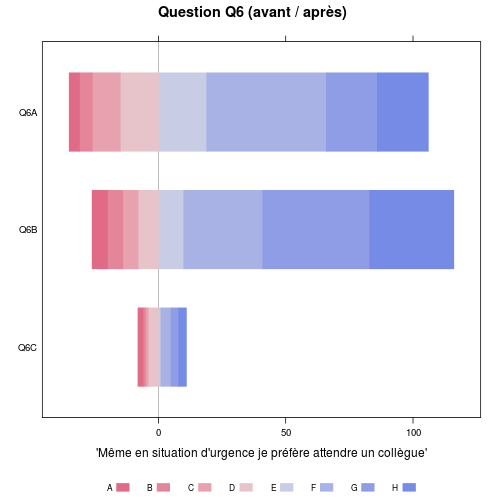
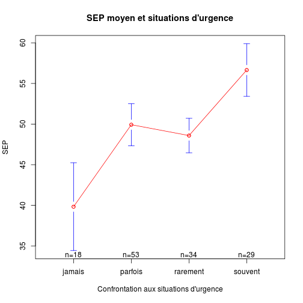

Données mémoire V.Brunstein
========================================================

Données originales
------------------
les données sont préparées par *Brunstein_prepare_data.Rmd*.

elles se récupère avec *load("Brunstein.Rdata")*.

```r
date()
```

```
## [1] "Wed Jun 12 18:21:43 2013"
```

```r
getwd()
```

```
## [1] "/home/jcb/Documents/CESU/Travaux/Brunstein/Brunstein"
```


1. 2013-03-28:
2. 2013-03-30:
3. 2013-04-20: nouvelle série de données (total 36 cas)
4. 2013-05-15: résultats 3: 82 questionnaire. L'odre et le nom des colonnes a été totalement modifié => nécessite de reécrire la programme. Abandon du programme en cours et création de Brunstein2.
5. 2013-05-21 Brunstein2: ne fonctionne qu'avec les données issues de *résultats enquête vs 3.0.xlsx*

Données transformées
--------------------
Les fichiers XLS sont enregistrés au format txt.csv sous le nom de *resultats.csv*. Un nouveau fichier remplace le fichier courant auquel on ajoute le suffixe *-n*, n allant de 1 à *x* de sorte que *resultats.csv* reste toujours le fichier actif.


```r
# cartudo: file<-'~/Bureau/Brunstein'
# file<-'~/Documents/CESU/Travaux/Brunstein-master' setwd(file)
library("HH")
library("gplots")
library("plyr")
library("epicalc")
```


Routines de l'université de Monash pour Likert:
source("~/Documents/Statistiques/Likert/monash/R/likert.R")

ATTENTION: pas compatible avec HH (même nom de fonction)
```

Chargement des donnnées:
------------------------

```r
load("Brunstein.Rdata")
```


Nouvelle présentation
---------------------

```r
names(data)
```

```
##  [1] "X"                          "date"                      
##  [3] "A"                          "B"                         
##  [5] "C"                          "situation.depuis.formation"
##  [7] "A.après.formation"          "B.après.formation"         
##  [9] "C.après.formation"          "D"                         
## [11] "E"                          "F"                         
## [13] "G"                          "H"                         
## [15] "I"                          "J"                         
## [17] "K"                          "L"                         
## [19] "M"                          "N"                         
## [21] "Q1A"                        "Q1B"                       
## [23] "Q1C"                        "Q2A"                       
## [25] "Q2B"                        "Q2C"                       
## [27] "Q3A"                        "Q3B"                       
## [29] "Q3C"                        "Q4A"                       
## [31] "Q4B"                        "Q4C"                       
## [33] "Q5A"                        "Q5B"                       
## [35] "Q5C"                        "Q6A"                       
## [37] "Q6B"                        "Q6C"                       
## [39] "Q7A"                        "Q7B"                       
## [41] "Q7C"                        "Q8A"                       
## [43] "Q8B"                        "Q8C"                       
## [45] "Q9A"                        "Q9B"                       
## [47] "Q9C"                        "Tel"                       
## [49] "X.1"                        "X.2"                       
## [51] "X.3"                        "X.4"                       
## [53] "X.5"                        "groupe"                    
## [55] "no"                         "diplome"                   
## [57] "date_diplome"               "sexe"                      
## [59] "travail"                    "exp_urg"                   
## [61] "conf_urg"                   "last_urg_n"                
## [63] "last_urg_t"                 "formation"                 
## [65] "date_formation"
```


Historique des transformation.

Stat simples
------------

### Origine socio-professionnelle:

```r
summary(data$diplome)
```

```
##    AS Autre   IDE  NA's 
##    30     6    45     2
```

```r
plot(data$diplome)
```

 

```r
ddply(data, .(data$diplome), "nrow")
```

```
##   data$diplome nrow
## 1           AS   30
## 2        Autre    6
## 3          IDE   45
## 4         <NA>    2
```


### Données pour Likert:

```r
x <- summary(as.factor(data$Q1A))
x
```

```
##    1    2    3    4    5    6    7    8   NA NA's 
##    1    1    2    9   24   27   12    3    1    3
```

```r
# likert(x)
```

Ca marche mais on obtient que 4 valeurs sur les 8 possibles et l'échelle de likert est faussée.
Voila ce qu'on devrait obtenir:

```r
a <- c(0, 0, 0, 2, 11, 6, 1, 0)
likert(a)
```

 

La question Q1 complète (avant/après):

```r
b <- summary(as.factor(data$Q1B))
b
```

```
##    5    6    7    8 NA's 
##    2   12   45   22    2
```

```r
Q1B <- c(0, 0, 0, 0, 0, 4, 11, 5)
a
```

```
## [1]  0  0  0  2 11  6  1  0
```

```r
Q1A <- a
c <- rbind(Q1A, Q1B)
likert(c, main = "Question Q1 (avant / après)")
```

 

```r

a <- as.integer(data$Q1A)
```

```
## Warning: NAs introduits lors de la conversion automatique
```

```r
b <- as.integer(data$Q1B)

summary(a)
```

```
##    Min. 1st Qu.  Median    Mean 3rd Qu.    Max.    NA's 
##    1.00    5.00    6.00    5.51    6.00    8.00       4
```

```r
summary(b)
```

```
##    Min. 1st Qu.  Median    Mean 3rd Qu.    Max.    NA's 
##    5.00    7.00    7.00    7.07    8.00    8.00       2
```

```r

boxplot(a, b)
```

 

```r

# ma<-mean(summary(as.factor(data$Q1A)))
# mb<-mean(summary(as.factor(data$Q1B)))

t <- t.test(a, b, paired = TRUE)
t
```

```
## 
## 	Paired t-test
## 
## data:  a and b 
## t = -9.885, df = 78, p-value = 2.099e-15
## alternative hypothesis: true difference in means is not equal to 0 
## 95 percent confidence interval:
##  -1.886 -1.253 
## sample estimates:
## mean of the differences 
##                   -1.57
```

```r
t[["statistic"]]
```

```
##      t 
## -9.885
```

```r
t[["parameter"]]
```

```
## df 
## 78
```

```r
t[["p.value"]]
```

```
## [1] 2.099e-15
```

Ce qui peut s'écrire avec **sweave**:

Il n'y a pas de différence significative entre les moyennes des scores avant et après:
($t(\Sexpr{res[['parameter']]})=\Sexpr{round(res[['statistic']],3)}$,
$p \Sexpr{ifelse(res[['p.value']]<0.001,'< 0.001',
   paste('=',round(res[['p.value']],3)))}$)

Expansion des score de likert:
------------------------------
Le score de Likert pour une question varie de 1 à 8 mais tous les items ne sont pas renseignés. Par exemple pour la question Q1A on obtient le score suivant:

```r
summary(as.factor(data$Q1A))
```

```
##    1    2    3    4    5    6    7    8   NA NA's 
##    1    1    2    9   24   27   12    3    1    3
```

Ce qui fausse la représentation de l'échelle de Likert. Celle-ci est exacte avec la série:

```r
a <- c(0, 0, 0, 2, 11, 6, 1, 0)
```

Pour obtenir automatiquement une séquence complète, on peut appliquer l'algorithme suivant: pour chaque ligne de *data* on forme un vecteur z contenant huit 0. Puis on affecte 1 à la position correspondante à la valeur du score pour cette question à cette ligne. Par exemple la valeur de Q1A pour la première ligne est 6 => z[6]=1. Enfin on "colle" le vecteur z à la liste a. L'opération est répétée pour toutes les lignes.


```r
a <- lapply(1:nrow(data), function(x) {
    z <- 0
    z[1:8] <- 0
    z[as.integer(data$Q1A[x])] <- 1
    a <- rbind(z)
})
```

```
## Warning: NAs introduits lors de la conversion automatique
```

```r
a <- do.call(rbind, a)
Q1A <- apply(a, 2, sum)

a <- lapply(1:nrow(data), function(x) {
    z <- 0
    z[1:8] <- 0
    z[as.integer(data$Q1B[x])] <- 1
    a <- rbind(z)
})
a <- do.call(rbind, a)
Q1B <- apply(a, 2, sum)

c <- rbind(Q1A, Q1B)
likert(c, main = "Question Q1 (avant / après)")
```

 

Application à la question 4
---------------------------

```r
a <- lapply(1:nrow(data), function(x) {
    z <- 0
    z[1:8] <- 0
    z[as.integer(data$Q4A[x])] <- 1
    a <- rbind(z)
})
a <- do.call(rbind, a)
Q4A <- apply(a, 2, sum)

a <- lapply(1:nrow(data), function(x) {
    z <- 0
    z[1:8] <- 0
    z[as.integer(data$Q4B[x])] <- 1
    a <- rbind(z)
})
a <- do.call(rbind, a)
Q4B <- apply(a, 2, sum)

a <- lapply(1:nrow(data), function(x) {
    z <- 0
    z[1:8] <- 0
    z[as.integer(data$Q4C[x])] <- 1
    a <- rbind(z)
})
```

```
## Warning: NAs introduits lors de la conversion automatique
```

```r
a <- do.call(rbind, a)
Q4C <- apply(a, 2, sum)

c <- rbind(Q4A, Q4B, Q4C)
likert(c, main = "Question Q4 (avant / après)", xlab = "'je pense que n'hésite pas à prendre des décisions en situation d'urgence'")
```

 


Application à la question 6
---------------------------

```r
a <- lapply(1:nrow(data), function(x) {
    z <- 0
    z[1:8] <- 0
    z[as.integer(data$Q6A[x])] <- 1
    a <- rbind(z)
})
a <- do.call(rbind, a)
Q6A <- apply(a, 2, sum)

a <- lapply(1:nrow(data), function(x) {
    z <- 0
    z[1:8] <- 0
    z[as.integer(data$Q6B[x])] <- 1
    a <- rbind(z)
})
a <- do.call(rbind, a)
Q6B <- apply(a, 2, sum)

a <- lapply(1:nrow(data), function(x) {
    z <- 0
    z[1:8] <- 0
    z[as.integer(data$Q6C[x])] <- 1
    a <- rbind(z)
})
```

```
## Warning: NAs introduits lors de la conversion automatique
```

```r
a <- do.call(rbind, a)
Q6C <- apply(a, 2, sum)

c <- rbind(Q6A, Q6B, Q6C)
likert(c, main = "Question Q6 (avant / après)", xlab = "'Même en situation d'urgence je préfère attendre un collègue'")
```

 

Calcul du SEP
-------------
Les questions avant/après vont de la colonne 21 à 47. Dans la version 3, il y a 3 colonnes par question: A, B, C.

Il faut d'abord transformer les valeurs de character en numeric:

```r
debut <- 21
fin <- 47
step <- 3
for (i in debut:fin) {
    data[, i] <- as.numeric(data[, i])
}
```

On crée une liste des question "avant":

```r
avant <- seq(from = debut, to = fin, by = step)
```

On isole dans un dataframe les questions "avant":

```r
av <- data[, avant]
```

on calcule la somme de chaque ligne:

```r
a <- apply(av, 1, sum)
a
```

```
##  [1] 44 48 49 55 45 45 51 56 47 52 49 50 45 43 44 63 46 58 53 39 50 63 55
## [24] 56 58 47 57 40 23 58 NA 60 61 54 55 37 50 58 51 49 44 44 55 63 62 72
## [47] 71 40 28 54 47 58 NA 19 60 65 43 52 47 49 51 43 51 43 50 58 56 39 52
## [70] 54 54 46 NA 49 NA 50 44 64 55 36 47 NA NA
```

```r
summary(a)
```

```
##    Min. 1st Qu.  Median    Mean 3rd Qu.    Max.    NA's 
##    19.0    45.0    50.0    50.4    56.0    72.0       6
```

On fait la même opération pour après

```r
apres <- seq(from = debut + 1, to = fin, by = step)
ap <- data[, apres]
b <- apply(ap, 1, sum)
summary(b)
```

```
##    Min. 1st Qu.  Median    Mean 3rd Qu.    Max.    NA's 
##    47.0    58.0    62.0    61.7    65.0    72.0       2
```

Pour faciliter la compréhension on crée deux variables complémentaires, sepa (sep avant) et sepb (sep après):

```r
data$sepa <- a
data$sepb <- b
```

L'étude de la différence sepb - sepa montre que si le globalement le SEP augmente après la formation (moyenne de 11 points), il régresse pour certains (-4) et augmente massivement pour d'autres (+42):

```r
s <- summary(data$sepb - data$sepa)
h <- data$sepb - data$sepa
s
```

```
##    Min. 1st Qu.  Median    Mean 3rd Qu.    Max.    NA's 
##    -4.0     6.0    11.0    11.5    17.0    42.0       6
```

```r
h
```

```
##  [1] 14 16 15  6 18 12 14 11 19  8 10  6  6 13 17 -4  9  2  9 19 19 -1  0
## [24]  7  1 24  1 20 42  7 NA  4 11 -2  9 25  6  8 16 16 16 17  5  1  5 -3
## [47] -2 16 29  2 12  6 NA 35 -1 -3 16 10 20 18 12 14  9 12 18  9 13 29 18
## [70]  7  9 24 NA  9 NA  7 11  2  7 27 17 NA NA
```

```r
hist(h, main = "Variation du SEP avant et après la formation", ylab = "Nombre", 
    xlab = "delta SEP", col = "lightblue")
abline(v = s[4], col = "blue")
```

 

Progression du SEP selon le groupe socio-professionnel:

```r
round(sort(tapply(data$sepb - data$sepa, data$diplome, mean, na.rm = TRUE)), 
    2)
```

```
##    AS   IDE Autre 
## 10.69 11.56 14.67
```


Le score SEP (Sentiment d'efficacité personnelle) a progressé après la formation.

```r
boxplot(data$sepa, data$sepb, main = "SEP avant et après la formation")
```

 

Et cette évolution est très significative:

```r
t <- t.test(data$sepa, data$sepb, paired = TRUE)
t
```

```
## 
## 	Paired t-test
## 
## data:  data$sepa and data$sepb 
## t = -11.27, df = 76, p-value < 2.2e-16
## alternative hypothesis: true difference in means is not equal to 0 
## 95 percent confidence interval:
##  -13.540  -9.473 
## sample estimates:
## mean of the differences 
##                  -11.51
```

### expérience professionnelle

```r
summary(data$exp_urg)
```

```
##  non  oui NA's 
##   50   31    2
```

SEP moyen en fonction de l'expérience:

```r
t <- tapply(data$sepa, data$exp_urg, mean, na.rm = TRUE)
t.test(data$sepa[data$exp_urg == "oui"], data$sepa[data$exp_urg == "non"])
```

```
## 
## 	Welch Two Sample t-test
## 
## data:  data$sepa[data$exp_urg == "oui"] and data$sepa[data$exp_urg == "non"] 
## t = 3.961, df = 73.49, p-value = 0.0001708
## alternative hypothesis: true difference in means is not equal to 0 
## 95 percent confidence interval:
##   3.739 11.308 
## sample estimates:
## mean of x mean of y 
##     54.87     47.35
```

Le SEP est significativement plus élevé dans le groupe avec expérience professionnelle.


Analyse de la question 4
------------------------
*Q: je pense que n'hésite pas à prendre des décisions en situation d'urgence*

```r
summary(data[, 30])
```

```
##    Min. 1st Qu.  Median    Mean 3rd Qu.    Max.    NA's 
##    1.00    5.00    6.00    5.48    6.00    8.00       3
```

```r
summary(data[, 31])
```

```
##    Min. 1st Qu.  Median    Mean 3rd Qu.    Max.    NA's 
##    5.00    7.00    7.00    7.01    8.00    8.00       2
```

```r
summary(data[, 32])
```

```
##    Min. 1st Qu.  Median    Mean 3rd Qu.    Max.    NA's 
##       6       7       7       7       7       8      64
```

Il y a une progression du groupe: après la formation, davantage d'apprenants se sentent capables de prendre une décision en situation d'urgence.

Analyse de la question 5
------------------------

```r
summary(data[, 33])
```

```
##    Min. 1st Qu.  Median    Mean 3rd Qu.    Max.    NA's 
##     1.0     4.5     5.0     5.2     6.0     8.0       4
```

```r
summary(data[, 34])
```

```
##    Min. 1st Qu.  Median    Mean 3rd Qu.    Max.    NA's 
##    5.00    6.00    7.00    6.69    7.00    8.00       2
```

```r
summary(data[, 35])
```

```
##    Min. 1st Qu.  Median    Mean 3rd Qu.    Max.    NA's 
##     5.0     6.0     6.0     6.4     7.0     7.0      63
```


Analyse de la question 6
------------------------
*Q: Même en situation d'urgence je préfère attendre un collègue*

```r
summary(data[, 36])
```

```
##    Min. 1st Qu.  Median    Mean 3rd Qu.    Max.    NA's 
##     1.0     5.0     6.0     5.6     7.0     8.0       3
```

```r
summary(data[, 37])
```

```
##    Min. 1st Qu.  Median    Mean 3rd Qu.    Max.    NA's 
##    1.00    4.00    6.00    5.72    7.00    8.00       2
```

```r
summary(data[, 38])
```

```
##    Min. 1st Qu.  Median    Mean 3rd Qu.    Max.    NA's 
##    1.00    4.00    6.00    5.11    7.00    8.00      64
```

Après la formation, la position du groupe évolue peu bien que l'on note une une diminution de la moyenne, cad que les stagiaires en fin de formation attendront moins la validation de leur décision par une pair avant d'agir.

### SEP et fréquence des situations d'urgence

fréquence absolue et selon le lieu d'exercice:

```r
summary(data$conf_urg)
```

```
##   jamais  parfois rarement  souvent     NA's 
##       10       39       18       14        2
```

```r
table(data$travail, data$conf_urg)
```

```
##                     
##                      jamais parfois rarement souvent
##   Bloc                    0       1        0       0
##   bloc ophtalmo           0       1        0       0
##   centre                  0       1        0       0
##   centre du sommeil       1       0        0       0
##   chir orthopédique       1       0        0       0
##   chir pediatrique        0       0        1       0
##   chirurgie               1       0        2       0
##   chirurgie générale      0       1        0       0
##   CIC                     0       1        0       0
##   CMCO                    0       2        0       0
##   EF cardio               0       1        0       0
##   EHPAD                   1       0        0       0
##   entreprise              0       3        0       0
##   GASTRO chir             0       0        1       0
##   GERIATRIE               0       1        0       0
##   gériatrie               0       0        1       0
##   geronto psy             0       0        1       0
##   gyneco                  1       0        1       1
##   HEMODIALYSE             0       0        0       1
##   long sejour             1       0        1       0
##   maternité               1       0        0       0
##   medecine                0       2        1       0
##   MEDECINE                0       2        1       0
##   médecine                0       1        0       1
##   medecine nucléaire      0       0        1       0
##   MIRNED                  0       0        1       0
##   NA                      0       5        0       0
##   NEPHRO                  0       1        0       0
##   neurologie              0       1        0       0
##   NHC                     0       1        0       0
##   obstetrique             0       0        2       0
##   oncologie               1       0        1       0
##   ORL                     0       0        0       1
##   pharmacie               1       0        0       0
##   PNEUMO                  0       2        1       0
##   POOL MCO                0       1        0       0
##   radio                   0       1        0       0
##   rea neurochir           0       0        0       1
##   SI HEMATO               0       0        0       1
##   SSPI                    0       1        0       0
##   ste anne                0       1        0       0
##   STE BARBE               0       2        0       0
##   STRASBOURG              0       0        1       0
##   TRAUMATO                0       2        0       0
##   UAA                     0       0        0       1
##   URGENCES                0       2        0       6
##   USC                     0       1        0       1
```

Sep moyen et fréquence des situations d'urgence

```r
tapply(data$sepa, data$conf_urg, mean, na.rm = TRUE)
```

```
##   jamais  parfois rarement  souvent 
##    41.33    50.39    46.88    60.14
```

```r
x <- split(data$sepa, data$conf_urg)
boxplot(x, main = "SEP en fonction de la fréquence des situations d'urgence", 
    ylab = "SEP", col = "orange")
```

 

```r
x <- aov(data$sepa ~ data$conf_urg)
x
```

```
## Call:
##    aov(formula = data$sepa ~ data$conf_urg)
## 
## Terms:
##                 data$conf_urg Residuals
## Sum of Squares           2268      4313
## Deg. of Freedom             3        73
## 
## Residual standard error: 7.686 
## Estimated effects may be unbalanced
## 6 observations deleted due to missingness
```

```r
summary(x)
```

```
##               Df Sum Sq Mean Sq F value  Pr(>F)    
## data$conf_urg  3   2268     756    12.8 8.3e-07 ***
## Residuals     73   4313      59                    
## ---
## Signif. codes:  0 '***' 0.001 '**' 0.01 '*' 0.05 '.' 0.1 ' ' 1 
## 6 observations deleted due to missingness
```

```r
plotmeans(data$sepa ~ data$conf_urg, ylab = "SEP", xlab = "Confrontation aux situations d'urgence", 
    main = "SEP moyen et situations d'urgence", col = "red")
```

 

```r

TukeyHSD(x)
```

```
##   Tukey multiple comparisons of means
##     95% family-wise confidence level
## 
## Fit: aov(formula = data$sepa ~ data$conf_urg)
## 
## $`data$conf_urg`
##                    diff    lwr    upr  p adj
## parfois-jamais    9.061  1.570 16.553 0.0114
## rarement-jamais   5.542 -2.878 13.962 0.3156
## souvent-jamais   18.810 10.176 27.443 0.0000
## rarement-parfois -3.520 -9.542  2.503 0.4212
## souvent-parfois   9.748  3.430 16.066 0.0007
## souvent-rarement 13.268  5.872 20.663 0.0001
```

Plus la confrontation au situations d'urgence augmente et plus le SEP est élevé.

Différence significative pour *parfois-jamais*, *souvent-jamais*.

Profession et SEP
-----------------


```r
table(data$diplome, data$conf_urg)
```

```
##        
##         jamais parfois rarement souvent
##   AS         4      12        6       8
##   Autre      2       2        2       0
##   IDE        4      25       10       6
```

SEP avant formation:

```r
tapply(data$sepa, data$diplome, mean, na.rm = TRUE)
```

```
##    AS Autre   IDE 
## 50.27 46.33 50.98
```

SEP après formation:

```r
tapply(data$sepb, data$diplome, mean, na.rm = TRUE)
```

```
##    AS Autre   IDE 
## 60.60 61.00 62.53
```

Le SEP avant formation est élevé pour les AS, IDE et MERM et particulièrement bas por les PPH. Après la formation, il augmente pour toutes les catégories mais la progression la plus spectaculaire est observée pour les PPH. Avant la formation, le SEP est significativement différent selon le métier:

```r
xa <- aov(data$sepa ~ data$diplome)
summary(xa)
```

```
##              Df Sum Sq Mean Sq F value Pr(>F)
## data$diplome  2    115    57.3    0.66   0.52
## Residuals    74   6465    87.4               
## 6 observations deleted due to missingness
```

```r
plotmeans(data$sepa ~ data$diplome, ylab = "SEP", xlab = "Diplome", main = "SEP moyen (avant) et métier", 
    col = "red")
```

 

Après la formation, il n'y a plus de différence de SEP quelque soit le métier:

```r
xb <- aov(data$sepb ~ data$diplome)
summary(xb)
```

```
##              Df Sum Sq Mean Sq F value Pr(>F)
## data$diplome  2     70    35.2    1.42   0.25
## Residuals    78   1936    24.8               
## 2 observations deleted due to missingness
```

```r
plotmeans(data$sepb ~ data$diplome, ylab = "SEP", xlab = "Diplome", main = "SEP moyen (après) et métier", 
    col = "red")
```

 

Expérience réelle de l'urgence
------------------------------
Existe t'il un lien entre le SEP et le fait d'avoir été confronté à une situation d'urgence ? On utiise l'item *last_urg_n*. L'information est donnée sur deux colonnes: la première est un chiffre, la seconde est l'unité de temps:

```r
summary(as.factor(data$last_urg_t))
```

```
##      ans    jours     mois       NA semaines     NA's 
##       21        8       26       18        4        6
```

La plus petite unité de mesure étant le *jour* on transforme toutes des mesures en jours. Pour ce faire on crée une nouvelle colonne **data$sem**:

```r
data$sem[data$last_urg_t == NA] <- 0
data$sem[data$last_urg_t == "semaines"] <- 7
data$sem[data$last_urg_t == "mois"] <- 30
data$sem[data$last_urg_t == "jours"] <- 1
data$sem[data$last_urg_t == "ans"] <- 365
```

On obtient une nouvelle variable appelée **data$exp** en multipliant le vecteur data$sem par data$de.quand.date.dernière.situation.d.urgence (après transformation en vecteur numérique):

```r
data$exp <- data$sem * as.numeric(data$last_urg_n)
summary(data$exp)
```

```
##    Min. 1st Qu.  Median    Mean 3rd Qu.    Max.    NA's 
##       1      42     300     690     365    4380      24
```

Non répondant ou sans expérience:

```r
notexp <- sum(is.na(data$exp))
```

soit en pourcentage du total:

```r
round(notexp * 100/nrow(data), 2)
```

```
## [1] 28.92
```

Corrélation entre SEP et confrontation à situation d'urgence:

```r
fit <- lm(sepa ~ exp, data = data)
summary(fit)
```

```
## 
## Call:
## lm(formula = sepa ~ exp, data = data)
## 
## Residuals:
##    Min     1Q Median     3Q    Max 
## -17.11  -4.55   0.23   4.88  18.95 
## 
## Coefficients:
##              Estimate Std. Error t value Pr(>|t|)    
## (Intercept) 53.128873   1.224007   43.41   <2e-16 ***
## exp         -0.000327   0.001027   -0.32     0.75    
## ---
## Signif. codes:  0 '***' 0.001 '**' 0.01 '*' 0.05 '.' 0.1 ' ' 1 
## 
## Residual standard error: 7.77 on 56 degrees of freedom
##   (25 observations deleted due to missingness)
## Multiple R-squared: 0.00181,	Adjusted R-squared: -0.016 
## F-statistic: 0.101 on 1 and 56 DF,  p-value: 0.751
```


Calcul du SEP7
==============
Le SEP7 est le SEP calculé sur les 7 premières questions. Les questions vont de la colonne 21 à la colonne 42 pour les sept premières questions. Les réponses doivent d'abord être transformées en valeurs numériques. Puis elle sont divisées en 2 groupes, avant et après. Pour chaque question, les valeurs sont sommées pour calculer la valeur du SEP avant (sep7a) et après (sep7b) la formation.

```r
debut <- 21
fin <- 42
step <- 3
for (i in debut:fin) {
    data[, i] <- as.numeric(data[, i])
}
avant <- seq(from = debut, to = fin, by = step)
av <- data[, avant]
sep7a <- apply(av, 1, sum)
summary(sep7a)
```

```
##    Min. 1st Qu.  Median    Mean 3rd Qu.    Max.    NA's 
##      17      40      45      45      50      64       6
```

```r

apres <- seq(from = debut + 1, to = fin, by = step)
ap <- data[, apres]
sep7b <- apply(ap, 1, sum)
summary(sep7b)
```

```
##    Min. 1st Qu.  Median    Mean 3rd Qu.    Max.    NA's 
##    38.0    45.0    47.0    47.1    50.0    56.0       2
```

On calcule la différence avant-après et on trace le graphique représentatif:

```r
s <- summary(sep7b - sep7a)
h <- sep7b - sep7a
s
```

```
##    Min. 1st Qu.  Median    Mean 3rd Qu.    Max.    NA's 
##  -13.00   -3.00    1.00    2.21    7.00   28.00       6
```

```r
hist(h, main = "Variation du SEP7 avant et après la formation", ylab = "Nombre", 
    xlab = "delta SEP7", col = "lightblue")
abline(v = s[4], col = "blue")
```

 

SEP7 et expérience de l'urgence
-------------------------------
Le niveau du SEP est-il différent avant la formation entre les personnes qui ont une expérience de l'urgence et les autres ?

```r
expurg <- as.factor(data$exp_urg)
t <- tapply(sep7a, expurg, mean, na.rm = TRUE)
t
```

```
##   non   oui 
## 42.43 48.74
```

```r
yl <- c(15, 60)
boxplot(sep7a ~ expurg, ylim = yl, ylab = "SEP 7", xlab = "Expérience de l'urgence", 
    main = "Avant formation")
```

 

```r
t.test(sep7a ~ expurg)
```

```
## 
## 	Welch Two Sample t-test
## 
## data:  sep7a by expurg 
## t = -3.696, df = 72.29, p-value = 0.000423
## alternative hypothesis: true difference in means is not equal to 0 
## 95 percent confidence interval:
##  -9.709 -2.906 
## sample estimates:
## mean in group non mean in group oui 
##             42.43             48.74
```

Il existe une différence entre les deux groupes et elle est significative.

Que se passe t-il si on pose la même question après la formation ?

```r
tapply(sep7b, expurg, mean, na.rm = TRUE)
```

```
##   non   oui 
## 46.72 47.71
```

```r
boxplot(sep7b ~ expurg, ylim = yl, ylab = "SEP 7", xlab = "Expérience de l'urgence", 
    main = "Après formation")
```

 

```r
t.test(sep7b ~ expurg)
```

```
## 
## 	Welch Two Sample t-test
## 
## data:  sep7b by expurg 
## t = -1.019, df = 63.63, p-value = 0.3121
## alternative hypothesis: true difference in means is not equal to 0 
## 95 percent confidence interval:
##  -2.9301  0.9508 
## sample estimates:
## mean in group non mean in group oui 
##             46.72             47.71
```

Après la formation, le niveau du SEP7 est équivalent dans les 2 groupes.

Calcul du SEP9
==============
Le SEP9 est le SEP calculé sur les 9 premières questions. Les questions vont de la colonne 32 à la colonne 49 pour les neuf premières questions. Les réponses doivent d'abord être transformées en valeurs numériques. Puis elle sont divisées en 2 groupes, avant et après. Pour chaque question, les valeurs sont sommées pour calculer la valeur du SEP avant (sep9a) et après (sep9b) la formation.


```r
debut <- 21
fin <- 47
step <- 3
for (i in debut:fin) {
    data[, i] <- as.numeric(data[, i])
}
avant <- seq(from = debut, to = fin, by = step)
av <- data[, avant]
sep9a <- apply(av, 1, sum)
summary(sep9a)
```

```
##    Min. 1st Qu.  Median    Mean 3rd Qu.    Max.    NA's 
##    19.0    45.0    50.0    50.4    56.0    72.0       6
```

```r

apres <- seq(from = debut + 1, to = fin, by = step)
ap <- data[, apres]
sep9b <- apply(ap, 1, sum)
summary(sep9b)
```

```
##    Min. 1st Qu.  Median    Mean 3rd Qu.    Max.    NA's 
##    47.0    58.0    62.0    61.7    65.0    72.0       2
```

```r

data$sep9a <- sep9a
data$sep9b <- sep9b
```

On calcule la différence avant-après et on trace le graphique représentatif:

```r
s <- summary(sep9b - sep9a)
h <- sep9b - sep9a
s
```

```
##    Min. 1st Qu.  Median    Mean 3rd Qu.    Max.    NA's 
##    -4.0     6.0    11.0    11.5    17.0    42.0       6
```

```r
hist(h, main = "Variation du SEP9 avant et après la formation", ylab = "Nombre", 
    xlab = "delta SEP9", col = "lightblue")
abline(v = s[4], col = "blue")
```

 

SEP9 et expérience de l'urgence
-------------------------------
Le niveau du SEP est-il différent avant la formation entre les personnes qui ont une expérience de l'urgence et les autres ?

```r
expurg <- as.factor(data$exp_urg)
t <- tapply(sep9a, expurg, mean, na.rm = TRUE)
t
```

```
##   non   oui 
## 47.35 54.87
```

```r
yl <- c(15, 73)
boxplot(sep9a ~ expurg, ylim = yl, xlab = "expérience de l'urgence", ylab = "SEP 9", 
    main = "Avant la formation")
```

 

```r
t.test(sep9a ~ expurg)
```

```
## 
## 	Welch Two Sample t-test
## 
## data:  sep9a by expurg 
## t = -3.961, df = 73.49, p-value = 0.0001708
## alternative hypothesis: true difference in means is not equal to 0 
## 95 percent confidence interval:
##  -11.308  -3.739 
## sample estimates:
## mean in group non mean in group oui 
##             47.35             54.87
```

Il existe une différence entre les deux groupes et elle est significative.

Que se passe t-il si on pose la même question après la formation ?

```r
tapply(sep9b, expurg, mean, na.rm = TRUE)
```

```
##   non   oui 
## 61.22 62.48
```

```r
boxplot(sep9b ~ expurg, ylim = yl, xlab = "expérience de l'urgence", ylab = "SEP 9", 
    main = "Après la formation")
```

 

```r
t.test(sep9b ~ expurg)
```

```
## 
## 	Welch Two Sample t-test
## 
## data:  sep9b by expurg 
## t = -1.111, df = 64.72, p-value = 0.2708
## alternative hypothesis: true difference in means is not equal to 0 
## 95 percent confidence interval:
##  -3.537  1.009 
## sample estimates:
## mean in group non mean in group oui 
##             61.22             62.48
```

Après la formation, le niveau du SEP9 est équivalent dans les 2 groupes.

Etude des questions A, B, C
============================
Préparation

```r

use(data)
pack()

label.var(A, "J'ai su trouver ma place au sein de l'équipe")
label.var(B, "Je suis content de moi")
label.var(C, "Le médecin semblait content de moi")

label.var(D, "J'ai été encouragé à échanger avec le reste du groupe")
label.var(E, "J'ai pu observer les PEC des autres et donner mon avis")
label.var(F, "L'ambiance était propice à mon apprentissage et ma participation")
label.var(G, "Dans les MES j'ai pu dédider des actios à entreprendre")

summary(as.factor(data$A))
```

```
##    1    2    3    4    5    6    7    8   NA NA's 
##    1    3    4    4   12   22   17   13    4    3
```

```r
summary(as.factor(data$B))
```

```
##    1    2    3    4    5    6    7    8   NA NA's 
##    1    3    4   10   15   24   10    8    5    3
```

```r
summary(as.factor(data$C))
```

```
##    1    2    3    4    5    6    7    8   NA NA's 
##    1    1    3    4   12   25   18    9    7    3
```

likert.


```r
a <- lapply(1:nrow(data), function(x) {
    z <- 0
    z[1:8] <- 0
    z[as.integer(data$A[x])] <- 1
    a <- rbind(z)
})
a <- do.call(rbind, a)
QA <- apply(a, 2, sum)
a <- lapply(1:nrow(data), function(x) {
    z <- 0
    z[1:8] <- 0
    z[as.integer(data$B[x])] <- 1
    a <- rbind(z)
})
a <- do.call(rbind, a)
QB <- apply(a, 2, sum)
a <- lapply(1:nrow(data), function(x) {
    z <- 0
    z[1:8] <- 0
    z[as.integer(data$C[x])] <- 1
    a <- rbind(z)
})
a <- do.call(rbind, a)
QC <- apply(a, 2, sum)
c <- rbind(QA, QB, QC)
c
```

```
##    [,1] [,2] [,3] [,4] [,5] [,6] [,7] [,8]
## QA    1    3    4    4   12   22   17   13
## QB    1    3    4   10   15   24   10    8
## QC    1    1    3    4   12   25   18    9
```

```r
likert(c)
```

 

Corrélation SEP 7 et questions a,b,c

```r
plot(as.factor(data$A), sep7a, ylab = "SEP 7", xlab = "J'ai su trouver ma place au sein de l'équipe")
```

 

```r
plot(as.factor(data$B), sep7a, ylab = "SEP 7", xlab = "")
```

 

```r
plot(as.factor(data$C), sep7a, ylab = "SEP 7", xlab = "")
```

 


Corrélation SEP 9 et questions a,b,c

```r
plot(as.factor(data$A), sep9a, ylab = "SEP 9", xlab = "J'ai su trouver ma place au sein de l'équipe")
```

 

```r
plot(as.factor(data$B), sep9a, ylab = "SEP 9", xlab = "")
```

 

```r
plot(as.factor(data$C), sep9a, ylab = "SEP 9", xlab = "")
```

 

Analyse de la question C
------------------------
La question C note la manière dont les apprenants se situent par rapport au jugement du médecin sur leur action. On considère que ceux qui se sont attribués une note inférieure à 5 ont ressenti négativement l'opinion du médecin. Comment évolue le SEP dans ce groupe ?
On sépare le groupe en 2 sous-groupes, inf à 5 et sup ou égal à 5:

```r
v <- as.factor(ifelse(data$C < 5, 1, 2))
summary(v)
```

```
##    1    2 NA's 
##    9   71    3
```

Groupe 1 = sentiment négatif, groupe 2 = sentiment positif.

Une majorité est satisfaite, un petit groupr est insatisfait, 3ne se prononcent pas. Calcul du SEP correspondant:

```r
a <- tapply(sep7a, v, mean, na.rm = TRUE)
a
```

```
##     1     2 
## 37.44 45.97
```

SEP après:

```r
b <- tapply(sep7b, v, mean, na.rm = TRUE)
b
```

```
##     1     2 
## 48.44 46.94
```

```r

data$sepa <- sep7a
data$sepb <- sep7b
```

Comment évolue le SEP en fonction du groupe ?

```r
b - a
```

```
##       1       2 
## 11.0000  0.9731
```

C'est le sous-groupe qui s'estime jugé péjorativement par le médecin qui progresse le plus.


Questions d à n
================

```r
a <- lapply(1:nrow(data), function(x) {
    z <- 0
    z[1:8] <- 0
    z[as.integer(data$D[x])] <- 1
    a <- rbind(z)
})
a <- do.call(rbind, a)
QD <- apply(a, 2, sum)

a <- lapply(1:nrow(data), function(x) {
    z <- 0
    z[1:8] <- 0
    z[as.integer(data$E[x])] <- 1
    a <- rbind(z)
})
```

```
## Warning: NAs introduits lors de la conversion automatique
```

```r
a <- do.call(rbind, a)
QE <- apply(a, 2, sum)

a <- lapply(1:nrow(data), function(x) {
    z <- 0
    z[1:8] <- 0
    z[as.integer(data$F[x])] <- 1
    a <- rbind(z)
})
a <- do.call(rbind, a)
QF <- apply(a, 2, sum)

a <- lapply(1:nrow(data), function(x) {
    z <- 0
    z[1:8] <- 0
    z[as.integer(data$G[x])] <- 1
    a <- rbind(z)
})
a <- do.call(rbind, a)
QG <- apply(a, 2, sum)

a <- lapply(1:nrow(data), function(x) {
    z <- 0
    z[1:8] <- 0
    z[as.integer(data$H[x])] <- 1
    a <- rbind(z)
})
a <- do.call(rbind, a)
QH <- apply(a, 2, sum)

a <- lapply(1:nrow(data), function(x) {
    z <- 0
    z[1:8] <- 0
    z[as.integer(data$I[x])] <- 1
    a <- rbind(z)
})
a <- do.call(rbind, a)
QI <- apply(a, 2, sum)

a <- lapply(1:nrow(data), function(x) {
    z <- 0
    z[1:8] <- 0
    z[as.integer(data$J[x])] <- 1
    a <- rbind(z)
})
a <- do.call(rbind, a)
QJ <- apply(a, 2, sum)

a <- lapply(1:nrow(data), function(x) {
    z <- 0
    z[1:8] <- 0
    z[as.integer(data$K[x])] <- 1
    a <- rbind(z)
})
a <- do.call(rbind, a)
QK <- apply(a, 2, sum)

a <- lapply(1:nrow(data), function(x) {
    z <- 0
    z[1:8] <- 0
    z[as.integer(data$L[x])] <- 1
    a <- rbind(z)
})
```

```
## Warning: NAs introduits lors de la conversion automatique
```

```
## Warning: NAs introduits lors de la conversion automatique
```

```
## Warning: NAs introduits lors de la conversion automatique
```

```
## Warning: NAs introduits lors de la conversion automatique
```

```r
a <- do.call(rbind, a)
QL <- apply(a, 2, sum)

a <- lapply(1:nrow(data), function(x) {
    z <- 0
    z[1:8] <- 0
    z[as.integer(data$M[x])] <- 1
    a <- rbind(z)
})
a <- do.call(rbind, a)
QM <- apply(a, 2, sum)

a <- lapply(1:nrow(data), function(x) {
    z <- 0
    z[1:8] <- 0
    z[as.integer(data$N[x])] <- 1
    a <- rbind(z)
})
a <- do.call(rbind, a)
QN <- apply(a, 2, sum)

c <- rbind(QD, QE, QF, QG, QH, QI, QJ, QK, QL, QM, QN)
c
```

```
##    [,1] [,2] [,3] [,4] [,5] [,6] [,7] [,8]
## QD    0    0    0    1    2    7   22   49
## QE    0    0    1    0    1    5   16   57
## QF    0    0    0    1    0    2   13   65
## QG    0    0    0    2    2   11   15   51
## QH    0    0    0    0    2    8   13   58
## QI    0    0    0    0    1    6   10   64
## QJ    0    0    0    0    3    1   12   65
## QK    0    0    0    0    3    2   10   66
## QL    0    0    0    1    9   28   23   16
## QM    0    0    0    0    1   20   37   23
## QN    0    0    0    0    1   12   32   36
```

```r
likert(c)
```

 

```r

library("epicalc")

data$D <- as.numeric(data$D)
data$E <- as.numeric(data$E)
```

```
## Warning: NAs introduits lors de la conversion automatique
```

```r
data$F <- as.numeric(data$F)
data$G <- as.numeric(data$G)
data$H <- as.numeric(data$H)
data$I <- as.numeric(data$I)
data$J <- as.numeric(data$J)
data$K <- as.numeric(data$K)
data$L <- as.numeric(data$L)
```

```
## Warning: NAs introduits lors de la conversion automatique
```

```r
data$M <- as.numeric(data$M)
data$N <- as.numeric(data$N)

use(data)
pack()

label.var(A, "J'ai su trouver ma place au sein de l'équipe")
label.var(C, "Le médecin semblait content de moi")
label.var(D, "J'ai été encouragé à échanger avec le reste du groupe")
label.var(E, "J'ai pu observer les PEC des autres et donner mon avis")
label.var(F, "L'ambiance était propice à mon apprentissage et ma participation")
label.var(G, "Dans les MES j'ai pu décider des actios à entreprendre")

des()
```

```
##  
##  No. of observations =  83 
##    Variable                   Class          
## 1  X                          character      
## 2  date                       character      
## 3  A                          character      
## 4  B                          character      
## 5  C                          character      
## 6  situation.depuis.formation character      
## 7  A.après.formation          character      
## 8  B.après.formation          character      
## 9  C.après.formation          character      
## 10 D                          numeric        
## 11 E                          numeric        
## 12 F                          numeric        
## 13 G                          numeric        
## 14 H                          numeric        
## 15 I                          numeric        
## 16 J                          numeric        
## 17 K                          numeric        
## 18 L                          numeric        
## 19 M                          numeric        
## 20 N                          numeric        
## 21 Q1A                        numeric        
## 22 Q1B                        numeric        
## 23 Q1C                        numeric        
## 24 Q2A                        numeric        
## 25 Q2B                        numeric        
## 26 Q2C                        numeric        
## 27 Q3A                        numeric        
## 28 Q3B                        numeric        
## 29 Q3C                        numeric        
## 30 Q4A                        numeric        
## 31 Q4B                        numeric        
## 32 Q4C                        numeric        
## 33 Q5A                        numeric        
## 34 Q5B                        numeric        
## 35 Q5C                        numeric        
## 36 Q6A                        numeric        
## 37 Q6B                        numeric        
## 38 Q6C                        numeric        
## 39 Q7A                        numeric        
## 40 Q7B                        numeric        
## 41 Q7C                        numeric        
## 42 Q8A                        numeric        
## 43 Q8B                        numeric        
## 44 Q8C                        numeric        
## 45 Q9A                        numeric        
## 46 Q9B                        numeric        
## 47 Q9C                        numeric        
## 48 Tel                        character      
## 49 X.1                        character      
## 50 X.2                        character      
## 51 X.3                        character      
## 52 X.4                        character      
## 53 X.5                        character      
## 54 groupe                     factor         
## 55 no                         integer        
## 56 diplome                    factor         
## 57 date_diplome               integer        
## 58 sexe                       factor         
## 59 travail                    factor         
## 60 exp_urg                    factor         
## 61 conf_urg                   factor         
## 62 last_urg_n                 factor         
## 63 last_urg_t                 factor         
## 64 formation                  factor         
## 65 date_formation             factor         
## 66 sepa                       numeric        
## 67 sepb                       numeric        
## 68 sem                        numeric        
## 69 exp                        numeric        
## 70 sep9a                      numeric        
## 71 sep9b                      numeric        
## 72 v                          factor         
##    Description                                                     
## 1                                                                  
## 2                                                                  
## 3  J'ai su trouver ma place au sein de l'équipe                    
## 4                                                                  
## 5  Le médecin semblait content de moi                              
## 6                                                                  
## 7                                                                  
## 8                                                                  
## 9                                                                  
## 10 J'ai été encouragé à échanger avec le reste du groupe           
## 11 J'ai pu observer les PEC des autres et donner mon avis          
## 12 L'ambiance était propice à mon apprentissage et ma participation
## 13 Dans les MES j'ai pu décider des actios à entreprendre          
## 14                                                                 
## 15                                                                 
## 16                                                                 
## 17                                                                 
## 18                                                                 
## 19                                                                 
## 20                                                                 
## 21                                                                 
## 22                                                                 
## 23                                                                 
## 24                                                                 
## 25                                                                 
## 26                                                                 
## 27                                                                 
## 28                                                                 
## 29                                                                 
## 30                                                                 
## 31                                                                 
## 32                                                                 
## 33                                                                 
## 34                                                                 
## 35                                                                 
## 36                                                                 
## 37                                                                 
## 38                                                                 
## 39                                                                 
## 40                                                                 
## 41                                                                 
## 42                                                                 
## 43                                                                 
## 44                                                                 
## 45                                                                 
## 46                                                                 
## 47                                                                 
## 48                                                                 
## 49                                                                 
## 50                                                                 
## 51                                                                 
## 52                                                                 
## 53                                                                 
## 54                                                                 
## 55                                                                 
## 56                                                                 
## 57                                                                 
## 58                                                                 
## 59                                                                 
## 60                                                                 
## 61                                                                 
## 62                                                                 
## 63                                                                 
## 64                                                                 
## 65                                                                 
## 66                                                                 
## 67                                                                 
## 68                                                                 
## 69                                                                 
## 70                                                                 
## 71                                                                 
## 72
```

```r
tableStack(D:N, minlevel = 1, maxlevel = 8, means = TRUE, medians = TRUE, na.rm = TRUE, 
    dataFrame = data, var.labels = TRUE, var.labels.trunc = 150)
```

```
##                1 2 3 4 5 6  7  8  count mean median sd 
## D              0 0 0 1 2 7  22 49 81    7.4  8      0.9
## E              0 0 1 0 1 5  16 57 80    7.6  8      0.8
## F              0 0 0 1 0 2  13 65 81    7.7  8      0.6
## G              0 0 0 2 2 11 15 51 81    7.4  8      1  
## H              0 0 0 0 2 8  13 58 81    7.6  8      0.8
## I              0 0 0 0 1 6  10 64 81    7.7  8      0.7
## J              0 0 0 0 3 1  12 65 81    7.7  8      0.7
## K              0 0 0 0 3 2  10 66 81    7.7  8      0.7
## L              0 0 0 1 9 28 23 16 77    6.6  7      1  
## M              0 0 0 0 1 20 37 23 81    7    7      0.8
## N              0 0 0 0 1 12 32 36 81    7.3  7      0.8
##  Total score                      76    81.8        6  
##  Average score                    76    7.4         0.5
```

```r

summ()
```

```
## 
## 
## No. of observations = 83
## 
##    Var. name                  obs. mean    median  s.d.    min.   max.  
## 1  X                                                                    
## 2  date                                                                 
## 3  A                                                                    
## 4  B                                                                    
## 5  C                                                                    
## 6  situation.depuis.formation                                           
## 7  A.après.formation                                                    
## 8  B.après.formation                                                    
## 9  C.après.formation                                                    
## 10 D                          81   7.43    8       0.85    4      8     
## 11 E                          80   7.58    8       0.84    3      8     
## 12 F                          81   7.74    8       0.63    4      8     
## 13 G                          81   7.37    8       0.98    4      8     
## 14 H                          81   7.57    8       0.77    5      8     
## 15 I                          81   7.69    8       0.66    5      8     
## 16 J                          81   7.72    8       0.68    5      8     
## 17 K                          81   7.72    8       0.69    5      8     
## 18 L                          77   6.57    7       0.99    4      8     
## 19 M                          81   7.01    7       0.77    5      8     
## 20 N                          81   7.27    7       0.76    5      8     
## 21 Q1A                        79   5.51    6       1.26    1      8     
## 22 Q1B                        81   7.07    7       0.72    5      8     
## 23 Q1C                        19   6.63    7       0.76    5      8     
## 24 Q2A                        79   5.52    6       1.37    1      8     
## 25 Q2B                        81   7.2     7       0.68    6      8     
## 26 Q2C                        20   6.75    7       0.72    5      8     
## 27 Q3A                        80   5.12    5       1.38    1      8     
## 28 Q3B                        81   6.73    7       0.87    3      8     
## 29 Q3C                        18   6.44    7       0.86    5      8     
## 30 Q4A                        80   5.47    6       1.45    1      8     
## 31 Q4B                        81   7.01    7       0.73    5      8     
## 32 Q4C                        19   7       7       0.47    6      8     
## 33 Q5A                        79   5.2     5       1.43    1      8     
## 34 Q5B                        81   6.69    7       0.82    5      8     
## 35 Q5C                        20   6.4     6       0.6     5      7     
## 36 Q6A                        80   5.6     6       1.77    1      8     
## 37 Q6B                        81   5.72    6       2.19    1      8     
## 38 Q6C                        19   5.11    6       2.26    1      8     
## 39 Q7A                        79   5.06    5       1.55    1      8     
## 40 Q7B                        81   6.68    7       0.91    4      8     
## 41 Q7C                        20   6.4     6.5     0.88    4      8     
## 42 Q8A                        80   7.28    8       1.28    1      8     
## 43 Q8B                        81   7.64    8       0.86    2      8     
## 44 Q8C                        19   7.95    8       0.23    7      8     
## 45 Q9A                        80   5.35    5       1.52    1      8     
## 46 Q9B                        81   6.96    7       0.77    5      8     
## 47 Q9C                        20   6.7     7       0.8     5      8     
## 48 Tel                                                                  
## 49 X.1                                                                  
## 50 X.2                                                                  
## 51 X.3                                                                  
## 52 X.4                                                                  
## 53 X.5                                                                  
## 54 groupe                     83   4.783   5       2.353   1      8     
## 55 no                         81   6.51    6       3.59    1      15    
## 56 diplome                    81   2.185   3       0.95    1      3     
## 57 date_diplome               80   1999.94 2003    9.45    1979   2012  
## 58 sexe                       81   2.086   2       0.424   1      4     
## 59 travail                    78   26.205  26.5    13.682  1      47    
## 60 exp_urg                    81   1.383   1       0.489   1      2     
## 61 conf_urg                   81   2.444   2       0.922   1      4     
## 62 last_urg_n                 77   7.623   7       4.685   1      14    
## 63 last_urg_t                 77   2.688   3       1.249   1      5     
## 64 formation                  73   5.89    6       2.951   1      11    
## 65 date_formation             4    2       2       0.816   1      3     
## 66 sepa                       77   44.97   45      8.21    17     64    
## 67 sepb                       81   47.1    47      4.25    38     56    
## 68 sem                        59   143.75  30      166.21  1      365   
## 69 exp                        59   689.56  300     1023.81 1      4380  
## 70 sep9a                      77   50.38   50      9.3     19     72    
## 71 sep9b                      81   61.7    62      5.01    47     72    
## 72 v                          80   1.888   2       0.318   1      2
```

```r
summ(D, ylab = "Nombre de réponses", main = "J'ai été encouragé à échanger avec le reste du groupe")
```

 

```
##   obs. mean   median  s.d.   min.   max.  
##   81   7.432  8       0.85   4      8
```

Note: pour transformer des variables en interger, on peut utilise *unclass(liste des var)*.

Dans **Epicalc** utiliser *label.var* pour ajouter un commentaire aux items de Likert. Ex: label.var(A, "J'ai su trouver ma place au sein de l'équipe")

Analyse par groupe
==================
La population de l'étude est compsée de 8 groupes d'apprenants. Le groupe 8 est particulier car composé exclusivement d'AS. Ce groupe homogène se comporte t'il différemment des autres groupes qui sont hétérogènes du point de vue de leur composition ?

```r
summary(data$groupe)
```

```
##  1  2  3  4  5  6  7  8 
##  8 12  9  7 11 10 13 13
```

NB: les groupes 4, 6 et 8 ont des non réponses

Calcul du **SEP7** avant-après par groupe
-------------------------------------------

data$sepa<-sep7a

data$sepb<-sep7b

SEP total avant et après la formation (pas informatif car les goupes ne sont pas de la même taille)

```r
tapply(data$sepa, data$groupe, sum, na.rm = TRUE)
```

```
##   1   2   3   4   5   6   7   8 
## 352 523 400 292 553 371 573 399
```

```r
tapply(data$sepb, data$groupe, sum, na.rm = TRUE)
```

```
##   1   2   3   4   5   6   7   8 
## 380 531 427 337 537 438 640 525
```

SEP moyen par groupe avant et après la formation:

```r
tapply(data$sepa, data$groupe, mean, na.rm = TRUE)
```

```
##     1     2     3     4     5     6     7     8 
## 44.00 43.58 44.44 48.67 50.27 41.22 44.08 44.33
```

```r
tapply(data$sepb, data$groupe, mean, na.rm = TRUE)
```

```
##     1     2     3     4     5     6     7     8 
## 47.50 44.25 47.44 48.14 48.82 43.80 49.23 47.73
```


Le SEP est-il en moyenne différent entre les groupes avant la formation ?

```r
x <- aov(data$sepa ~ data$groupe)
x
```

```
## Call:
##    aov(formula = data$sepa ~ data$groupe)
## 
## Terms:
##                 data$groupe Residuals
## Sum of Squares          565      4557
## Deg. of Freedom           7        69
## 
## Residual standard error: 8.127 
## Estimated effects may be unbalanced
## 6 observations deleted due to missingness
```

```r
summary(x)
```

```
##             Df Sum Sq Mean Sq F value Pr(>F)
## data$groupe  7    565    80.7    1.22    0.3
## Residuals   69   4557    66.0               
## 6 observations deleted due to missingness
```

Pas de différences entre les groupes avant la formation.

Même question après:

```r
y <- aov(data$sepb ~ data$groupe)
y
```

```
## Call:
##    aov(formula = data$sepb ~ data$groupe)
## 
## Terms:
##                 data$groupe Residuals
## Sum of Squares        312.2    1131.1
## Deg. of Freedom           7        73
## 
## Residual standard error: 3.936 
## Estimated effects may be unbalanced
## 2 observations deleted due to missingness
```

```r
summary(y)
```

```
##             Df Sum Sq Mean Sq F value Pr(>F)  
## data$groupe  7    312    44.6    2.88   0.01 *
## Residuals   73   1131    15.5                 
## ---
## Signif. codes:  0 '***' 0.001 '**' 0.01 '*' 0.05 '.' 0.1 ' ' 1 
## 2 observations deleted due to missingness
```

Il existe une différence de SEP entre les groupes après la formation:

```r
plotmeans(data$sepb ~ data$groupe, xlab = "Groupes d'apprenants", ylab = "SEP 7")
```

 

```r
TukeyHSD(y)
```

```
##   Tukey multiple comparisons of means
##     95% family-wise confidence level
## 
## Fit: aov(formula = data$sepb ~ data$groupe)
## 
## $`data$groupe`
##         diff       lwr     upr  p adj
## 2-1 -3.25000  -8.85648  2.3565 0.6162
## 3-1 -0.05556  -6.02411  5.9130 1.0000
## 4-1  0.64286  -5.71429  7.0000 1.0000
## 5-1  1.31818  -4.38932  7.0257 0.9961
## 6-1 -3.70000  -9.52643  2.1264 0.5011
## 7-1  1.73077  -3.78878  7.2503 0.9761
## 8-1  0.22727  -5.48023  5.9348 1.0000
## 3-2  3.19444  -2.22193  8.6108 0.5952
## 4-2  3.89286  -1.94896  9.7347 0.4377
## 5-2  4.56818  -0.55911  9.6955 0.1161
## 6-2 -0.45000  -5.70934  4.8093 1.0000
## 7-2  4.98077   0.06356  9.8980 0.0449
## 8-2  3.47727  -1.65002  8.6046 0.4145
## 4-3  0.69841  -5.49173  6.8886 1.0000
## 5-3  1.37374  -4.14714  6.8946 0.9938
## 6-3 -3.64444  -9.28818  1.9993 0.4792
## 7-3  1.78632  -3.54002  7.1127 0.9654
## 8-3  0.28283  -5.23805  5.8037 1.0000
## 5-4  0.67532  -5.26352  6.6142 1.0000
## 6-4 -4.34286 -10.39608  1.7104 0.3416
## 7-4  1.08791  -4.67053  6.8464 0.9989
## 8-4 -0.41558  -6.35443  5.5233 1.0000
## 6-5 -5.01818 -10.38509  0.3487 0.0838
## 7-5  0.41259  -4.61950  5.4447 1.0000
## 8-5 -1.09091  -6.32848  4.1467 0.9980
## 7-6  5.43077   0.26419 10.5973 0.0324
## 8-6  3.92727  -1.43964  9.2942 0.3167
## 8-7 -1.50350  -6.53559  3.5286 0.9818
```

Le test de Tukey confirme que deux groupes ont un SEP moyen différents (groupes 2 et 6 ).

On forme une nouvelle colonne *gp* pour former 2 groupes:
- le groupe 8 constitué uniquement d'AS: homo
- tous les autres:hetero

```r
data$gp[data$groupe == 8] <- "homo"
data$gp[data$groupe != 8] <- "hetero"
```

et on teste:

```r
tapply(data$sepa, data$gp, mean, na.rm = TRUE)
```

```
## hetero   homo 
##  45.06  44.33
```

```r
tapply(data$sepb, data$gp, mean, na.rm = TRUE)
```

```
## hetero   homo 
##  47.00  47.73
```

Par acquis de conscience:

```r
t.test(data$sepb ~ data$gp)
```

```
## 
## 	Welch Two Sample t-test
## 
## data:  data$sepb by data$gp 
## t = -0.6349, df = 15.82, p-value = 0.5346
## alternative hypothesis: true difference in means is not equal to 0 
## 95 percent confidence interval:
##  -3.158  1.703 
## sample estimates:
## mean in group hetero   mean in group homo 
##                47.00                47.73
```

Conclusions: pas de différence de score SEP entre les groupes homo et hetero. Il daut noter que l'effectif du groupe *homo* est trop faible pour pouvoir conclure.

Calcul du **SEP9** avant-après par groupe
-------------------------------------------

```r
data$sepa <- data$sep9a
data$sepb <- data$sep9b

tapply(data$sepa, data$groupe, sum, na.rm = TRUE)
```

```
##   1   2   3   4   5   6   7   8 
## 393 589 449 325 619 414 645 445
```

```r
tapply(data$sepb, data$groupe, sum, na.rm = TRUE)
```

```
##   1   2   3   4   5   6   7   8 
## 499 703 562 439 704 573 834 684
```

```r
tapply(data$sepa, data$groupe, mean, na.rm = TRUE)
```

```
##     1     2     3     4     5     6     7     8 
## 49.12 49.08 49.89 54.17 56.27 46.00 49.62 49.44
```

```r
tapply(data$sepb, data$groupe, mean, na.rm = TRUE)
```

```
##     1     2     3     4     5     6     7     8 
## 62.38 58.58 62.44 62.71 64.00 57.30 64.15 62.18
```

Le SEP est-il en moyenne différent entre les groupes avant la formation ?

```r
x <- aov(data$sepa ~ data$groupe)
x
```

```
## Call:
##    aov(formula = data$sepa ~ data$groupe)
## 
## Terms:
##                 data$groupe Residuals
## Sum of Squares          691      5889
## Deg. of Freedom           7        69
## 
## Residual standard error: 9.238 
## Estimated effects may be unbalanced
## 6 observations deleted due to missingness
```

```r
summary(x)
```

```
##             Df Sum Sq Mean Sq F value Pr(>F)
## data$groupe  7    691    98.7    1.16   0.34
## Residuals   69   5889    85.3               
## 6 observations deleted due to missingness
```

Pas de différences entre les groupes avant la formation.

Même question après:

```r
y <- aov(data$sepb ~ data$groupe)
y
```

```
## Call:
##    aov(formula = data$sepb ~ data$groupe)
## 
## Terms:
##                 data$groupe Residuals
## Sum of Squares          465      1542
## Deg. of Freedom           7        73
## 
## Residual standard error: 4.596 
## Estimated effects may be unbalanced
## 2 observations deleted due to missingness
```

```r
summary(y)
```

```
##             Df Sum Sq Mean Sq F value Pr(>F)   
## data$groupe  7    465    66.4    3.15 0.0058 **
## Residuals   73   1542    21.1                  
## ---
## Signif. codes:  0 '***' 0.001 '**' 0.01 '*' 0.05 '.' 0.1 ' ' 1 
## 2 observations deleted due to missingness
```

Il existe une différence de SEP entre les groupes après la formation:

```r
plotmeans(data$sepb ~ data$groupe, xlab = "Groupes d'apprenants", ylab = "SEP 9")
```

 

```r
TukeyHSD(y)
```

```
##   Tukey multiple comparisons of means
##     95% family-wise confidence level
## 
## Fit: aov(formula = data$sepb ~ data$groupe)
## 
## $`data$groupe`
##         diff      lwr     upr  p adj
## 2-1 -3.79167 -10.3376  2.7543 0.6171
## 3-1  0.06944  -6.8992  7.0381 1.0000
## 4-1  0.33929  -7.0831  7.7617 1.0000
## 5-1  1.62500  -5.0389  8.2889 0.9946
## 6-1 -5.07500 -11.8777  1.7277 0.2930
## 7-1  1.77885  -4.6656  8.2233 0.9885
## 8-1 -0.19318  -6.8571  6.4707 1.0000
## 3-2  3.86111  -2.4629 10.1851 0.5519
## 4-2  4.13095  -2.6898 10.9517 0.5621
## 5-2  5.41667  -0.5698 11.4031 0.1050
## 6-2 -1.28333  -7.4240  4.8573 0.9979
## 7-2  5.57051  -0.1707 11.3117 0.0636
## 8-2  3.59848  -2.3880  9.5849 0.5716
## 4-3  0.26984  -6.9576  7.4973 1.0000
## 5-3  1.55556  -4.8904  8.0016 0.9949
## 6-3 -5.14444 -11.7339  1.4450 0.2400
## 7-3  1.70940  -4.5095  7.9283 0.9888
## 8-3 -0.26263  -6.7086  6.1834 1.0000
## 5-4  1.28571  -5.6483  8.2197 0.9990
## 6-4 -5.41429 -12.4818  1.6533 0.2616
## 7-4  1.43956  -5.2838  8.1629 0.9976
## 8-4 -0.53247  -7.4665  6.4015 1.0000
## 6-5 -6.70000 -12.9662 -0.4338 0.0277
## 7-5  0.15385  -5.7215  6.0292 1.0000
## 8-5 -1.81818  -7.9334  4.2970 0.9823
## 7-6  6.85385   0.8215 12.8862 0.0151
## 8-6  4.88182  -1.3844 11.1480 0.2424
## 8-7 -1.97203  -7.8473  3.9033 0.9652
```

On forme une nouvelle colonne *gp* pour former 2 groupes:
- le groupe 8: homo
- tous les autres:hetero

```r
data$gp[data$groupe == 8] <- "homo"
data$gp[data$groupe != 8] <- "hetero"
```

et on teste:

```r
tapply(data$sepa, data$gp, mean, na.rm = TRUE)
```

```
## hetero   homo 
##  50.50  49.44
```

```r
tapply(data$sepb, data$gp, mean, na.rm = TRUE)
```

```
## hetero   homo 
##  61.63  62.18
```

Par acquis de conscience:

```r
t.test(data$sepb ~ data$gp)
```

```
## 
## 	Welch Two Sample t-test
## 
## data:  data$sepb by data$gp 
## t = -0.3666, df = 14.2, p-value = 0.7193
## alternative hypothesis: true difference in means is not equal to 0 
## 95 percent confidence interval:
##  -3.786  2.679 
## sample estimates:
## mean in group hetero   mean in group homo 
##                61.63                62.18
```

Conclusions: pas de différence de score SEP entre les groupes homo et hetero. Il daut noter que l'effectif du groupe *homo* est trop faible pour pouvoir conclure.

Calcul alpha de Cronbach
========================

```r
library("psy", lib.loc = "/home/jcb/R/x86_64-pc-linux-gnu-library/2.15")
```


on extraitles colonnes 21 à 47 correspondant aux questions 1 à 9 puis on élimine les colonnes correspondant aux questions de type C qui commencent à la colonne 3 et progressent par pas de 3.

```r
a <- cbind(data[21:47])
a <- a[, -seq(3, 47, 3)]
```

on transforme *a* en integer:

```r
for (i in 1:ncol(a)) {
    a[, i] <- as.integer(a[, i])
}
```

Calcul du Cronbach
------------------
Dans le cas particulier d'une échelle de likert utilisée avant at après, je ne sais pas si le CAC doit porter sur 9 ou 18 questions ?
Dans le doute j'ai testé les 3 hypothèses. Le CAC est très bon pour 18 questions et les 9 questions avant. Il reste correct si on isole les questions après

```r
cronbach(a)
```

```
## $sample.size
## [1] 77
## 
## $number.of.items
## [1] 18
## 
## $alpha
## [1] 0.8463
```

```r
cronbach(a[, seq(1, ncol(a), 2)])
```

```
## $sample.size
## [1] 77
## 
## $number.of.items
## [1] 9
## 
## $alpha
## [1] 0.8842
```

```r
cronbach(a[, seq(2, ncol(a), 2)])
```

```
## $sample.size
## [1] 81
## 
## $number.of.items
## [1] 9
## 
## $alpha
## [1] 0.6831
```

Le coefficient alpha de Cronbach (cac) (Lee Chronbach 1951) est un indice statistique qui mesure la consistance interne (ou homogénéité ou cohérence interne) d'un instrument d'évaluation composé d'un ensemble d'items qui tous contribuent à appréhender une même entité: niveau de connaissance ou de compétence sur un thème, niveau d'aptitude, de motivation ou d'intérêt pour un sujet donné.
En logique, deux items sont consistants lorsqu'ils ne sont pas contradictoires. Dans le cas d'une échelle de Likert, c'est une mesure indirecte de la corrélation entre les items. De ce fait, le *cac* varie entre 0 et 1 et on l'interprète habituellement de cette façon:
- cac < 0.5: pas acceptable
- 0.6 < cac < 0.5: pauvre
- 0.6< cac < 0.7: faible
- 0.7 < cac < 0.8: acceptable
- 0.8 <cac <0.9: bon
- 0.9 < cac < 0.95: excellent
- > 0.95 : les items sont probablement redondants
NB: cela suppose que tous les items sont lmesurés sur la même échelle et que le sens de la mesure est le même (sinon il faut indiquer au programme qu'il inverse l'échelle)

Résultats avec la commande *alpha* de la librairie *psych*

```r
library("psych")
```

```
## Attaching package: 'psych'
```

```
## The following object(s) are masked from 'package:psy':
## 
## wkappa
```

```
## The following object(s) are masked from 'package:epicalc':
## 
## alpha
```

```
## The following object(s) are masked from 'package:gtools':
## 
## logit
```

```
## The following object(s) are masked from 'package:HH':
## 
## logit
```

```r
alpha(a)
```

```
## Warning: Some items were negatively correlated with total scale and were
## automatically reversed
```

```
## 
## Reliability analysis   
## Call: alpha(x = a)
## 
##   raw_alpha std.alpha G6(smc) average_r mean  sd
##       0.87      0.89    0.94      0.32    6 1.2
## 
##  Reliability if an item is dropped:
##      raw_alpha std.alpha G6(smc) average_r
## Q1A       0.85      0.88    0.93      0.31
## Q1B       0.86      0.89    0.94      0.32
## Q2A       0.84      0.88    0.93      0.30
## Q2B       0.86      0.89    0.94      0.32
## Q3A       0.85      0.88    0.93      0.30
## Q3B       0.86      0.88    0.94      0.31
## Q4A       0.84      0.88    0.93      0.30
## Q4B       0.86      0.88    0.93      0.31
## Q5A       0.85      0.88    0.93      0.30
## Q5B       0.86      0.88    0.93      0.31
## Q6A       0.88      0.90    0.94      0.35
## Q6B-      0.89      0.90    0.94      0.35
## Q7A       0.85      0.88    0.93      0.31
## Q7B       0.86      0.89    0.94      0.32
## Q8A       0.87      0.89    0.94      0.33
## Q8B       0.86      0.89    0.94      0.32
## Q9A       0.85      0.88    0.94      0.31
## Q9B       0.86      0.89    0.94      0.32
## 
##  Item statistics 
##       n    r r.cor r.drop mean   sd
## Q1A  79 0.69  0.68   0.70  5.5 1.26
## Q1B  81 0.56  0.54   0.41  7.1 0.72
## Q2A  79 0.78  0.78   0.80  5.5 1.37
## Q2B  81 0.54  0.52   0.40  7.2 0.68
## Q3A  80 0.76  0.77   0.77  5.1 1.38
## Q3B  81 0.72  0.71   0.60  6.7 0.87
## Q4A  80 0.78  0.79   0.80  5.5 1.45
## Q4B  81 0.68  0.67   0.54  7.0 0.73
## Q5A  79 0.73  0.73   0.75  5.2 1.43
## Q5B  81 0.68  0.67   0.55  6.7 0.82
## Q6A  80 0.18  0.13   0.07  5.6 1.77
## Q6B- 81 0.21  0.16   0.11  5.7 2.19
## Q7A  79 0.68  0.67   0.63  5.1 1.55
## Q7B  81 0.55  0.53   0.38  6.7 0.91
## Q8A  80 0.39  0.34   0.32  7.3 1.28
## Q8B  81 0.55  0.51   0.43  7.6 0.86
## Q9A  80 0.67  0.66   0.67  5.3 1.52
## Q9B  81 0.56  0.53   0.45  7.0 0.77
## 
## Non missing response frequency for each item
##        1    2    3    4    5    6    7    8 miss
## Q1A 0.01 0.01 0.03 0.11 0.30 0.34 0.15 0.04 0.05
## Q1B 0.00 0.00 0.00 0.00 0.02 0.15 0.56 0.27 0.02
## Q2A 0.01 0.03 0.04 0.10 0.25 0.37 0.15 0.05 0.05
## Q2B 0.00 0.00 0.00 0.00 0.00 0.15 0.51 0.35 0.02
## Q3A 0.01 0.04 0.05 0.18 0.34 0.25 0.10 0.04 0.04
## Q3B 0.00 0.00 0.01 0.00 0.02 0.35 0.44 0.17 0.02
## Q4A 0.01 0.04 0.04 0.12 0.22 0.34 0.18 0.05 0.04
## Q4B 0.00 0.00 0.00 0.00 0.01 0.22 0.51 0.26 0.02
## Q5A 0.01 0.04 0.06 0.14 0.30 0.30 0.09 0.05 0.05
## Q5B 0.00 0.00 0.00 0.00 0.04 0.42 0.36 0.19 0.02
## Q6A 0.02 0.04 0.08 0.10 0.16 0.30 0.14 0.16 0.04
## Q6B 0.07 0.05 0.06 0.10 0.02 0.25 0.20 0.25 0.02
## Q7A 0.03 0.05 0.08 0.15 0.25 0.30 0.10 0.04 0.05
## Q7B 0.00 0.00 0.00 0.01 0.07 0.32 0.41 0.19 0.02
## Q8A 0.01 0.01 0.00 0.01 0.04 0.08 0.25 0.60 0.04
## Q8B 0.00 0.01 0.00 0.00 0.00 0.06 0.16 0.77 0.02
## Q9A 0.02 0.02 0.05 0.14 0.28 0.28 0.15 0.06 0.04
## Q9B 0.00 0.00 0.00 0.00 0.01 0.27 0.46 0.26 0.02
```

pour SEP avant:

```r
alpha(a[, seq(1, ncol(a), 2)])
```

```
## 
## Reliability analysis   
## Call: alpha(x = a[, seq(1, ncol(a), 2)])
## 
##   raw_alpha std.alpha G6(smc) average_r mean  sd
##       0.88      0.89    0.91      0.47  5.3 1.5
## 
##  Reliability if an item is dropped:
##     raw_alpha std.alpha G6(smc) average_r
## Q1A      0.86      0.87    0.90      0.45
## Q2A      0.85      0.86    0.89      0.44
## Q3A      0.85      0.86    0.88      0.44
## Q4A      0.85      0.86    0.88      0.44
## Q5A      0.86      0.87    0.89      0.45
## Q6A      0.92      0.91    0.93      0.57
## Q7A      0.86      0.88    0.90      0.47
## Q8A      0.90      0.91    0.92      0.55
## Q9A      0.86      0.87    0.90      0.46
## 
##  Item statistics 
##      n    r r.cor r.drop mean  sd
## Q1A 79 0.84  0.83   0.78  5.5 1.3
## Q2A 79 0.87  0.87   0.82  5.5 1.4
## Q3A 80 0.88  0.90   0.83  5.1 1.4
## Q4A 80 0.88  0.89   0.83  5.5 1.4
## Q5A 79 0.85  0.85   0.79  5.2 1.4
## Q6A 80 0.31  0.19   0.16  5.6 1.8
## Q7A 79 0.76  0.72   0.68  5.1 1.5
## Q8A 80 0.40  0.29   0.26  7.3 1.3
## Q9A 80 0.78  0.75   0.70  5.3 1.5
## 
## Non missing response frequency for each item
##        1    2    3    4    5    6    7    8 miss
## Q1A 0.01 0.01 0.03 0.11 0.30 0.34 0.15 0.04 0.05
## Q2A 0.01 0.03 0.04 0.10 0.25 0.37 0.15 0.05 0.05
## Q3A 0.01 0.04 0.05 0.18 0.34 0.25 0.10 0.04 0.04
## Q4A 0.01 0.04 0.04 0.12 0.22 0.34 0.18 0.05 0.04
## Q5A 0.01 0.04 0.06 0.14 0.30 0.30 0.09 0.05 0.05
## Q6A 0.02 0.04 0.08 0.10 0.16 0.30 0.14 0.16 0.04
## Q7A 0.03 0.05 0.08 0.15 0.25 0.30 0.10 0.04 0.05
## Q8A 0.01 0.01 0.00 0.01 0.04 0.08 0.25 0.60 0.04
## Q9A 0.02 0.02 0.05 0.14 0.28 0.28 0.15 0.06 0.04
```

SEP après:

```r
alpha(a[, seq(2, ncol(a), 2)])
```

```
## Warning: Some items were negatively correlated with total scale and were
## automatically reversed
```

```
## 
## Reliability analysis   
## Call: alpha(x = a[, seq(2, ncol(a), 2)])
## 
##   raw_alpha std.alpha G6(smc) average_r mean  sd
##       0.73      0.85    0.87      0.39  6.7 1.2
## 
##  Reliability if an item is dropped:
##      raw_alpha std.alpha G6(smc) average_r
## Q1B       0.69      0.82    0.84      0.37
## Q2B       0.69      0.83    0.85      0.38
## Q3B       0.67      0.82    0.84      0.36
## Q4B       0.67      0.81    0.83      0.35
## Q5B       0.67      0.82    0.84      0.36
## Q6B-      0.88      0.88    0.88      0.48
## Q7B       0.70      0.83    0.85      0.38
## Q8B       0.70      0.84    0.86      0.40
## Q9B       0.69      0.83    0.86      0.39
## 
##  Item statistics 
##       n    r r.cor r.drop mean   sd
## Q1B  81 0.74  0.71  0.590  7.1 0.72
## Q2B  81 0.71  0.67  0.560  7.2 0.68
## Q3B  81 0.79  0.77  0.657  6.7 0.87
## Q4B  81 0.83  0.83  0.704  7.0 0.73
## Q5B  81 0.80  0.79  0.669  6.7 0.82
## Q6B- 81 0.24  0.11  0.075  5.7 2.19
## Q7B  81 0.68  0.64  0.443  6.7 0.91
## Q8B  81 0.62  0.53  0.461  7.6 0.86
## Q9B  81 0.67  0.60  0.549  7.0 0.77
## 
## Non missing response frequency for each item
##        1    2    3    4    5    6    7    8 miss
## Q1B 0.00 0.00 0.00 0.00 0.02 0.15 0.56 0.27 0.02
## Q2B 0.00 0.00 0.00 0.00 0.00 0.15 0.51 0.35 0.02
## Q3B 0.00 0.00 0.01 0.00 0.02 0.35 0.44 0.17 0.02
## Q4B 0.00 0.00 0.00 0.00 0.01 0.22 0.51 0.26 0.02
## Q5B 0.00 0.00 0.00 0.00 0.04 0.42 0.36 0.19 0.02
## Q6B 0.07 0.05 0.06 0.10 0.02 0.25 0.20 0.25 0.02
## Q7B 0.00 0.00 0.00 0.01 0.07 0.32 0.41 0.19 0.02
## Q8B 0.00 0.01 0.00 0.00 0.00 0.06 0.16 0.77 0.02
## Q9B 0.00 0.00 0.00 0.00 0.01 0.27 0.46 0.26 0.02
```

Calcul du cronbach sur 7 items
-------------------------------
Toutes les colonnes, colonnes avant et après

```r
cronbach(a[, seq(1, ncol(a) - 4, 1)])
```

```
## $sample.size
## [1] 77
## 
## $number.of.items
## [1] 14
## 
## $alpha
## [1] 0.8232
```

```r
cronbach(a[, seq(1, ncol(a) - 4, 2)])
```

```
## $sample.size
## [1] 77
## 
## $number.of.items
## [1] 7
## 
## $alpha
## [1] 0.8821
```

```r
cronbach(a[, seq(2, ncol(a) - 4, 2)])
```

```
## $sample.size
## [1] 81
## 
## $number.of.items
## [1] 7
## 
## $alpha
## [1] 0.6147
```


