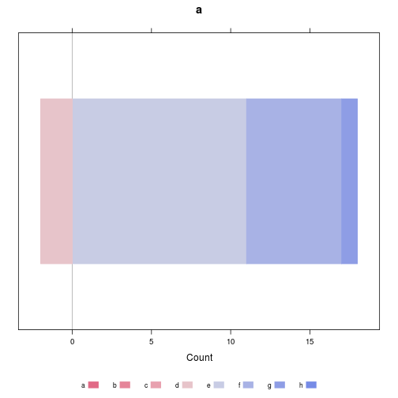

Etude V.Brunstein
========================================================
Petite note méthodologique:
1. pour que les résultats soient interprétable, il faut que la taille des groupes soit suffisante, en pratique au moins 30. Le non dit de cette affirmation est qu'elle s'applique à l'échantillon mais par récursivité au sous-groupes. Je m'explique:
- l'échantillon comporte environ 80 éléments. Pour calculer l'age moyen, pas de problème, l'age moyen est représentatif de la population. Cet échantillon est constitué en gros de deux catégories socio-proffessionnelles (AS et IDE) soit 2 groupes d'environ 40 personnes. Si on s'intéresse aux IDE ayant une expérience de l'urgence, on tombe aux environs de 20. Sachant que l'évaluation se fait avec une échelle de 8 valeurs, cela fait en moyenne des sous groupes de 2 ou 3 personnes soit 10 fois mons que chiffre théorique de 30.
Concusions: plus on divise léchantillon et plus il faut être prudent dans les conclusions que l'on tire surtout si les résultats ne sont pas significatifs. Pour une prochaine étude il est peut être préférable d'utiliser une échelle classique à 5 items.
2. revoir la formulation de certaines questions. On ne comprend pas l'objectif poursuivi ?
3. attention à la formulation: pour un ordinateur AFGSU 2 n'est pas la même chose que AFGSU2.
4. incohérence dans la colonne formation à l'urgence: OUI, NON, AFGSU...

Résultats commentés
-------------------


éléments
========

1. Pour les catégories professionnelles : rassembler dans autres ce qui n’est ni AS ni IDE. Mettre AP avec groupe AS.
#### Origine socio-professionnelle:

```r
summary(data$diplome)
```

```
##    AS Autre   IDE  NA's 
##    30     6    45     2
```

```r
plot(data$diplome, xlab = "Profession", ylab = "Nombre", main = "Catégories socio-professionnelles")
```

 

```r
ddply(data, .(data$diplome), "nrow")
```

```
##   data$diplome nrow
## 1           AS   30
## 2        Autre    6
## 3          IDE   45
## 4         <NA>    2
```


#### 2a. évaluer le SEP au départ questions 1 à 7 au total


```
## [1] "SEP7 avant la formation:"
```

```
##    Min. 1st Qu.  Median    Mean 3rd Qu.    Max.    NA's 
##      17      40      45      45      50      64       6
```

```
## [1] "SEP7 après la formation:"
```

```
##    Min. 1st Qu.  Median    Mean 3rd Qu.    Max.    NA's 
##    38.0    45.0    47.0    47.1    50.0    56.0       2
```

```
## [1] "SEP7 après un mois:"
```

```
##    Min. 1st Qu.  Median    Mean 3rd Qu.    Max.    NA's 
##    41.0    43.0    45.0    44.5    46.0    49.0      67
```

Evolution du SEP7 (différence Avant- Après)

```
##    Min. 1st Qu.  Median    Mean 3rd Qu.    Max.    NA's 
##  -13.00   -3.00    1.00    2.21    7.00   28.00       6
```

 

#### 2b. évaluer le SEP au départ questions 1 à 7 selon les catégories professionnelles

```
## [1] "SEP7 avant moyen selon la catégorie socio-prof:"
```

```
##    AS Autre   IDE 
## 44.96 41.50 45.44
```

```
##     AS  Autre    IDE 
##  9.978 11.203  6.611
```

 

```
##              Df Sum Sq Mean Sq F value Pr(>F)
## data$diplome  2     82    41.2     0.6   0.55
## Residuals    74   5040    68.1               
## 6 observations deleted due to missingness
```

```
## [1] "Pas de différence entre les groupes"
```


#### 3. évaluerle SEP questions _4 / 6/ 8 à part 

```
## [1] "Q4"
```

```
## [1] 5.475
```

```
## [1] 7.012
```

```
## [1] "Q6"
```

```
## [1] 5.6
```

```
## [1] 5.716
```

```
## [1] "Q8"
```

```
## [1] 7.275
```

```
## [1] 7.642
```


#### 4. évaluer question 3 par rapport niveau global du SEP

```r
sep3a <- as.integer(data[, "Q3A"])
sep3b <- as.integer(data[, "Q3B"])
mean(sep3a, na.rm = T)
```

```
## [1] 5.125
```

```r
mean(sep3b, na.rm = T)
```

```
## [1] 6.728
```


#### 5. impact du SEP de départ et experience de service d'urgence en faisant un ratio selon l'ancienneté de l'experience ?

```r
boxplot(data$sep7a ~ data$exp_urg, ylab = "SEP 7 avant", xlab = "Expérience de l'urgence")
```

 

```r
a <- t.test(data$sep7a ~ data$exp_urg)
a
```

```
## 
## 	Welch Two Sample t-test
## 
## data:  data$sep7a by data$exp_urg 
## t = -3.696, df = 72.29, p-value = 0.000423
## alternative hypothesis: true difference in means is not equal to 0 
## 95 percent confidence interval:
##  -9.709 -2.906 
## sample estimates:
## mean in group non mean in group oui 
##             42.43             48.74
```


#### 6. impact du SEP et type de formation à l'urgence avec date

 les formations sont trop dispersées: 

```r
a <- as.character(data$formation)
a[a == "AFGSU 1"] <- "AFGSU1"
a[a == "AFGSU 2"] <- "AFGSU2"
summary(as.factor(a))
```

```
##         AFGSU        AFGSU1        AFGSU2          AFPS      IDE SMUR 
##            10             3            17            11             2 
##           NON           oui soins urgence          UVIH          NA's 
##            18             3             6             3            10
```

```r
boxplot(data$sep7a ~ a, las = 2, ylab = "SEP 7 avant")
```

 

Les IDE SMUR se détachent du lot mais il n'y en a que deux.

#### 7. impact du SEP avec les questions A B C total et de manière individuelle est ce que C a plus d'impact que A

- a  j'ai su trouver ma place au sein de l'équipe
- b	j'étais satisfait de ma prise en charge
- c	j'ai eu l'impression que le médecin à son arrivée était satisfait des actions entrepriseslabel.var(E, "J'a


```
##     1     2     3     4     5     6     7     8    NA 
## 22.00 39.00 38.33 39.00 43.42 44.80 49.24 50.23 36.50
```

 

```
## 
## Call:
## lm(formula = data$sep7a ~ as.factor(a))
## 
## Residuals:
##    Min     1Q Median     3Q    Max 
## -23.23  -3.80   0.20   4.76  13.77 
## 
## Coefficients:
##                Estimate Std. Error t value Pr(>|t|)    
## (Intercept)       22.00       6.89    3.19  0.00213 ** 
## as.factor(a)2     17.00       7.95    2.14  0.03619 *  
## as.factor(a)3     16.33       7.95    2.05  0.04389 *  
## as.factor(a)4     17.00       7.70    2.21  0.03068 *  
## as.factor(a)5     21.42       7.17    2.99  0.00392 ** 
## as.factor(a)6     22.80       7.06    3.23  0.00191 ** 
## as.factor(a)7     27.24       7.09    3.84  0.00027 ***
## as.factor(a)8     28.23       7.15    3.95  0.00019 ***
## as.factor(a)NA    14.50       7.70    1.88  0.06403 .  
## ---
## Signif. codes:  0 '***' 0.001 '**' 0.01 '*' 0.05 '.' 0.1 ' ' 1 
## 
## Residual standard error: 6.89 on 68 degrees of freedom
##   (6 observations deleted due to missingness)
## Multiple R-squared: 0.37,	Adjusted R-squared: 0.296 
## F-statistic: 4.99 on 8 and 68 DF,  p-value: 6.89e-05
```

```
##     1     2     3     4     5     6     7     8    NA 
## 22.00 41.33 41.33 38.40 43.67 47.30 48.70 54.12 36.50
```

 

```
## 
## Call:
## lm(formula = data$sep7a ~ as.factor(a))
## 
## Residuals:
##     Min      1Q  Median      3Q     Max 
## -27.125  -3.304   0.667   3.667  10.500 
## 
## Coefficients:
##                Estimate Std. Error t value Pr(>|t|)    
## (Intercept)       22.00       6.46    3.41  0.00111 ** 
## as.factor(a)2     19.33       7.46    2.59  0.01165 *  
## as.factor(a)3     19.33       7.46    2.59  0.01165 *  
## as.factor(a)4     16.40       6.77    2.42  0.01814 *  
## as.factor(a)5     21.67       6.67    3.25  0.00180 ** 
## as.factor(a)6     25.30       6.60    3.84  0.00028 ***
## as.factor(a)7     26.70       6.77    3.94  0.00019 ***
## as.factor(a)8     32.13       6.85    4.69  1.4e-05 ***
## as.factor(a)NA    14.50       7.22    2.01  0.04859 *  
## ---
## Signif. codes:  0 '***' 0.001 '**' 0.01 '*' 0.05 '.' 0.1 ' ' 1 
## 
## Residual standard error: 6.46 on 68 degrees of freedom
##   (6 observations deleted due to missingness)
## Multiple R-squared: 0.446,	Adjusted R-squared: 0.381 
## F-statistic: 6.85 on 8 and 68 DF,  p-value: 1.44e-06
```

```
##     1     2     3     4     5     6     7     8    NA 
## 22.00 45.00 40.33 37.25 41.33 45.75 48.50 53.11 36.20
```

 

```
## 
## Call:
## lm(formula = data$sep7a ~ as.factor(a))
## 
## Residuals:
##    Min     1Q Median     3Q    Max 
## -19.20  -3.25   0.25   3.89  12.25 
## 
## Coefficients:
##                Estimate Std. Error t value Pr(>|t|)    
## (Intercept)       22.00       6.54    3.36  0.00128 ** 
## as.factor(a)2     23.00       9.26    2.48  0.01542 *  
## as.factor(a)3     18.33       7.56    2.43  0.01793 *  
## as.factor(a)4     15.25       7.32    2.08  0.04091 *  
## as.factor(a)5     19.33       6.81    2.84  0.00598 ** 
## as.factor(a)6     23.75       6.68    3.56  0.00069 ***
## as.factor(a)7     26.50       6.72    3.94  0.00019 ***
## as.factor(a)8     31.11       6.90    4.51  2.6e-05 ***
## as.factor(a)NA    14.20       7.17    1.98  0.05168 .  
## ---
## Signif. codes:  0 '***' 0.001 '**' 0.01 '*' 0.05 '.' 0.1 ' ' 1 
## 
## Residual standard error: 6.54 on 68 degrees of freedom
##   (6 observations deleted due to missingness)
## Multiple R-squared: 0.431,	Adjusted R-squared: 0.364 
## F-statistic: 6.45 on 8 and 68 DF,  p-value: 3.24e-06
```


#### 8. ceci au total et par catégorie professionnelle et avec variante experience de l'urgence


```r
a <- data[data$diplome == "IDE", c("A", "sep7a", "exp_urg")]

# suppression des lignes où 'A' = NA
a <- a[a$A != "NA", ]

tapply(a$sep7a, a$A, mean, na.rm = TRUE)
```

```
##     2     3     4     5     6     7     8 
## 38.00 42.00 38.33 45.89 44.45 48.78 47.50
```

```r
boxplot(a$sep7a ~ as.factor(a$A), ylab = "Score SEP 7 moyen", main = "j'ai su trouver ma place au sein de l'équipe\n IDE", 
    xlab = "1 = pas d'accord, 8 = tout à fait d'accord, NA = NSP")
```

 

```r

lm <- lm(a$sep7a ~ as.factor(a$A))
summary(lm)
```

```
## 
## Call:
## lm(formula = a$sep7a ~ as.factor(a$A))
## 
## Residuals:
##     Min      1Q  Median      3Q     Max 
## -20.500  -2.861   0.384   3.431  16.500 
## 
## Coefficients:
##                 Estimate Std. Error t value Pr(>|t|)    
## (Intercept)       38.000      6.577    5.78  1.5e-06 ***
## as.factor(a$A)3    4.000      9.301    0.43     0.67    
## as.factor(a$A)4    0.333      7.594    0.04     0.97    
## as.factor(a$A)5    7.889      6.932    1.14     0.26    
## as.factor(a$A)6    6.455      6.869    0.94     0.35    
## as.factor(a$A)7   10.778      6.932    1.55     0.13    
## as.factor(a$A)8    9.500      6.976    1.36     0.18    
## ---
## Signif. codes:  0 '***' 0.001 '**' 0.01 '*' 0.05 '.' 0.1 ' ' 1 
## 
## Residual standard error: 6.58 on 35 degrees of freedom
##   (2 observations deleted due to missingness)
## Multiple R-squared: 0.194,	Adjusted R-squared: 0.0557 
## F-statistic:  1.4 on 6 and 35 DF,  p-value: 0.241
```


Avec ou sans expérience de l'urgence:

```r
a1 <- a[a$exp_urg == "oui", ]
a2 <- a[a$exp_urg == "non", ]
summary(a1$sep7a)
```

```
##    Min. 1st Qu.  Median    Mean 3rd Qu.    Max.    NA's 
##    37.0    45.0    49.0    48.6    51.5    64.0       2
```

```r
summary(a2$sep7a)
```

```
##    Min. 1st Qu.  Median    Mean 3rd Qu.    Max.    NA's 
##    27.0    40.0    44.0    43.1    47.0    52.0       2
```


#### 9. idem pour ceux qui ont vécu une situaiton d'urgence post formation avec évolution A/B/C entre avant et après formation 

#### 10. évolution du SEP par catégorie professionnelle et totale entre début fin de formation

#### 11. idem avec évaluation à 1 mois

#### 12. évolution du SEP pour AS en séparant AS du groupe 8 par rapport aux autres AS

 Effectif trop faible

#### 13.évaluation des questions D à N et impact sur SEP fin de formation ou sur l'évaluation du SEP entre début et fin de formation

** PAS COMPRIS LA QUESTION ???**


```
## [1] "Résumé des réponses au questions d à n évéluées après la formation"
```

```
##    [,1] [,2] [,3] [,4] [,5] [,6] [,7] [,8]
## QD    0    0    0    1    2    7   22   49
## QE    0    0    1    0    1    5   16   57
## QF    0    0    0    1    0    2   13   65
## QG    0    0    0    2    2   11   15   51
## QH    0    0    0    0    2    8   13   58
## QI    0    0    0    0    1    6   10   64
## QJ    0    0    0    0    3    1   12   65
## QK    0    0    0    0    3    2   10   66
## QL    0    0    0    1    9   28   23   16
## QM    0    0    0    0    1   20   37   23
## QN    0    0    0    0    1   12   32   36
```

 


#### 14. idem pour les aspects suivants par type de questions

#### 15. évaluation questions D et E (vicariant)
 

```
## 
## Call:
## lm(formula = data$sep7b ~ x)
## 
## Residuals:
##    Min     1Q Median     3Q    Max 
## -8.793 -2.793  0.207  3.207  8.207 
## 
## Coefficients:
##             Estimate Std. Error t value Pr(>|t|)    
## (Intercept)   36.625      4.484    8.17  4.4e-12 ***
## x              0.698      0.297    2.35    0.021 *  
## ---
## Signif. codes:  0 '***' 0.001 '**' 0.01 '*' 0.05 '.' 0.1 ' ' 1 
## 
## Residual standard error: 4.15 on 78 degrees of freedom
##   (3 observations deleted due to missingness)
## Multiple R-squared: 0.0662,	Adjusted R-squared: 0.0542 
## F-statistic: 5.53 on 1 and 78 DF,  p-value: 0.0212
```


#### 16.évaluation questions H / I / J /K (persuasion verbale)  
 

```
## 
## Call:
## lm(formula = data$sep7b ~ x)
## 
## Residuals:
##    Min     1Q Median     3Q    Max 
## -8.846 -2.576  0.424  3.424  8.424 
## 
## Coefficients:
##             Estimate Std. Error t value Pr(>|t|)    
## (Intercept)   35.897      5.902    6.08    4e-08 ***
## x              0.365      0.192    1.90    0.061 .  
## ---
## Signif. codes:  0 '***' 0.001 '**' 0.01 '*' 0.05 '.' 0.1 ' ' 1 
## 
## Residual standard error: 4.18 on 79 degrees of freedom
##   (2 observations deleted due to missingness)
## Multiple R-squared: 0.0439,	Adjusted R-squared: 0.0318 
## F-statistic: 3.62 on 1 and 79 DF,  p-value: 0.0606
```


#### 17.évaluation questions  G / L / N (maitrise)

#### 18.évaluation questions F (état psychologique émotionnel)

#### 19.évaluation question M (transférabilité)

#### 20.évaluation G seul et  G /L / N par catégorie professionnelle ???

```
##    Min. 1st Qu.  Median    Mean 3rd Qu.    Max.    NA's 
##    4.00    7.00    8.00    7.37    8.00    8.00       2
```

```
## $AS
##    Min. 1st Qu.  Median    Mean 3rd Qu.    Max. 
##    4.00    6.00    7.00    6.87    8.00    8.00 
## 
## $Autre
##    Min. 1st Qu.  Median    Mean 3rd Qu.    Max. 
##    7.00    7.25    8.00    7.67    8.00    8.00 
## 
## $IDE
##    Min. 1st Qu.  Median    Mean 3rd Qu.    Max. 
##    5.00    8.00    8.00    7.67    8.00    8.00
```

   

#### 21. Sep avant et groupe de formation


```r
q <- tapply(data$sep7a, data$groupe, mean, na.rm = T)
q
```

```
##     1     2     3     4     5     6     7     8 
## 44.00 43.58 44.44 48.67 50.27 41.22 44.08 44.33
```

```r
boxplot(data$sep7a ~ data$groupe, ylab = "SEP 7 avant formation", xlab = "Groupe", 
    col = "orange")
```

 

```r
s <- aov(data$sep7a ~ data$groupe)
summary(s)
```

```
##             Df Sum Sq Mean Sq F value Pr(>F)
## data$groupe  7    565    80.7    1.22    0.3
## Residuals   69   4557    66.0               
## 6 observations deleted due to missingness
```

#### 22. Evolution du SEP

```r
boxplot(data$sep7a, data$sep7b, data$sep7c, names = c("avant", "après", "à 1 mois"), 
    ylab = "SEP", main = "Evolution du SEP", col = "yellow")
```

 

```r
sep1 <- summary(data$sep7a)
sep2 <- summary(data$sep7b)
sep3 <- summary(data$sep7c)
rbind(sep1, sep2, sep3)
```

```
##      Min. 1st Qu. Median Mean 3rd Qu. Max. NA's
## sep1   17      40     45 45.0      50   64    6
## sep2   38      45     47 47.1      50   56    2
## sep3   41      43     45 44.5      46   49   67
```

```r

boxplot(q, horizontal = T, main = "Evolution du SEP à un mois", xlab = "comparaison SEP à 1 mois - SEP initial", 
    col = "pink")
```

 

```r
summary(data$sep7c - data$sep7a)
```

```
##    Min. 1st Qu.  Median    Mean 3rd Qu.    Max.    NA's 
##  -10.00   -4.25   -1.00   -0.44    4.00   10.00      67
```

#### 24. Fréquence des situations d'urgence ORDERED

```r
status <- factor(data$conf_urg, order = T, levels = c("jamais", "rarement", 
    "parfois", "souvent"))
tapply(data$sep7a, status, mean, na.rm = TRUE)
```

```
##   jamais rarement  parfois  souvent 
##    37.44    41.88    44.92    53.50
```

```r
boxplot(data$sep7a ~ status, main = "SEP 7 en fonction de la fréquence des situations d'urgence", 
    ylab = "SEP 7", col = "orange")
```

 

```r
x <- lm(data$sep7a ~ status)
summary(x)
```

```
## 
## Call:
## lm(formula = data$sep7a ~ status)
## 
## Residuals:
##     Min      1Q  Median      3Q     Max 
## -20.444  -3.875   0.125   4.556  11.079 
## 
## Coefficients:
##             Estimate Std. Error t value Pr(>|t|)    
## (Intercept)   44.435      0.894   49.70  < 2e-16 ***
## status.L      11.452      2.020    5.67  2.7e-07 ***
## status.Q       2.074      1.788    1.16     0.25    
## status.C       1.547      1.521    1.02     0.31    
## ---
## Signif. codes:  0 '***' 0.001 '**' 0.01 '*' 0.05 '.' 0.1 ' ' 1 
## 
## Residual standard error: 6.86 on 73 degrees of freedom
##   (6 observations deleted due to missingness)
## Multiple R-squared: 0.328,	Adjusted R-squared: 0.301 
## F-statistic: 11.9 on 3 and 73 DF,  p-value: 1.99e-06
```

```r
x <- aov(data$sep7a ~ status)
summary(x)
```

```
##             Df Sum Sq Mean Sq F value Pr(>F)    
## status       3   1682     561    11.9  2e-06 ***
## Residuals   73   3440      47                   
## ---
## Signif. codes:  0 '***' 0.001 '**' 0.01 '*' 0.05 '.' 0.1 ' ' 1 
## 6 observations deleted due to missingness
```

#### 25.
Application à la question 1
---------------------------

```r
a <- lapply(1:nrow(data), function(x) {
    z <- 0
    z[1:8] <- 0
    z[as.integer(data$Q1A[x])] <- 1
    a <- rbind(z)
})
a <- do.call(rbind, a)
Q1A <- apply(a, 2, sum)

a <- lapply(1:nrow(data), function(x) {
    z <- 0
    z[1:8] <- 0
    z[as.integer(data$Q1B[x])] <- 1
    a <- rbind(z)
})
a <- do.call(rbind, a)
Q1B <- apply(a, 2, sum)

a <- lapply(1:nrow(data), function(x) {
    z <- 0
    z[1:8] <- 0
    z[as.integer(data$Q1C[x])] <- 1
    a <- rbind(z)
})
a <- do.call(rbind, a)
Q1C <- apply(a, 2, sum)

c <- rbind(Q1A, Q1B, Q1C)
likert(c, main = "Question Q1 (avant / après)", xlab = "je pense que j'arrive à faire face aux pbs inattendus dans mon activité professionnelle")
```

 

#### 26. Formation préalable à l'urgence

On forme une nouvelle colonne *formationON* qui dimplifie la colonne *formation* en remplaçant toute formation par *OUI*.

```r
data$formationON <- as.character(data$formation)
data$formationON[data$formationON != "NON" & data$formationON != "NA"] <- "OUI"
data$formationON <- as.factor(data$formationON)
summary(data$formationON)
```

```
##  NON  OUI NA's 
##   18   55   10
```

Calcul de la valeur *médiane* du SEP 7 avant, après et à 1 mois et des boxplot correspondants:

```r
tapply(data$sep7a, data$formationON, median, na.rm = T)
```

```
##  NON  OUI 
## 45.5 44.0
```

```r
tapply(data$sep7b, data$formationON, median, na.rm = T)
```

```
## NON OUI 
##  47  46
```

```r
tapply(data$sep7c, data$formationON, median, na.rm = T)
```

```
## NON OUI 
##  43  45
```

```r

boxplot(data$sep7a ~ data$formationON, ylab = "SEP 7 avant", xlab = "Formation préalable à l'urgence", 
    col = "orange")
```

 

```r
boxplot(data$sep7b ~ data$formationON, ylab = "SEP 7 après", xlab = "Formation préalable à l'urgence", 
    col = "yellow")
```

 

```r
boxplot(data$sep7c ~ data$formationON, ylab = "SEP 7 à 1 mois", xlab = "Formation préalable à l'urgence", 
    col = "pink")
```

 


 

questions:
==========
faut il classifier les services d'activité par categorie medecine / chirurgie / urgence et soins continus

data$service<-data[data$travail==""]<-""
